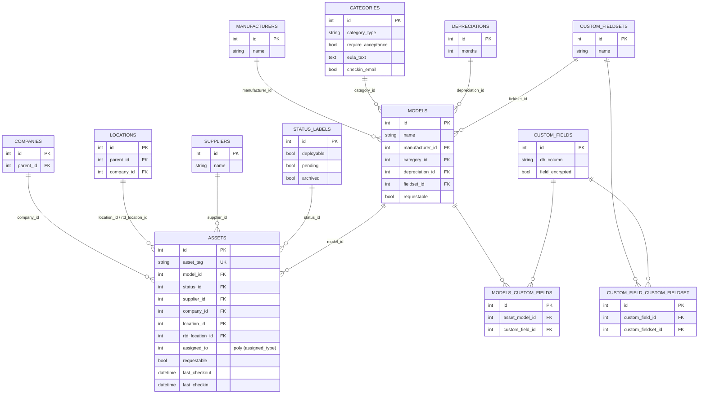
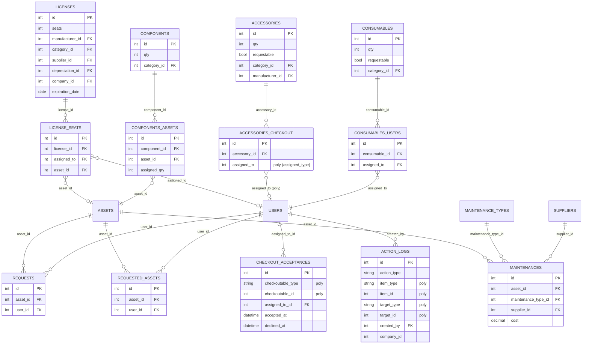
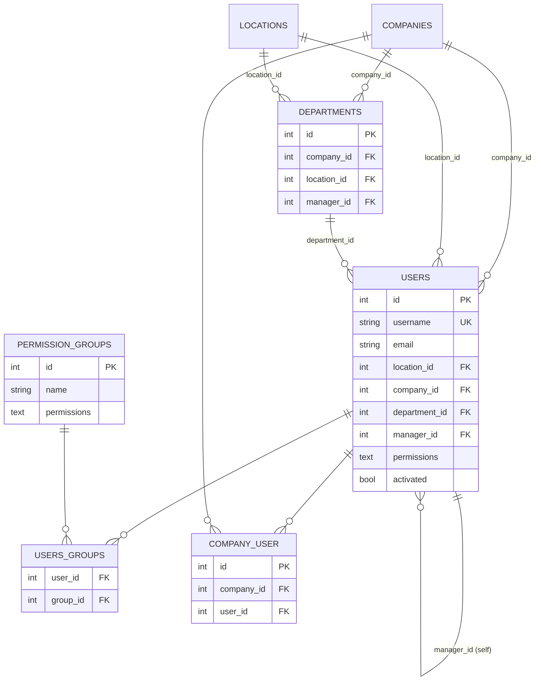
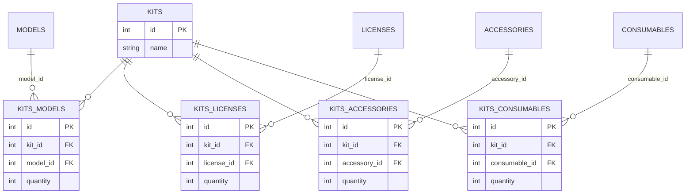
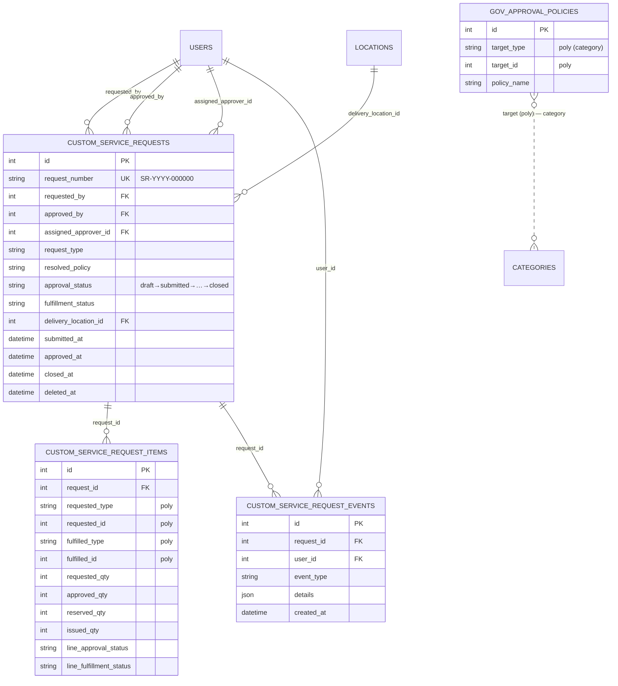
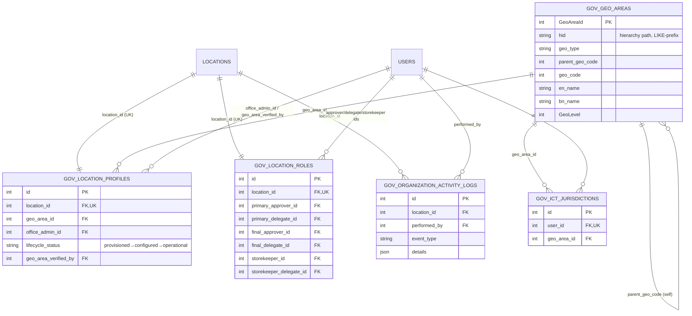
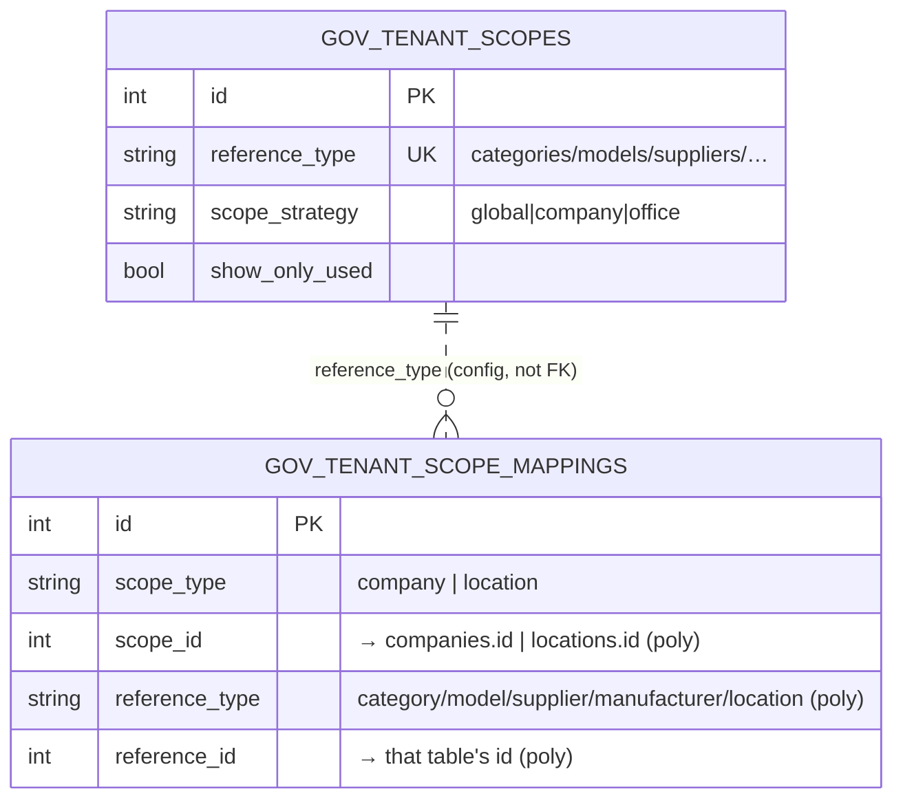
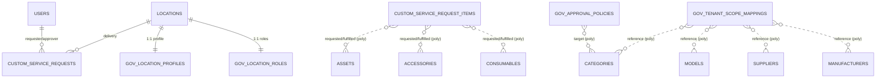

# Database ER Diagram — Asset-Store-BD

> Reverse-engineered from the **live database** `asset_store_bd` (67 tables) + all migrations. Split into subject-area diagrams because one graph of 67 tables is unreadable. Mermaid `erDiagram` blocks render on GitHub / any Mermaid viewer.
>
> **Two layers:** **Core Snipe-IT** inventory (≈50 tables) + **Gov-Store** custom packages (`custom_service_*`, `gov_*` — 11 tables).
>
> **Important:** core Snipe-IT declares its relations in **Eloquent, not as DB foreign keys** (verified — the DB has almost no FK constraints on core tables). The gov-store tables *do* declare real FKs. So the lines below combine: (a) real DB FKs, and (b) Eloquent relationships for core. Polymorphic links can't be drawn as one FK — they're listed separately in §9.

## Contents
- [Legend](#legend)
- [1. Core — Reference data & Assets](#1-core--reference-data--assets)
- [2. Core — Checkout / Assignment / History](#2-core--checkout--assignment--history)
- [3. Core — Users, Groups, Org units](#3-core--users-groups-org-units)
- [4. Core — Predefined Kits](#4-core--predefined-kits)
- [5. Gov-Store — Service Requests](#5-gov-store--service-requests)
- [6. Gov-Store — Organization & Geo](#6-gov-store--organization--geo)
- [7. Gov-Store — Tenant Scope](#7-gov-store--tenant-scope)
- [8. Cross-layer bridge (how gov links to core)](#8-cross-layer-bridge-how-gov-links-to-core)
- [9. Polymorphic relationships](#9-polymorphic-relationships-not-single-fks)
- [10. Confirmed DB foreign keys](#10-confirmed-db-foreign-keys-live-schema)
- [11. Full table inventory (67)](#11-full-table-inventory-67)
- [12. Appendix — full columns](#12-appendix--full-columns)

---

## Legend

- `PK` primary key · `FK` foreign key (Eloquent or DB) · `poly` polymorphic (`*_type` + `*_id`) · `UK` unique.
- Crow's-foot: `||--o{` one-to-many · `||--||` one-to-one · `}o--o|` many-to-optional-one · `}o--||` many-to-one.
- Entity names = table names (UPPERCASE). Only key/identifying columns shown per entity; full columns in §12.

---

## 1. Core — Reference data & Assets



---

## 2. Core — Checkout / Assignment / History

`assets.assigned_to` + `assigned_type` is polymorphic (User / Location / Asset). Accessories, consumables, components, licenses each have their own pivot.



---

## 3. Core — Users, Groups, Org units



---

## 4. Core — Predefined Kits



---

## 5. Gov-Store — Service Requests

The basket→request→approval→fulfillment core. `custom_service_requests` = the document/basket; items carry the **separation of quantities** (`requested/approved/reserved/issued`); events = immutable timeline.



---

## 6. Gov-Store — Organization & Geo

Extends core `locations` with a 1:1 profile + a roles row, ties them to the Bangladesh geo hierarchy, and tags ICT officers to a geo boundary.



---

## 7. Gov-Store — Tenant Scope

Config table (`gov_tenant_scopes`, one row per reference type + strategy) + a polymorphic mapping table binding a reference row to a company/location boundary.



---

## 8. Cross-layer bridge (how gov links to core)

The single most important integration view — where custom tables touch Snipe-IT core.



> Fulfillment turns an approved item into a real Snipe-IT checkout via Adapters — the item's `fulfilled_type/id` points at the concrete core row that was issued (supports substitution vs the originally `requested_*`).

---

## 9. Polymorphic relationships (not single FKs)

| Table.columns | `*_type` values → target table |
|---|---|
| `assets.assigned_type` + `assigned_to` | `User`→users, `Location`→locations, `Asset`→assets |
| `accessories_checkout.assigned_type` + `assigned_to` | `User`→users (also asset/location) |
| `action_logs.item_type/item_id` | asset / accessory / consumable / component / license / user |
| `action_logs.target_type/target_id` | user / location / asset |
| `checkout_acceptances.checkoutable_type/id` | asset / accessory / consumable / licenseseat |
| `maintenances.checked_out_to_type/id` | user / asset |
| `custom_service_request_items.requested_type/id` | `asset`→assets, `accessory`→accessories, `consumable`→consumables |
| `custom_service_request_items.fulfilled_type/id` | same set (supports substitution) |
| `gov_tenant_scope_mappings.scope_type/scope_id` | `company`→companies, `location`→locations |
| `gov_tenant_scope_mappings.reference_type/reference_id` | category / model / supplier / manufacturer / location |
| `gov_approval_policies.target_type/target_id` | `category`→categories |

> Morph aliases (`asset`,`accessory`,`consumable`) are registered in `CustomRequestServiceProvider::boot()` via `Relation::morphMap()`.

---

## 10. Confirmed DB foreign keys (live schema)

These are the **actual** `FOREIGN KEY` constraints present in the DB (core Snipe-IT deliberately has none on business tables):

```
custom_service_request_events.request_id      -> custom_service_requests.id
custom_service_request_events.user_id         -> users.id
custom_service_request_items.request_id       -> custom_service_requests.id
custom_service_requests.requested_by          -> users.id
custom_service_requests.approved_by           -> users.id
custom_service_requests.assigned_approver_id  -> users.id
gov_ict_jurisdictions.user_id                 -> users.id
gov_ict_jurisdictions.geo_area_id             -> gov_geo_areas.GeoAreaId
gov_location_profiles.location_id             -> locations.id
gov_location_profiles.geo_area_id             -> gov_geo_areas.GeoAreaId
gov_location_profiles.office_admin_id         -> users.id
gov_location_profiles.geo_area_verified_by    -> users.id
gov_location_roles.location_id                -> locations.id
gov_location_roles.primary_approver_id        -> users.id
gov_location_roles.primary_delegate_id        -> users.id
gov_location_roles.final_approver_id          -> users.id
gov_location_roles.final_delegate_id          -> users.id
gov_location_roles.storekeeper_id             -> users.id
gov_location_roles.storekeeper_delegate_id    -> users.id
gov_organization_activity_logs.location_id    -> locations.id
gov_organization_activity_logs.performed_by   -> users.id
telescope_entries_tags.entry_uuid             -> telescope_entries.uuid
```

---

## 11. Full table inventory (67)

**Core inventory & reference (18):** `assets` `models` `categories` `manufacturers` `suppliers` `locations` `companies` `departments` `status_labels` `depreciations` `custom_fields` `custom_fieldsets` `custom_field_custom_fieldset` `models_custom_fields` `maintenances` `maintenance_types` `asset_logs` `asset_uploads`

**Checkoutables & pivots (11):** `licenses` `license_seats` `accessories` `accessories_checkout` `consumables` `consumables_users` `components` `components_assets` `checkout_acceptances` `requests` `requested_assets`

**Users / auth / access (10):** `users` `users_groups` `permission_groups` `company_user` `throttle` `login_attempts` `password_resets` `saml_nonces` `settings` `action_logs`

**Kits (5):** `kits` `kits_models` `kits_licenses` `kits_accessories` `kits_consumables`

**OAuth / Passport (5):** `oauth_access_tokens` `oauth_auth_codes` `oauth_clients` `oauth_personal_access_clients` `oauth_refresh_tokens`

**Imports / reports / framework (4):** `imports` `report_templates` `migrations` `telescope_entries` (+`telescope_entries_tags` `telescope_monitoring`)

**Gov-Store — service requests (4):** `custom_service_requests` `custom_service_request_items` `custom_service_request_events` `gov_approval_policies`

**Gov-Store — organization/geo (5):** `gov_location_profiles` `gov_location_roles` `gov_ict_jurisdictions` `gov_organization_activity_logs` `gov_geo_areas`

**Gov-Store — tenant scope (2):** `gov_tenant_scopes` `gov_tenant_scope_mappings`

---

## 12. Appendix — full columns (key tables)

<details><summary>Gov-Store tables</summary>

```
custom_service_requests: id, request_number, requested_by, approved_by, assigned_approver_id,
  request_type, resolved_policy, purpose, justification, required_by_date, delivery_location_id,
  cost_center, approval_status, fulfillment_status, submitted_at, approved_at, closed_at,
  created_at, updated_at, deleted_at
custom_service_request_items: id, request_id, requested_type, requested_id, fulfilled_type,
  fulfilled_id, requested_qty, approved_qty, reserved_qty, issued_qty, line_approval_status,
  line_fulfillment_status, notes, created_at, updated_at
custom_service_request_events: id, request_id, user_id, event_type, details, created_at
gov_approval_policies: id, target_type, target_id, policy_name, created_at, updated_at
gov_geo_areas: GeoAreaId, hid, geo_type, parent_geo_code, geo_code, bn_name, domain, en_name,
  GeoLevel, created_at, updated_at
gov_ict_jurisdictions: id, user_id, geo_area_id, created_at, updated_at
gov_location_profiles: id, location_id, geo_area_id, office_admin_id, lifecycle_status,
  geo_area_verified_at, geo_area_verified_by, created_at, updated_at
gov_location_roles: id, location_id, primary_approver_id, primary_delegate_id,
  primary_delegate_until, final_approver_id, final_delegate_id, final_delegate_until,
  storekeeper_id, storekeeper_delegate_id, storekeeper_delegate_until, created_at, updated_at
gov_organization_activity_logs: id, location_id, performed_by, event_type, details, created_at
gov_tenant_scopes: id, reference_type, scope_strategy, show_only_used, created_at, updated_at
gov_tenant_scope_mappings: id, scope_type, scope_id, reference_type, reference_id,
  created_at, updated_at
```
</details>

<details><summary>Core tables (key entities)</summary>

```
assets: id, name, asset_tag, model_id, serial, purchase_date, asset_eol_date, eol_explicit,
  purchase_cost, order_number, assigned_to, notes, image, created_by, physical, status_id,
  archived, warranty_months, depreciate, supplier_id, requestable, rtd_location_id,
  _snipeit_mac_address_1, accepted, last_checkout, last_checkin, expected_checkin, company_id,
  assigned_type, last_audit_date, next_audit_date, location_id, checkin_counter,
  checkout_counter, requests_counter, byod, created_at, updated_at, deleted_at
models: id, name, model_number, min_amt, manufacturer_id, category_id, require_serial,
  depreciation_id, created_by, eol, image, fieldset_id, notes, requestable, …
categories: id, name, tag_color, eula_text, use_default_eula, require_acceptance,
  alert_on_response, category_type, checkin_email, image, notes, …
users: id, email, password, permissions, activated, first_name, last_name, username,
  location_id, company_id, department_id, manager_id, employee_num, jobtitle, ldap_import,
  two_factor_secret, scim_externalid, vip, remote, start_date, end_date, …
licenses: id, name, serial, seats, depreciation_id, supplier_id, manufacturer_id, category_id,
  company_id, expiration_date, termination_date, maintained, reassignable, min_amt, …
license_seats: id, license_id, assigned_to, unreassignable_seat, notes, asset_id, …
accessories: id, name, category_id, qty, requestable, location_id, company_id, min_amt,
  manufacturer_id, model_number, supplier_id, …
accessories_checkout: id, accessory_id, assigned_to, assigned_type, note, created_by, …
consumables: id, name, category_id, location_id, supplier_id, qty, requestable, company_id,
  min_amt, manufacturer_id, item_no, …
consumables_users: id, consumable_id, assigned_to, note, created_by, …
components: id, name, category_id, location_id, company_id, supplier_id, qty, manufacturer_id,
  min_amt, serial, …
components_assets: id, assigned_qty, component_id, asset_id, note, created_by, …
maintenances: id, asset_id, supplier_id, maintenance_type_id, asset_maintenance_type, name,
  is_warranty, start_date, completion_date, cost, checked_out_to_id, checked_out_to_type, …
action_logs: id, created_by, action_type, target_id, target_type, location_id, note, item_type,
  item_id, expected_checkin, quantity, accepted_id, company_id, action_date, action_source,
  remote_ip, user_agent, …
checkout_acceptances: id, checkoutable_type, checkoutable_id, assigned_to_id, qty,
  signature_filename, accepted_at, declined_at, stored_eula, …
locations: id, name, city, state, country, parent_id, manager_id, company_id, ldap_ou, …
companies: id, name, parent_id, email, phone, …
departments: id, name, company_id, location_id, manager_id, …
status_labels: id, name, deployable, pending, archived, color, show_in_nav, default_label
custom_fields: id, name, format, element, field_values, field_encrypted, db_column,
  show_in_email, is_unique, display_in_user_view, …
requests: id, asset_id, user_id, request_code
requested_assets: id, asset_id, user_id, accepted_at, denied_at, notes
```
</details>

---

*Source: live DB `asset_store_bd` (information_schema) + package migrations. Core relations are Eloquent-defined (no DB FKs); gov-store relations are real DB FKs (§10). Regenerate FK list: `SELECT TABLE_NAME, COLUMN_NAME, REFERENCED_TABLE_NAME, REFERENCED_COLUMN_NAME FROM information_schema.KEY_COLUMN_USAGE WHERE TABLE_SCHEMA=DATABASE() AND REFERENCED_TABLE_NAME IS NOT NULL;`*