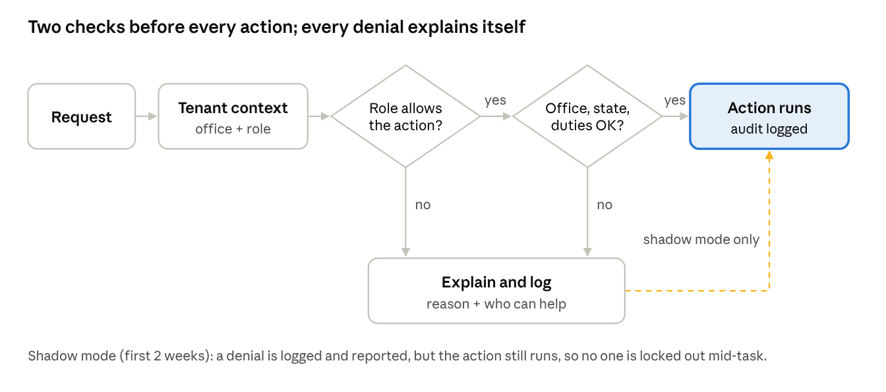
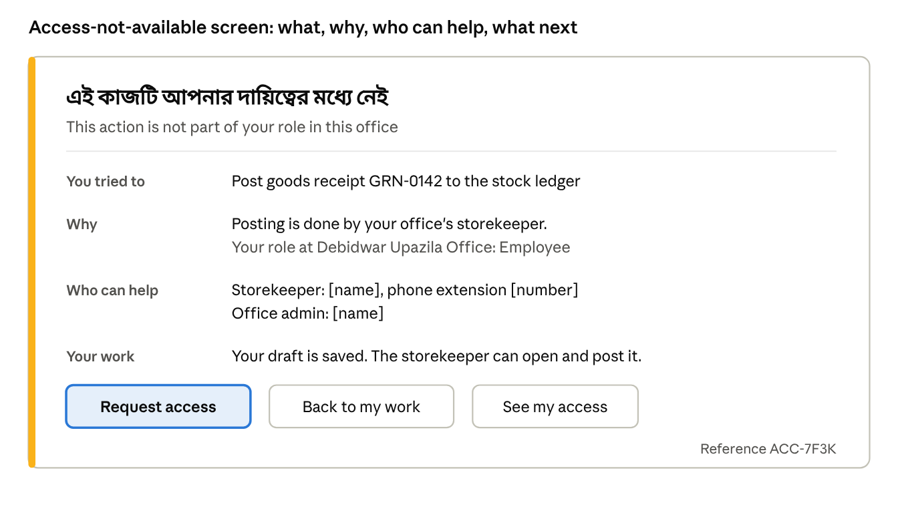

# G1 Analysis: Unprotected Store Operations and Classification Actions

Oct 4, 2026 · @zahid

Related: [gov-store Gap Assessment](gov-store-gap-assessment.md) (gap G1) · [Package-wise Gap Analysis](gov-store-package-gap-analysis.md)

## Execution review — 4 October 2026

The original document is a design proposal, not a record of completed protection. Review of the current routes, controllers, services and role assignment code confirmed that the central authorization service, middleware, document policy and access UI had not been implemented.

Additional work found during review:

- Draft saving exposes `DEBUG CRASH`, file, line and trace details as well as the posting snapshot leak. Sanitize all workspace failures.
- Posting and saving must lock the document row and recheck state inside the transaction. A pre-transaction status check does not prevent concurrent double posting or a save racing a post. Do not continue posting after a failed auto-save.
- `READY` has no verification workflow today. Accept validated DRAFT and READY postings until G7 implements verification; READY is not editable. Never treat an unknown state as editable. Do not advertise an implemented reversal flow when none exists.
- Working-membership selection must belong to the authenticated user and be approved. Tenant context must reset per request; stale company/global flags must not survive a different user or office.
- Office-copy listing and fetching must use the same server-side ministry boundary, including for a manually supplied office ID. This boundary always enforces, including shadow mode.
- `RoleAssignmentService` still writes deprecated `LocationRole` records, while configuration and menus use `OfficeResponsibility`. Use the current responsibility store, expire temporary cover server-side, and invalidate role caches after assignments.
- My Catalog's archive/restore scope currently prefers company scope for ordinary office users. Use company scope only for an actual company administrator; office operators modify their own office.
- Catalog execute currently bypasses validation and ignores uploaded files. Bind review to the authenticated session and fingerprints of the exact bundled files that will execute. The existing coordinator only supports the three-file compiled bundle; explicitly reject unsupported uploads instead of silently importing another dataset.
- Register only the declared gov-store gates. The proposed broad `Gate::before` for every dotted permission would override unrelated Snipe-IT policies.
- Fix the duplicate rule-assignment route name, keep both URLs protected, and test the effective Laravel route collection.
- Live review also found Custom Requests URLs pointing to deleted controller methods, queues that ignored temporary cover, and unscoped request detail lookups. Remove the obsolete URLs, use the shared ability decision, and bind detail actions to the working office.
- The posting endpoint must enforce the same administrative-reference and metadata checklist as the UI. Missing references previously disabled the UI button but could be bypassed by a direct POST. READY posting validates saved metadata, not disabled form fields.

### Updated implementation order

1. Implement the ability registry, shared role decisions, bilingual denials/action controls and durable audit storage. National abilities enforce immediately; office actions default to shadow. Invalid mode values fail closed.
2. Protect all Store Operations, Classification and Custom Requests routes with explicit abilities, retain narrower object-level checks, and align menus with the route's ability. The route regression test covers these package surfaces; unrelated organization, membership, tracking, onboarding and scoping packages retain their own authorization and are outside G1. The original blanket `gov-store/*` criterion is narrowed to avoid redefining those packages' roles in this change.
3. Implement document office/type/state checks, locked save/post transactions, separate drafter/poster attribution, takeover without changing the original creator, private attachment delivery and safe error references **before** enforcement.
4. Implement mandatory national review/reason/typed confirmation, validated bundle execution, office-copy bounds and office adoption scope corrections.
5. Implement My access, office-admin request review through the responsibility assignment service, temporary cover, notifications, permission matrix/CSV, aggregate shadow reporting and restricted individual audit views.
6. Run focused authorization, route, lifecycle, review-token, language and rendering regression checks. Record the actual results here. Add a CI job using an isolated test database. Apply only the new G1 migrations needed for the authorized local dev exercise; never run a full migrate/seed or reset against the developer's existing database as test setup.
7. Deployment operator applies the new migrations before serving the updated application, clears route/config caches, and uses `GOVSTORE_ACCESS_MODE=shadow`. National controls remain enforced. Monitor for at least two weeks, run the named usability/accessibility sessions, announce a real enforcement date/help contact, then change configuration to `enforce` and refresh cached configuration. These real-world steps cannot be completed by a local code change and remain open until evidence is recorded.

No second verifier or auditor role is introduced by this execution. Those remain dependent on G7 and the future auditor role. Indefinite denial retention and superuser-only individual access remain the agreed policy.

### Execution results

Implementation steps 1–6 are complete locally. G1 is ready for the planned observation period; it is **not yet closed for enforced rollout**.

| Work | Result and evidence |
| --- | --- |
| Shared authorization | Named abilities, gates, role resolution, explicit middleware on all 99 G1 routes, matching menus, bilingual HTML/JSON denials and accessible action reasons implemented. National/admin controls enforce in both modes. |
| Documents | Receipt and issue workspaces, office/type/state checks, row locks, atomic posting, server-side checklist validation, drafter/poster records, retained-draft takeover and clearly marked draft prints implemented. |
| National changes | Review freezes the proposed input, rejects changed configurations, requires a reason and typed CHANGE, and rejects token reuse. Catalog execute additionally requires review of fingerprints of the exact three-file bundle. Publication history records actor, time and reason. Generic national totals are explicitly an upper bound, not a claim of exact impact. |
| Access management | My access, current-office admin inbox, approval/decline, expiring cover, durable in-app updates, matrix/CSV, aggregate shadow report and restricted audit view implemented. |
| Regression suite | 29 isolated SQLite tests, 649 assertions passed. Includes role/menu/gate matrix, route coverage, mutation denials, state/type/office checks, READY saved-metadata validation, cross-office request mutations, live-role changes, catalog and national tokens, access approval/replay, shared-context reset, rendered-failure rollback, bilingual keys and PHP syntax checks of compiled templates. CI job added; remote CI execution is still pending. |
| Live dev checks | 91 HTTP checks passed at snipeit.local across ordinary staff, storekeeper, approver/office admin and administrator accounts. Tested receipts/issues and repost/edit rejection, foreign-document 404, national publication/replay, access request/approval without logout, cover expiry, private evidence upload/download/delete and shadow/takeover behavior. Browser verified My access, approver read-only controls and the bilingual posting preview with item quantity/reference. [Recorded results](g1-live-verification.json). |
| Local state | Both new migrations applied to the dev database. Restored the original environment setting, so office controls use the default shadow mode; national controls stay enforced. Test grants expired. Test receipts/issues have matching IN/OUT quantities and net consumable stock remains 50. The test national policy is unassigned. Test documents and audit records remain as dev evidence. |
| Existing evidence files | Ran govstore:protect-attachments: 4 existing files moved into private storage. 180 older attachment rows had no source file before migration; they remain a data-recovery issue and cannot be recreated by authorization code. |

Browser evidence: [posted receipt viewed by an approver](images/g1-live-posted-receipt.png) and [posting confirmation](images/g1-live-posting-confirmation.png).

### Work remaining before enforced rollout

1. Obtain the first CI run and run the full application regression suite in its configured isolated test database. The local G1 suite does not establish that all unrelated Snipe-IT suites pass.
2. Monitor the aggregate shadow report for at least two real weeks and resolve role-assignment gaps with office administrators.
3. Run the named storekeeper/approver/admin usability sessions and pa11y plus screen-reader checks. Bilingual strings, labels and aria descriptions exist, but this does not establish WCAG AA compliance.
4. Set GOVSTORE_ACCESS_ENFORCEMENT_DATE and GOVSTORE_ACCESS_HELP_CONTACT, publish the office-admin guide and in-app notice, then switch GOVSTORE_ACCESS_MODE to enforce and refresh cached configuration after the observation criteria are met.
5. Recover or explicitly resolve the 180 pre-existing missing evidence files. On other deployments run the private-evidence command after applying migrations; do not leave old public evidence files exposed.
6. G7 must supply document verification before a second verifier is required. Auditor-role access and a correction/reversal workflow remain separate work; this implementation does not claim they exist. Full national catalog re-import was not performed in the live smoke run; bundle integrity/replay safeguards are covered by isolated tests.

## Original baseline analysis

The following risk description records the state before this execution. Current completion and rollout status are recorded above.

Any logged-in user can post goods receipts and issues to their office's permanent ledger, publish product rules that apply to every office, or re-import the national classification catalog. The only thing standing in their way is that the menu hides the links. 62 routes in Store Operations and Classification check only that the user is logged in, and 22 of them change data.

Office boundaries still hold: documents and stock are filtered to the user's own office, so this is not a cross-ministry data leak. The gap is about **roles within an office** and **national settings anyone can change**. A clerk who only requests stationery, or a curious employee who guesses a URL, can do a storekeeper's or a system administrator's job.

**Who it hurts.** Storekeepers are held accountable for ledger entries they did not make. Approvers and auditors can no longer trust that the stock register reflects authorised acts. Every office inherits a product rule or catalog change made by mistake elsewhere. Behind them all is the public, whose stock is being accounted for.

**Recommended fix (3–4 weeks, one developer):**

1. Build one access check out of the logic the menu already uses, and apply it to every route and every action button.
2. Add document-level rules for office, role and document state, and record who drafted and who posted every document.
3. Roll out in “shadow mode” first, logging what would be blocked without blocking it, so nobody is locked out of real work.
4. Replace the generic “sad panda” 403 page with screens that explain why an action is unavailable and who can help, in Bangla and English.

## The problem in detail

Three groups of endpoints are reachable by anyone logged in: the store ledger, the global product rules, and the national catalog. Each group carries at least one critical action. Every route below has only the `web` and `auth` middleware (plus tenant context); none of the controllers behind them checks a role.

| # | Endpoints (method + path) | What it does | Who should be allowed | Who can today | Risk |
| --- | --- | --- | --- | --- | --- |
| 1 | `POST /gov-store/operations/documents/{type}/{id}/post` | Posts a GRN/GIN to the immutable ledger, creates assets, changes Snipe-IT quantities and records programme deliveries | The office's storekeeper, after verification | Any member of that office | Critical |
| 2 | `POST .../policies/{id}/publish`, `.../assign`, `.../assign-gpo`, `.../assignments/{id}/unassign` | Makes a product rule live, or attaches or detaches it from categories and models, **for every office** | The national rules owner (superuser) | Any logged-in user in any office | Critical |
| 3 | `POST /admin/catalog/import/validate`, `/import/execute` | Replaces the national reference catalog; execution first deletes the English synonyms | Superuser (the route group's own comment says “Superadmin Only”) | Any logged-in user | Critical |
| 4 | `POST .../documents/initialize`, `.../{id}/draft`, `.../{id}/attachments` (upload, delete) | Creates and edits draft receipts and issues, and adds or removes evidence files | The office's storekeeper | Any member of that office | High |
| 5 | `POST .../policies/{id}/draft`, `.../policies/store`, `.../policies/{id}/duplicate` | Creates and edits draft product rules | Superuser | Any logged-in user | High |
| 6 | `POST /admin/catalog/mapping/save` | Changes the national UNSPSC-to-Snipe-IT category mapping every office relies on | Superuser | Any logged-in user | High |
| 7 | `POST /admin/catalog/collections`, `/{id}/attach`, `/{id}/detach` | Edits the national collection library new offices adopt from | Superuser | Any logged-in user | High |
| 8 | `POST /admin/catalog/adoption/adopt`, `/abandon`, `/provision`; `POST .../catalog/bulk/execute` | Creates Snipe-IT categories and adopts or drops them for the user's office (or the whole ministry for a company admin) | Office admin or storekeeper | Any member of that office | High |
| 9 | `POST .../catalog/adopt/copy/fetch` | Returns any office's adopted catalog codes when given its location ID | Office admin, for offices they can see | Any logged-in user, for any office | Medium |
| 10 | `GET` hub, workspace, preview, print, register, kardex, product profile and search endpoints | Shows the office's stock levels, documents, suppliers and attachments | Storekeeper, approvers, office admin, auditors | Any member of that office | Medium |
| 11 | `GET` rules studio, inspector, simulator, impact, catalog dashboard, history and collections screens | Shows rule and catalog configuration | Superuser (rules), staff (catalog search) | Any logged-in user | Low |

**Counts.** Store Operations has 30 route definitions (29 URLs; `assign` is registered twice under one name), all unprotected, and 12 of them change data. Classification has 39 routes, of which 32 are unprotected and 10 change data. The exceptions are My Catalog (4 routes), the governance registry (2) and the add-to-collection API (1), which already check access in their controllers. The earlier figure of “37 + 30 actions” counted controller methods, including unrouted legacy ones; this table counts what is actually reachable.

**Aggravating details found in the code**

- The posting endpoint wraps failures in `\Error("POSTING CRASH: … DB Snapshot: …")`, which escapes the `catch (\Exception)` block. With debug mode on, file paths and the compiled profile snapshot are shown to the user.
- `post()` does not check that the `{type}` in the URL matches the document's actual type.
- Product rules (`Profile`) have `company_id` and `location_id` columns but no global scope, so every rule is global by construction.
- Posting writes Snipe-IT action logs, but rule publishing, catalog imports and mapping changes record no actor.

## Root cause

The right access logic already exists, but it lives in the menu, not on the routes. On top of that, gov-store uses three permission vocabularies that do not line up, so there was no obvious single check for a developer to call.

**How a request flows today**

1. The `web` and `auth` middleware confirm the user is logged in.
2. `InitializeTenantContext` works out the working office, the user's role there (storekeeper, approver, office admin and so on) and an effective permission set, then injects those permissions into the user object in memory.
3. The controller runs. Nothing between steps 2 and 3 asks “may this role do this action?”

Separately, `MenuRegistry::tree()` evaluates each menu item's qualifier: `admin`, `office_admin`, `ict_officer`, `company_admin`, `storekeeper`, `approver` or a project designation, falling back to the effective permission set. This is exactly the check the routes need, but it is used only to decide which links to draw.

**Three vocabularies, none covering these actions**

| Source | Example keys | Used by |
| --- | --- | --- |
| Menu qualifiers (`MenuRegistry`) | `storekeeper`, `approver`, `office_admin`, `admin`, `superuser` | Hiding and showing menu links |
| Capability profiles (`tenant-scope/config/permissions.php`) | `inventory.adjust`, `requests.approve`, `office.configure`, `catalog.request` | `SnipePermissionAdapter`, which rewrites the user's Snipe-IT permissions per request |
| `ResponsibilityRegistry` | `adjust_stock`, `checkout_assets`, `approve_requests`, `configure_office` | `TenantBoundaryService`, for checkout checks |

None of the three has a key for posting a store document, publishing a product rule or importing the catalog, so a developer adding those features had nothing to check against.

**Inconsistent patterns elsewhere.** Some packages did protect their actions, each in its own way. Tracking has a `TrackingAuthorizationService` (39 checks), `MyCatalogController` has an access-mode helper (admin, office manager, employee), and `GovApprovalController` checks approver roles inline. None of these is reusable from Store Operations.

**Why it slipped through.** The menu was built first and became the de facto access model. The Classification route group even carries the comment “Superadmin Only” without any middleware to enforce it. With no feature tests, nothing failed when a plain employee opened `/gov-store/operations/hub` directly.

## Who is affected

Most harm will come from honest mistakes, not attackers: people in a hurry, following a link a colleague shared, on a system that never told them “this is not your job”. A good fix protects these people as much as it protects the data.

| Person | What they need from the system | How G1 hurts them today |
| --- | --- | --- |
| Employee or requester | To ask for items and track requests, without fear of breaking anything | Can reach screens that change the ledger, with no warning that the action is outside their role |
| Storekeeper | Sole, provable control over the ledger they answer for at audit | Entries in “their” register may have been made by someone else; they carry the blame |
| Primary and final approvers | Confidence that issued stock matches what they approved | Stock can be issued through a store document that bypasses the approval flow |
| Office admin | To set up the office catalog and roles without surprises | Any staff member can adopt or drop categories for the whole office |
| Rules owner (system administrator) | One controlled place to change national product rules | Anyone can publish a rule; there is no record of who did it |
| Auditor or oversight officer | A trustworthy trail of who did what, under which authority | The trail shows a user ID but not whether that person was entitled to act |
| The public | Public stock is accounted for honestly | Weaker internal control over public property |

**Realistic scenarios**

1. **The accidental posting.** An office assistant opens a link to the Store Documents Hub that a colleague pasted in chat. She starts a receipt “to see how it works” and presses Post. 50 reams of paper enter the permanent ledger. There is no reversal document, so the storekeeper has to explain the entry at the next audit.
2. **The well-meant rule change.** A storekeeper in one district finds the serial-number rule slowing his receipts. He duplicates the laptop rule, removes the requirement and publishes it. Overnight, no office in the country records serial numbers for laptops.
3. **The stale import.** A trainee practising on the live system runs the catalog import with an old file. The English synonyms are deleted first, and national search quality drops for everyone, with no record of who ran it.
4. **The departing employee.** An employee leaving under a dispute posts issues against items they handle, draining recorded stock. Office boundaries limit this to one office, but nothing limits it to the right person.

## Mitigation design

One list of named abilities, checked in one service, applied the same way to routes, buttons and menus. Before any sensitive action runs, the request passes two checks: does this role allow the action, and do the office, the document state and separation of duties allow it here and now?



**Layer 1: one vocabulary of abilities.** Add `tenant-scope/config/abilities.php` as the single list. Each ability names the roles that hold it and carries a plain-language explanation in Bangla and English. That explanation is reused by the menu, the buttons and the denial screen.

| Ability | Granted to | Explanation shown to users |
| --- | --- | --- |
| `storeops.documents.view` | Storekeeper, approvers, office admin, auditor (once that role exists) | View your office's store documents and stock register |
| `storeops.documents.draft` | Storekeeper | Prepare goods receipts and issues for your office |
| `storeops.documents.post` | Storekeeper (after verification, where required) | Record a receipt or issue permanently in the stock ledger |
| `storeops.rules.view` | Superuser (the rules owner for now) | See the national product rules |
| `storeops.rules.publish` | Superuser only | Change product rules for every office |
| `catalog.master.manage` | Superuser | Import the national catalog and edit its mappings and collections |
| `catalog.office.adopt` | Office admin and storekeeper (their office); company admin (every office in the company) | Choose which categories your office, or your whole company, uses |

**Layer 2: one check, `GovAccess`.** Move the qualifier logic out of `MenuRegistry::tree()` into a `GovAccess` service in tenant-scope. Instead of a bare true or false, it returns a decision that carries a reason key and the people who hold the ability in the user's office. Register every ability as a Laravel gate, so `can:` works in routes and `@can` works in Blade. Then make `MenuRegistry` call the same service, so the menu and the routes can never disagree again.

```php
foreach (array_keys(config('govstore-abilities')) as $ability) {
    Gate::define($ability, fn ($user) => app(GovAccess::class)
        ->decide($user, $ability)->toGateResponse());
}
```

**Layer 3: route middleware, deny by default.** Every gov-store route group declares its ability:

```php
Route::post('/documents/{type}/{id}/post', [DocumentWorkspaceController::class, 'post'])
    ->middleware('gov.can:storeops.documents.post');
```

The coverage test loads `Route::getRoutes()` and checks `gov-store/operations/*`, `gov-store/access/*`, `gov-requests/*` and `admin/catalog/*` for exactly one registered `gov.can` ability. Future features then cannot ship unprotected.

**Layer 4: a document policy.** `DocumentPolicy` checks what a role alone cannot:

- the document belongs to the user's working office (the scope already does this; the policy states it explicitly);
- the state allows the action: only DRAFT documents can be edited; validated DRAFT and READY documents can be posted, and POSTED, CANCELLED and unknown states cannot be changed;
- the `{type}` in the URL matches the document's type;
- **separation of duties**: for now, record who drafted and who posted each document. Enforcing a second verifier is deferred until the committee package (G7) gives the Ready state a real verification step.

**Layer 5: guard rails on national changes.** Publishing a product rule or running a catalog import affects every office, so:

- show the current/proposed configuration and national office/category/model totals, labeled as an upper bound, before confirming;
- require a short “reason for change”;
- keep the catalog's validate step mandatory before execute;
- keep national changes a single superuser decision, with no second approver.

**Layer 6: an audit that helps people.** Log every sensitive action with who, role, office, ability and reason. Log denials too, rate-limited and kept indefinitely for now, so superusers can see who keeps reaching for something they lack. This is usually a training or role-assignment problem, not malice. Also replace the `\Error("POSTING CRASH …")` wrapper with a friendly message plus a reference ID, keeping the technical details in the log only.

## Human-centered principles

A lock alone makes people feel accused and stuck, so they look for workarounds such as shared passwords. These ten commitments shape every screen and rule in this fix.

1. **Explain, don't just block.** Every denial answers four questions in plain Bangla (English alongside): what you tried, why it is not available to you, who can do it in your office (by name), and what you can do next.
2. **Show limits before people hit them.** Where someone has a legitimate reason to be on a screen, such as an approver reading a receipt, show the restricted button as disabled with its reason, rather than hiding it and letting them hunt. Hide only what has nothing to do with their work.
3. **Never lock someone out mid-task.** Two weeks of shadow mode first. During enforcement, a user who loses access keeps their unfinished drafts, and the storekeeper can take them over with one click.
4. **Make the permanent feel permanent.** Posting to the ledger and publishing national rules get a confirmation that shows exactly what will change. Typed confirmation is kept for national changes only, so routine work does not get confirmation fatigue.
5. **Respect small offices.** No rule in this fix may stop a one-storekeeper upazila office from posting. When a second-verifier rule arrives with the committee package, small offices will get a fallback, not a block.
6. **Give every “no” a path to “yes”.** A **Request access** button sends the office admin a pre-filled request. The admin approves with one click, which assigns the responsibility through the existing role-handshake flow, with an optional end date for leave cover.
7. **Help people know their role.** A **My access** panel shows the working office, the user's roles there, and in plain words what each role lets them do.
8. **Audit to support, not to punish.** Denial reports are reviewed as patterns (“12 approvers tried to post this week”) that point to training or role gaps. Individual attempts are not shown as accusations. Logs are kept indefinitely for now, and only superusers see individual records.
9. **Accessible and bilingual by default.** Disabled controls use `aria-disabled` and an `aria-describedby` reason, so screen readers announce why. Status is never conveyed by colour alone, and every new string goes in both language files.
10. **Test with the people who will live with it.** Before enforcement, run short usability sessions with storekeepers, approvers and an office admin, and change the wording until they can explain each screen back in their own words.

## UI plan

The UI work replaces one dead end (the 403 “sad panda”) with ten pieces, all built on the same `GovAccess` decision. Every piece reads its words from the ability's Bangla and English explanation, so the screens stay consistent as abilities are added.



| # | Screen or component | Who sees it | What it shows and does |
| --- | --- | --- | --- |
| 1 | **Access-not-available page** (replaces the 403 page) | Anyone denied | What you tried, why, who in your office can do it, and what happens to your work. Buttons: Request access, Back to my work, See my access, plus a reference ID. AJAX calls get the same fields as JSON and show them in an inline panel instead of a broken spinner. |
| 2 | **`<x-gov-action>` button component** | Everyone, inside workspaces | Renders Post, Save draft, Attach, Publish and similar buttons as enabled, or disabled with a one-line reason (tooltip plus `aria-describedby`), from the same decision the server uses |
| 3 | **Posting confirmation dialog** | Storekeeper | Document type and number, office, line count, total quantity per item and value, and “Cannot be edited after posting; contact your storekeeper to arrange corrections”. Buttons: Post to ledger, Go back. |
| 4 | **Read-only workspace mode** | Approvers, office admin, auditors once that role exists | A banner (“Viewing only: you can read and print”), no edit controls, and Print kept |
| 5 | **My access panel** | Everyone (user menu) | Working office (existing switcher), roles held there, abilities in plain words, and pending access requests |
| 6 | **Access request flow** | Requester and office admin | Form pre-filled with the ability, a required reason, and an optional end date. The office admin gets a dedicated Access requests inbox linked from My access to approve or decline with a reason. Approval assigns the role through `RoleAssignmentService`, and both sides are notified. |
| 7 | **Permission matrix** | Superuser, ICT officers, auditors once that role exists | A read-only grid of roles × abilities generated from `config/abilities.php`, the routes each ability protects, and CSV export as audit evidence |
| 8 | **National change review** | Superuser | Before publishing a rule or importing the catalog: an impact summary (offices, categories and models affected), a before/after diff and a required reason. Afterwards, a “Published by … on … because …” banner on the rule. |
| 9 | **Shadow-mode report** | Superuser, ICT officers (rollout only) | “Would have been denied” events grouped by ability, role and office, grouped as aggregate counts without exposing individual staff attempts |
| 10 | **Access and audit log** | Superusers now; auditors once that role exists | Sensitive actions and denials, filterable by office, ability and outcome, plus who drafted and who posted each document |

**Placement.** Pieces 1–4 ship with enforcement, because they are what makes enforcement humane. Pieces 5–6 ship in the same release, so a denied user has somewhere to go. Pieces 7–10 can follow within two weeks.

**Design rules for all pieces.** Bangla first with English beneath on denial and confirmation screens. Bootstrap 3 / AdminLTE classes only (no Bootstrap 5 utilities). Shared Blade components instead of inline styles. Named people over role codes (“Ask [name], storekeeper”, not “requires inventory_operator”). Every action reachable by keyboard.

## Original rollout estimate

The updated implementation order and outstanding rollout steps above supersede this original schedule. All safety controls now ship before office enforcement.

There are two speeds. National endpoints are locked to superusers in the first two days, because only superusers legitimately use them and nobody can be locked out of real work. Office-level actions go through two weeks of shadow mode first, because that is where real people's daily work would break. Total effort is about 15–20 developer days, plus 3 days of UX writing and usability testing.

1. **Days 1–2: hotfix the national endpoints.** Add `can:` superuser middleware to product-rule publish, assign, unassign, draft, store and duplicate, and to catalog import, mapping and collections (table rows 2, 3, 5, 6 and 7). Replace the `POSTING CRASH` error wrapper with a reference-ID message. 2 days.
2. **Week 1–2: build the foundation.** Write `config/abilities.php` with Bangla and English explanations, the `GovAccess` service, gate registration and the `gov.can` middleware. Refactor `MenuRegistry` onto `GovAccess` and add the route-coverage test. Build the access-not-available page and the `<x-gov-action>` component. About 7 days.
3. **Weeks 2–4: shadow mode for office actions.** Attach `gov.can` to the store document and adoption routes with `GOVSTORE_ACCESS_MODE=shadow`. Watch the shadow report daily and fix wrong role assignments with office admins *before* anyone is blocked. Run short usability sessions with a few storekeepers, approvers and office admins. About 3 days of build, then monitoring.
4. **Week 4: tell people first.** Show a bilingual in-app banner a week ahead (“From [date], only storekeepers can post store documents. Check your access here.”). Send a one-page guide to office admins on assigning storekeepers and handling access requests, and name a help contact.
5. **Week 4–5: enforce.** Switch to enforce once the shadow report is quiet. Ship the posting confirmation, read-only mode, My access panel and access-request flow (UI pieces 3–6) in the same release. About 5 days.
6. **Weeks 5–6: complete.** Add `DocumentPolicy` with state checks, type matching and drafter/poster recording, then the permission matrix, national change review, and the audit log screens (pieces 7–10). About 5 days.

**What to watch after enforcement**

| Signal | Healthy | Action if not |
| --- | --- | --- |
| Denials per office per day | Falls to near zero within 2 weeks | Check that office's role assignments and talk to its admin |
| Access requests answered | Within 1 working day | Remind office admins; let ICT officers act as backup |
| Postings drafted and posted by the same person | Tracked as a baseline only | Use it to size the second-verifier rule when committees arrive |
| “Who can help” shows nobody | Never | The office has no storekeeper: alert its admin and ICT officer |

## Acceptance criteria and test plan

Checked boxes have local implementation/test evidence above. G1 is closed for enforced rollout only after the remaining CI, accessibility, usability and observation steps are complete. Enforcement-specific behavior was tested by temporarily enabling enforcement on the dev server.

**Protection**

- [x] Every route in the explicitly defined G1 surfaces declares an ability, and the route-coverage test passes locally. CI job added; first remote run is pending.
- [x] A user with no role gets the access-not-available page on each of the 22 data-changing endpoints. AJAX calls get a 403 JSON response that carries the reason and who can help.
- [x] A storekeeper can draft and post in their own office. A document from another office returns 404, as the scope does today.
- [x] A non-superuser cannot publish, assign or unassign product rules, or import, map or edit collections. A superuser can, after giving a reason, and an audit record is written.
- [x] A posted document cannot be edited, posted again, or posted under the wrong `{type}`.
- [x] For every seeded role × ability pair, menu visibility equals the gate result.

**People**

- [x] An approver can view and print a receipt and sees Post disabled, with a reason.
- [x] An office with one storekeeper can post, and every posted document records who drafted it and who posted it.
- [x] An employee requests access, the office admin approves, and the employee can act on their next page load, without logging out.
- [x] A user who loses access keeps their drafts, and the storekeeper can take them over.
- [x] No error page shows file paths, SQL or snapshots; each shows a reference ID instead.

**Language and accessibility**

- [ ] Every new string exists in both `en-US` and `bn-BD`, and a usability-session participant can explain the denial page back in their own words.
- [ ] The denial page, confirmation dialog and My access panel pass `pa11y` (WCAG 2.1 AA), and a screen reader announces the reason for each disabled button.

**Rollout**

- [x] In shadow mode, office-role restrictions log without blocking; national/admin abilities, unknown abilities and office/type/state boundaries remain enforced. Would-be denials deduplicate per user, ability and day.
- [x] Switching to enforce is a configuration change, with no deploy.

## Decisions

The product owner settled the open questions on 4 Oct 2026, and the sections above already reflect these answers.

| # | Question | Decision | Effect on this plan |
| --- | --- | --- | --- |
| 1 | Who owns national product rules? | Superusers, for now | `storeops.rules.view` and `storeops.rules.publish` go to superusers only |
| 2 | Is there an auditor role? | Planned, not yet built | Auditor access (abilities table, read-only mode, audit screens) switches on when the role exists; until then superusers use the audit views |
| 3 | Is “self-verified, reviewed later” acceptable to audit? | Not relevant yet | Nothing verifies documents today: the Ready state has no effect and the committee package is unbuilt. This fix only records the drafter and poster; enforcing a second verifier moves to the committee work (G7). |
| 4 | Two administrators for national rule changes? | No; rule changes are a superuser decision | The impact preview and required reason stay; no second approver |
| 5 | How long are denial logs kept, and who sees them? | Kept indefinitely for now | Only superusers see individual records; patterns feed the shadow report |
| 6 | Which district pilots the rollout? | Out of scope for this plan | Shadow mode runs everywhere; switch to enforce when the report is quiet |
| 7 | Company admin adoption scope | Company admins adopt company-wide | `catalog.office.adopt` lets a company admin adopt for every office in the company, matching how `BulkAdoptionController` already scopes adoption |
