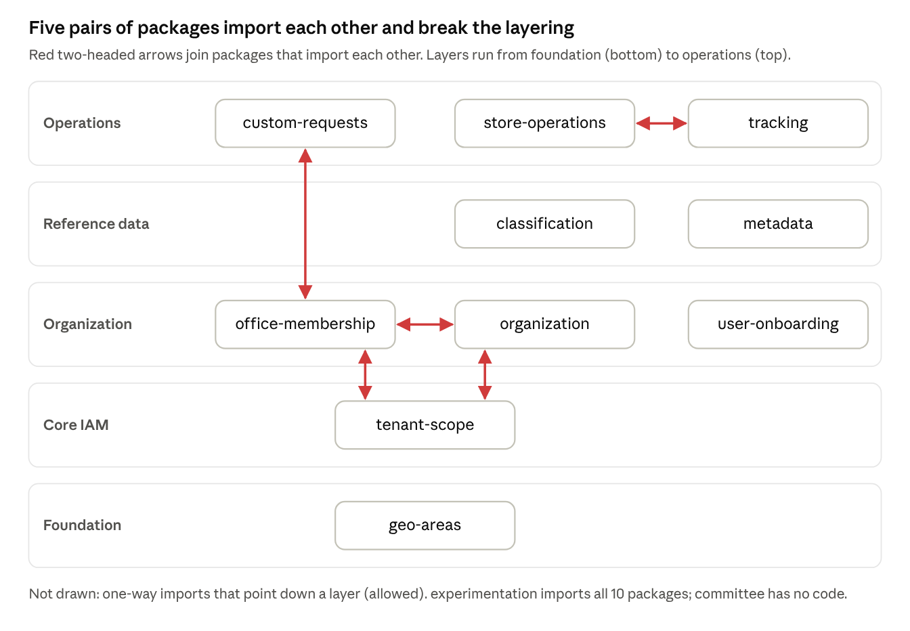

# gov-store Gap Assessment

Oct 4, 2026 · @zahid

## Executive summary

gov-store covers a lot of ground, but it is not ready for production yet. It has 11 working packages plus one that is only planned (committee), adding about 45,000 lines of PHP and Blade on top of Snipe-IT. The blocking gaps are missing route-level authorization, almost no automated tests, and a tenant-scope bug that hides stock from the superadmin view.

**What is in good shape**

- Clear bounded contexts: one package each for tenancy, organization, membership, requests, store operations, classification, tracking and metadata.
- A document-driven store ledger (draft → ready → posted, immutable movements, kardex register) and a full request → approval → fulfillment flow.
- Bangla/English language files with matching keys in 6 of 8 localized packages, and one consistent AdminLTE layout (75 views extend `layouts/default`).

**Top gaps**

1. **Authorization relies on hiding menu items.** 37 Store Operations actions (posting GRN/GIN, Product Rules Studio) and 30 Classification actions (import, adoption, collections) have no permission check on the route or controller. Any logged-in user who knows the URL can reach them.
2. **The superadmin Global Overview shows zero office stock.** `MinistryLocationScope` ignores the `isGlobal` flag and adds `1 = 0` when no office is set.
3. **Almost nothing is tested.** There is one test file (experimentation) across 12 packages, and the root `phpunit.xml` and CI never run anything under `packages/`.
4. **The packages are tightly coupled.** The base `tenant-scope` layer imports Organization and Office Membership models, which creates dependency cycles. No package's `composer.json` declares what it depends on.
5. **Several features are incomplete.** Committee is only a plan. Only receipt and issue documents work (adjustment and transfer exist as models but have no document flow). Components cannot be requested, and approvals send no notifications.
6. **The UI has gaps.** Menu titles are hard-coded in English in 7 packages. The views have 19 `aria-*` attributes and 1 `alt` between them, plus 1,413 inline `style` attributes.

**Recommendation:** run a 2–3 week hardening phase before any new feature work: route authorization, the scope fix, and removing debug code. Then build test coverage, finish the half-built document types, and polish the UI for Bangla and accessibility (see the roadmap).

## Scope and method

This is a static code review of `packages/gov-store` in the `asset-store-bd` repository (Snipe-IT fork, Laravel 12, PHP 8.2), as of the latest commit (`76934cd8eb update seeding`). The application was not run, so UI findings come from the Blade source, not from screenshots.

What was reviewed:

- Package manifests, service providers, and root `composer.json` / `config/app.php` registration
- Routes, controllers, middleware, and services for authorization and data-scoping behaviour
- 120 Blade views and the `en-US` / `bn-BD` language files
- The existing reports in the repo (July 2026 codebase and multi-tenant security audits, the Store Operations diagnostic report, the experimentation README). Their claims were re-checked against the current code before being reused here.

Severity scale used in the gap table:

| Severity | Meaning |
| --- | --- |
| Critical | Security or data-integrity risk, or a core workflow that is broken; blocks production |
| High | A significant missing feature or quality gap that will hurt users or maintainers soon |
| Medium | Inconsistency or debt that slows delivery or degrades the experience |
| Low | Hygiene; fix opportunistically |

## Current package inventory

There are 12 package folders: 11 have code and 1 (committee) is only a plan. Together they hold about 28,700 lines of PHP, 16,400 lines of Blade and 171 route definitions, and have 1 test file.

| Package | Responsibility | PHP lines | Blade lines | Routes | Tests | State |
| --- | --- | --- | --- | --- | --- | --- |
| store-operations | GRN/GIN documents, inventory ledger, kardex register, Product Rules Studio | 5,415 | 3,141 | 30 | 0 | Partial: receipt and issue only |
| classification | UNSPSC/CGA/HS reference catalog, collections, adoption into Snipe-IT categories | 4,203 | 3,172 | 39 | 0 | Working; plan phases still open |
| tracking | Initiatives, tracking codes, targets, allocations, retrospectives | 4,110 | 4,452 | 16 | 0 | Working; heaviest UI |
| custom-requests | Request catalog, basket, approvals, fulfillment queue and register | 2,928 | 1,979 | 25 | 0 | Working; duplicate `/admin` route |
| organization | Office provisioning, office hub, ICT jurisdictions, ministry directory, company admins | 2,811 | 1,599 | 21 | 0 | Working |
| experimentation | Super-admin demo data: populate, wipe, installation reset | 2,818 | 85 | 10 | 1 | Working; dev-only |
| office-membership | Memberships, role assignment, role handshakes, clearance rules, override console | 2,391 | 1,064 | 17 | 0 | Working |
| tenant-scope | Tenant context, global query scopes, boundary policies, unified menu | 2,376 | 743 | 8 | 0 | Working; Global view bug |
| metadata | Custom-field convergence for asset models, health page | 1,071 | 95 | 2 | 0 | Working |
| user-onboarding | Queue for assigning new users to an office | 312 | 73 | 2 | 0 | Minimal |
| geo-areas | Bangladesh division → union hierarchy and search API | 292 | 0 | 1 | 0 | Working; debug `dd()` left in |
| committee | Committee registry for receiving, inspection, audit and similar committees | 0 | 0 | 0 | 0 | Plan only (`plan.md`) |

**Packaging and tooling gaps**

- **Dependencies are undeclared.** Every `composer.json` has an empty `require` (only metadata and tracking name PHP or Laravel), yet the packages import each other's classes (diagram below).
- **Licensing is mixed.** 8 packages say MIT, metadata and tracking say “proprietary”, and the host Snipe-IT is AGPL-3.0-or-later.
- **The tracking namespace casing is wrong.** The root `composer.json` and `config/app.php` register `GovStore\tracking\`, but the code declares `GovStore\Tracking\`. It works only because the package's own autoload entry masks the mismatch.
- **Registration is manual and duplicated.** All 11 providers are listed in `config/app.php` and their PSR-4 paths are repeated in the root `composer.json`. organization, metadata, tracking and experimentation have no `extra.laravel.providers`, and experimentation is missing from the root `require`.
- **Nothing is versioned.** Every package is required as `dev-master`, and none has a changelog.
- **Two migration filenames are malformed:** `2026__08_04_create_gov_catalog_collections_table.php` and `2026_07_12_xxxxxx_update_gov_tables_for_onboarding.php`. Their run order is unreliable on a fresh install.
- **Documentation is scattered.** 8 reports and plans sit inside package folders, and only experimentation has a README.

The base `tenant-scope` layer reads Organization and Office Membership models directly, and office-membership in turn imports custom-requests. Because of this, no package can be installed or tested on its own. Breaking these five loops is task G5 in the roadmap.

## Current feature inventory

Of 19 feature areas, 8 are complete, 8 are partial and 3 are missing. The office, membership and ledger foundations are solid. The gaps cluster around workflow completeness: the other document types, committees, notifications, and an API.

| Feature area | What exists today | Main routes | Maturity | Main gap |
| --- | --- | --- | --- | --- |
| Office provisioning | Create and onboard offices with geo verification and duplicate check; office hub with roles; ICT jurisdictions; bilingual ministry directory import; company admins; readiness pages | `/gov-store/admin/organization/*`, `/gov-store/office/*` | Complete | None blocking |
| Membership and roles | Join by token or invite code; approve/reject; switch working office; role handshakes; release gated by clearance rules; superadmin override console with audit log | `/gov-store/my-memberships/*` | Complete | Role assignment and handshake controllers have no permission checks |
| Inventory ledger and register | Immutable movements with running balance, per-item kardex, ledger repair command, quantity sync back to Snipe-IT | `/gov-store/operations/register`, `/kardex/*` | Complete | No export |
| Product Rules Studio | Profiles and policies built from capabilities (serial, warranty, quantity, programme tracking); draft, simulate, preview impact, publish; assign to categories and models | `/gov-store/operations/settings/product-rules/*` | Complete | Routes reachable by any logged-in user |
| Programme tracking | Funding types, initiatives and workspace, operation units, tracking codes with a 3-level matrix, geography and participant scopes, GRN validation handshake, retrospectives, report | `/gov-store/admin/tracking/*` | Complete | Document upload controller points at a model that does not exist (`TrackingReference`) and is not routed |
| Geography | Division → district → upazila → union data and select2 search API | `/gov-store/api/geo/search` | Complete | `dd()` diagnostic page on a non-AJAX call |
| Fulfillment | Fulfillment queue, issue against a request with substitutions, close, fulfillment register | `/gov-requests/fulfillment*` | Complete | Bulk asset fulfillment not supported |
| Demo data | Populate, resume, wipe and installation reset with encrypted backups; CLI | `/gov-store/admin/experiments` | Complete | Dev-only by design |
| Tenancy and data isolation | Per-request tenant context; office scope on assets, consumables, accessories, components, licenses; reference scope on categories, models, suppliers, manufacturers, locations; scoping dashboard, policy configurator, boundary explorer | `/gov-store/admin/scope/*` | Partial | Global view returns no rows; `Schema::hasColumn` runs on every scoped query; 104 `withoutGlobalScope` calls (33 in `app/`, 71 in packages) |
| Store documents (GRN/GIN) | Draft → Ready → Posted lifecycle, line items, attachments, preview, validation checklist, print | `/gov-store/operations/hub`, `/documents/{type}/{id}` | Partial | Only `receipt` and `issue` work; stock adjustment and transfer have models or capabilities but no document flow; nothing acts on the Ready state |
| Request catalog and basket | Browse requestable items, draft basket, update quantities, submit with purpose, justification and cost centre | `/gov-requests/catalog`, `/basket` | Partial | No component adapter, so components cannot be requested |
| Approvals | Location-role approvers, approval policies, approve, reject, process | `/gov-requests/admin/*` | Partial | No notifications, delegation, escalation or SLA; `/admin` is defined twice |
| Classification catalog | Import of UNSPSC/CGA/HS; search, explorer, collections, bulk adoption, office copy, governance registry, organization catalog, starter templates | `/admin/catalog/*` | Partial | External catalog source is a disabled placeholder; admin routes have no permission checks |
| Metadata convergence | Logical schema mapped to Snipe-IT custom fieldsets, provider registry, converge job, health page | `/gov-store/admin/metadata/health` | Partial | Only 3 hard-coded domain providers (baseline, laptop, police) and no editor UI |
| User onboarding | Queue of new users waiting for an office assignment | `/gov-store/admin/onboard` | Partial | One screen, untranslated |
| Reporting and dashboards | Scoping dashboard, initiative report, stock register | various | Partial | No charts and no CSV/Excel export from operational lists |
| Committees | Planned registry of official committees and members (`committee/plan.md`) | none | Missing | Needed for receiving/inspection verification of GRNs |
| Notifications | No mail or in-app notifications in any workflow package | none | Missing | Requesters and approvers must poll screens |
| REST API | Only 3 session-authenticated AJAX endpoints (tracking); no token API for gov-store data | none | Missing | Blocks mobile apps and integrations |

## UI assessment

The outer shell is consistent: all 75 page views extend Snipe-IT's AdminLTE 2 / Bootstrap 3 layout and set a page title. Inside that shell, quality is uneven. Bangla coverage, accessibility, small-screen layout and styling discipline all fall short of what a government-wide rollout needs.

| Dimension | Finding | Evidence |
| --- | --- | --- |
| Layout and design system | One shell, but no shared gov-store component library; widgets are rebuilt per page | 768 Bootstrap 3 / AdminLTE classes vs 23 Bootstrap 4/5-only classes (`d-flex`, `ms-*`, `form-select`) that do nothing under Bootstrap 3; no `<x-*>` Blade components in use |
| Styling discipline | Presentation lives in markup, not CSS | 1,413 inline `style=""` attributes; 24 views with their own `<style>` block |
| Front-end code | Page logic is written inline and never bundled or linted | 57 views with inline `<script>`; the tracking-code matrix is 11 JS partials (state, renderer, drag-drop, clipboard, keyboard) inside Blade; 23 `console.log` calls left in |
| Navigation | One central menu registry, but it is bolted on: 5 middlewares rewrite `</body>` in every HTML response | `InjectTenantScopeUi`, `InjectGovStoreUi`, `InjectMembershipUi`, `InjectStoreOperationsUi`, `InjectTrackingUi`; URL prefixes vary (`/gov-requests`, `/admin/catalog`, `/gov-store/...`) |
| Breadcrumbs | Missing on gov-store pages, against the repo's own convention that every UI route has one | Only 3 breadcrumb definitions, all in experimentation |
| Bangla localization | Good key parity where language files exist, but menus and several screens are English-only | organization is missing 20 `bn-BD` keys and experimentation 7; metadata, user-onboarding and geo-areas have no language files; menu titles are hard-coded in English in 7 packages; about 100 lines of English text are hard-coded in views (tracking ~46, classification ~30, store-operations ~19) |
| Accessibility | Far below WCAG 2.1 AA expectations for public-sector software | Across 120 views: 19 `aria-*` attributes, 18 `role`, 1 `alt`; 148 `<label>` elements for 280 inputs and selects; 730 Font Awesome icons, mostly without text alternatives; status shown by label colour alone |
| Responsiveness | Built for desktop; most screens collapse to a single column below 992 px | 219 `col-md-*` vs 36 `col-sm-*` and 17 `col-xs-*`; wide grids (tracking matrix, document line items) are not designed for store-room tablets |
| Lists and tables | No sort, search, column chooser or export the way Snipe-IT's own lists have | No bootstrap-table usage; 11 `paginate()` calls in 5 packages, so lists in custom-requests, organization, office-membership and tracking load every row |
| Dashboards and feedback | Text-only dashboards; no notification inbox | No charts, even though Chart.js 2.9 ships with the host app |
| Interaction model | Two patterns side by side | One Livewire component (classification search), while the repo guide says Blade without Livewire |

Raw `{!! !!}` output appears 4 times, and all 4 print static HTML, so none is an XSS risk today. They are still worth moving into components so they can be translated.

## Gap analysis

There are 20 gaps: 3 critical, 8 high, 8 medium and 1 low. Critical and high gaps cluster in authorization, data scoping, testing and the unfinished store workflows.

| ID | Area | Gap and evidence | Impact | Severity |
| --- | --- | --- | --- | --- |
| G1 | Security | Store Operations (37 actions, including posting GRN/GIN and publishing product rules) and Classification admin (30 actions, including import execution and bulk adoption) have no route- or controller-level permission check. The menu registry only hides links. | Any logged-in user can post ledger entries or change product rules by typing the URL | Critical |
| G2 | Data isolation | `MinistryLocationScope` ignores `TenantContext::isGlobal` and adds `1 = 0` when no office is set. | Superadmin Global Overview shows zero stock; national oversight is impossible | Critical |
| G3 | Testing | 1 test file (experimentation) across 12 packages; `phpunit.xml` and the 3 CI test workflows cover only `tests/`. | Ledger, scoping and approval logic can regress silently | Critical |
| G4 | Data isolation | Company admins are scoped to the company, not the office (July audit finding 1.1, still true). There are 104 `withoutGlobalScope` calls (33 in `app/`, 71 in packages). | Cross-office reads and writes inside a ministry; every bypass needs review | High |
| G5 | Architecture | Import cycles: tenant-scope ↔ organization ↔ office-membership, office-membership ↔ custom-requests, store-operations ↔ tracking. No package declares its dependencies. | Packages cannot be installed, tested or versioned on their own | High |
| G6 | Store workflows | Only `receipt` and `issue` document types work. `StockAdjustment` and the transfer capability have no document flow, and nothing acts on the Ready state. | Losses, write-offs and inter-office transfers bypass the ledger or happen in core Snipe-IT | High |
| G7 | Store workflows | The committee package exists only as `plan.md`. | Receiving and inspection committees for GRNs cannot be recorded or enforced | High |
| G8 | Workflow | No mail or in-app notifications for requests, approvals, fulfillment or role handshakes. | Slow approvals; users must poll screens | High |
| G9 | Localization | Menu titles are English in 7 packages; about 100 view lines are hard-coded in English; metadata, user-onboarding and geo-areas have no language files; 27 `bn-BD` keys are missing. | Bangla-first users meet mixed-language screens | High |
| G10 | Accessibility | 19 `aria-*`, 18 `role` and 1 `alt` across 120 views; 148 labels for 280 form fields; status shown by colour alone. | Fails WCAG 2.1 AA expectations for public-sector software | High |
| G11 | Code hygiene | `dd()` in `GeoAreaController`; 23 `console.log` calls; `TrackingDocumentController` imports a missing `TrackingReference` model; `/gov-requests/admin` is defined twice; a “relationships remain unchanged” placeholder comment in `TrackingCode.php`. | Debug output reachable in production; dead code hides a missing document feature | High |
| G12 | Authorization design | Checks are hand-written in controllers (`isSuperUser`, `hasAccess`), with no FormRequest or Policy classes and a single `Gate::define`. | Inconsistent rules; hard to audit who can do what | Medium |
| G13 | Performance | `Schema::hasColumn` runs on every scoped query, and list screens in 4 packages load all rows without pagination. | Slow pages once offices hold real volumes | Medium |
| G14 | Feature | No component adapter in custom-requests, so components cannot be requested. | Store items that exist cannot be requested | Medium |
| G15 | Integration | No token-authenticated REST API for gov-store data; the tracking “API” runs on the web session. | No path for mobile apps, e-GP or other government systems | Medium |
| G16 | UI architecture | 1,413 inline styles, 57 inline-script views, Bootstrap 4/5 classes under Bootstrap 3, no shared Blade components. | Visual drift and slow UI changes | Medium |
| G17 | UI navigation | Menus injected by rewriting `</body>`; three URL prefix styles; no breadcrumbs. | Fragile navigation and a disorienting information architecture | Medium |
| G18 | UI lists and reporting | No sort, search, column chooser or export on gov-store lists; no charts on dashboards. | Officers export by hand; managers lack at-a-glance views | Medium |
| G19 | Packaging | Namespace casing mismatch (`tracking`), mixed MIT/proprietary licences under an AGPL host, `dev-master` only, malformed migration names, manual provider registration. | Fragile installs and an unclear licensing position | Medium |
| G20 | Documentation | No per-package README (except experimentation); plans and audit reports scattered inside package folders. | Slow onboarding for new developers | Low |

## Recommendations and roadmap

Close the three critical gaps in a 2–3 week hardening phase before any new features. Then build the test safety net, finish the store workflows, and run the UI work alongside from week 5. Efforts are rough estimates for one developer who knows the codebase; G-numbers refer to the gap table.

**Phase 0: Harden (weeks 1–3)**

- [ ] Put `can:` middleware or Policies on every Store Operations and Classification route, using the menu registry's permission map as the single source of truth (G1, G12). About 5 days.
- [ ] Make `MinistryLocationScope` and `TenantScope` honour `isGlobal`, and cache column checks per table (G2, G13). 1–2 days.
- [ ] Decide whether company admins are ministry-wide or office-bound, enforce that rule, and review the 104 `withoutGlobalScope` calls (G4). About 5 days.
- [ ] Remove the `dd()`, the `console.log` calls, the duplicate `/admin` route and the dead `TrackingDocumentController` (G11). 1 day.

**Phase 1: Safety net and structure (weeks 3–7)**

- [ ] Add package test folders to `phpunit.xml` and CI. Write feature tests for tenant scoping, GRN/GIN posting and ledger balances, and the request → approval → fulfillment flow (G3). 3–4 weeks.
- [ ] Break the import cycles by moving shared lookups (membership, office profile) behind tenant-scope interfaces or a new `gov-store/core` package. Declare `require` in each `composer.json`, fix the tracking namespace, enable auto-discovery and rename the two malformed migrations (G5, G19). 1–2 weeks.

**Phase 2: Complete the workflows (weeks 7–14)**

- [ ] Add stock adjustment and inter-office transfer document types on the existing document engine (G6). 2–3 weeks.
- [ ] Build the committee package from `committee/plan.md` and use it to verify the Ready → Posted step (G7). About 3 weeks.
- [ ] Add mail and in-app notifications for request, approval, fulfillment and handshake events (G8). 1–2 weeks.
- [ ] Add a component adapter to custom-requests (G14) and wire up tracking document upload (G11). About 1 week.

**Phase 3: UI quality (weeks 5–14, alongside phases 1–2)**

- [ ] Finish Bangla: move menu titles and hard-coded text into language files, add language files for metadata, onboarding and geo, and fill the 27 missing keys (G9). 1–2 weeks.
- [ ] Do an accessibility pass to WCAG 2.1 AA (labels, `aria-label` on icon buttons, status not shown by colour alone) and run the repo's existing `pa11y.js` in CI (G10). About 2 weeks.
- [ ] Create shared Blade components (page header, status badge, form field, data table), one gov-store stylesheet, and JavaScript bundled through Laravel Mix; retire inline styles screen by screen (G16). About 3 weeks.
- [ ] Add breadcrumbs, move everything under one `/gov-store/` prefix with redirects from the old paths, and render the menu through a view composer instead of rewriting responses (G17). About 1 week.
- [ ] Move lists to bootstrap-table with server-side pagination and export, and add Chart.js to the dashboards (G18, G13). About 2 weeks.

**Phase 4: Integration and housekeeping (after week 14)**

- [ ] Build a Passport-authenticated REST API with transformers, following the host app's API pattern (G15). 3–4 weeks.
- [ ] Write a README for each package, move reports into `docs/`, and choose licences compatible with the AGPL host (G19, G20). 2–3 days.
