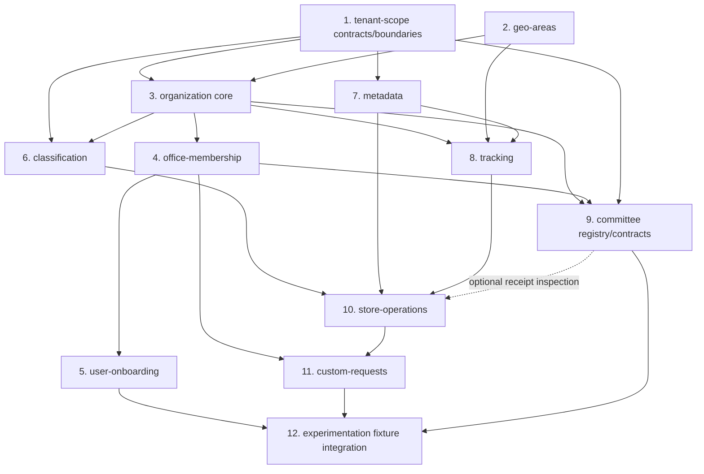

# gov-store Package-wise Gap Analysis

Original review: 4 October 2026 · @zahid. Reassessed: **7 October 2026 (Asia/Dhaka)** at `a65c7f864f`.

## Updated scorecard

**19 of the original 64 gaps are mitigated (29.69%); 7 are partially mitigated; 38 remain open.** There are **45 gaps requiring further work**, including the partial rows. The package sections below are arranged in dependency order, with foundations before their consumers.

Tenant-scope implementation update: **7 October 2026 (Asia/Dhaka), working tree**. The original reassessment revision above remains the baseline for the other packages. See [tenant-scope implementation and verification](../verification/tenant-scope-implementation-2026-10-07.md).

These are implementation statuses, not production closure. Office-role enforcement still has outstanding G1 rollout requirements. A package with mitigated rows can also have deployment, historical-data or policy work remaining.

| Order | Package | Original gaps | Mitigated | Partial | Open | Next dependency-relevant work |
| --- | --- | --- | --- | --- | --- | --- |
| 1 | tenant-scope | 7 | 7 | 0 | 0 | Deploy resolver/job contracts; retain outstanding G1 rollout gates |
| 2 | geo-areas | 4 | 0 | 0 | 4 | Remove debug dump; establish versioned geography |
| 3 | organization | 6 | 1 | 1 | 4 | Safe schema ownership; office type and provisioning event |
| 4 | office-membership | 5 | 1 | 0 | 4 | Secure role transfers; complete clearance rules |
| 5 | user-onboarding | 4 | 0 | 0 | 4 | Queue system-created users using membership services |
| 6 | classification | 7 | 1 | 0 | 6 | Consume provisioning event; queue bulk adoption |
| 7 | metadata | 4 | 0 | 0 | 4 | Stabilize provider and field-mapping contracts |
| 8 | tracking | 7 | 0 | 0 | 7 | Fix projection refresh and scoped evaluation |
| 9 | committee | 2 | 1 | 1 | 0 | Registry delivered; complete consumer integration boundary |
| 10 | store-operations | 8 | 2 | 3 | 3 | Ledger cut-over, remaining document types and receipt fields |
| 11 | custom-requests | 6 | 5 | 1 | 0 | Complete item adapters after stock contracts |
| 12 | experimentation | 4 | 1 | 1 | 2 | Isolated fixture CI, packaging and restore |
| **Total** | **12 packages** | **64** | **19** | **7** | **38** | **45 still require work** |

Original severities are preserved for reconciliation with the baseline. They are not a new assessment of residual risk.

| Original severity | Original gaps | Mitigated | Partial | Open |
| --- | --- | --- | --- | --- |
| Critical | 3 | 3 | 0 | 0 |
| High | 19 | 6 | 3 | 10 |
| Medium | 31 | 7 | 4 | 20 |
| Low | 11 | 3 | 0 | 8 |
| **Total** | **64** | **19** | **7** | **38** |

### Counting and evidence

- **Mitigated:** the original defect or missing control has an implemented remedy supported by inspected source and relevant tests or recorded verification. An equivalent supported workflow can replace the originally suggested fix.
- **Partial:** a compound gap has only some parts addressed, or its foundation exists but the consumer workflow is missing. Partial rows are excluded from the mitigated count.
- **Open:** the original defect or capability remains unresolved.

Each ID combines a package prefix with its **original row number**. The denominator remains 64: overlapping findings remain separate original rows, while deeper analyses are linked rather than added. Removing the request legacy path, for example, addresses both CR-1 and CR-2. Additional ledger risks must still be handled even though they are outside this original inventory.

The baseline was a static review at `76934cd8eb`. This reassessment inspected current source, routes, manifests, migrations, language files and tests, and cross-checked:

- [G1 execution and outstanding rollout](g1-unprotected-actions-analysis.md)
- [Custom Requests implementation, verification and operational work](../verification/custom-requests-refactor.md)
- [Committee implementation](../verification/committee-implementation-2026-10-05.md) and [UI verification](../verification/committee-ui-redesign-2026-10-05.md)
- [Store Operations deeper analysis and 6 October implementation update](store-operations-package-gap-analysis.md)
- [Custom Requests deeper baseline](custom-requests-package-gap-analysis.md)

The companion [cross-cutting assessment](gov-store-gap-assessment.md) still contains historical claims, including “committee is plan only” and “only one test file”. Use this reassessment and execution records for current package status; its G1–G20 identifiers form a separate inventory. Historical line counts, catalog totals and screenshots are not new runtime measurements.

## Package dependency order

The numbered sections are the recommended **primary implementation order**. A consumer requires the specific upstream contract or invariant listed here, not completion of every upstream UI improvement. Independent branches can proceed once their own prerequisites are available.

Current imports contain cycles, so a strict one-pass ordering of the existing implementation is impossible. Define resolver and extension contracts in foundational packages first, then bind them from consumers. This order is a mitigation plan for those cycles, not a claim they are already removed.

| Order | Package | Prerequisite to complete first | Reason and handoff |
| --- | --- | --- | --- |
| 1 | tenant-scope | Host authentication/core models | Trustworthy context and abilities support all protected consumers. Organization/membership resolver interfaces and owning-package adapters are delivered under TS-3. |
| 2 | geo-areas | Core geography schema | Independent of tenant fixes; supplies geography to offices and jurisdiction checks. Can proceed alongside package 1. |
| 3 | organization | Tenant resolver contracts; geography boundaries | Establish office/company identity, safe table ownership, office type and a committed provisioning event. Finish core provisioning first; return to closure after membership clearance. |
| 4 | office-membership | Office/admin identity; tenant contracts | Authorized memberships/responsibilities support onboarding, registrars and approvers. Publish clearance extension points instead of importing consumers. |
| 5 | user-onboarding | Authorized membership assignment; office routing | Queue system-created users and assign through membership services. This branch does not block catalog or metadata. |
| 6 | classification | Provisioning event/office type; tenant-aware job context | ORG-2 must precede CL-2 starter catalogs. Adoption supplies categories/models to inventory consumers. |
| 7 | metadata | Tenant context; native asset models/custom fields | Stabilize mappings before serialized receipts consume them. Independent of catalog search/UI fixes; verify provisioned models at the classification handoff. |
| 8 | tracking | Office/geography scope; metadata provider extension | Repair projections and publish scoped programme verifier/event contracts before Store Operations integrations. Return to asset-event verification after receipt posting emits the event. |
| 9 | committee | Office identity; memberships/registrar; tenant abilities | Registry and roster contracts already exist. Complete the consumer boundary before optional inspection; do not rebuild the registry. Tracking consumers use its scope contract where needed. |
| 10 | store-operations | Tenant abilities; catalog identities; metadata; tracking verifier; committee contracts for optional inspection | Stabilize ledger opening/cut-over, state rules and stock issuing before request fulfillment. Receipt inspection remains deferred under the recorded decision. |
| 11 | custom-requests | Membership responsibilities/clearance; Store Operations issuing/opening stock | Complete adapters after stock/reservation semantics. Reuse delivered cover/notices and register request clearance from this package. |
| 12 | experimentation | Stable schemas/contracts of fixture consumers | Update integration fixtures after business contracts stabilize. Begin isolated test setup/CI alongside package 1, without waiting for final fixture integration. |



Arrows show selected handoffs after contract extraction, not every current import. Tenant context remains a prerequisite for every protected consumer.

### Required returns and completion gates

| Dependency | First pass | Return / completion condition |
| --- | --- | --- |
| tenant-scope ↔ organization/membership | Resolver contracts and owning-package bindings delivered under TS-3 | Shared-context reset, active membership ownership and immediate role updates verified locally. Consumers must preserve these invariants; other workflow cycles remain separate gaps. |
| organization ↔ membership clearance | Finish office identity/provisioning and safe ownership | Complete ORG-1 closure after OM-2 and request/committee clearance extensions cover holdings and obligations. |
| organization → classification | Define office type; emit provisioning event after commit | Close ORG-2/CL-2 with a provisioning-to-starter-catalog test, explicit job context and safe retries. |
| tracking ↔ store-operations | Repair TR-1; establish verifier/event boundary | Close TR-2 only after successful serialized receipt posting updates programme associations/projections once. A listener alone is insufficient. |
| committee → store-operations | Retain delivered resolver/snapshot/purpose contracts | CM-2, SO-3 and SO-4's committee reference need consumer integration and policy review. Inspection is deferred and does not block other repairs/current direct posting. |
| store-operations → custom-requests | Review opening stock, canonical identities, stock locks and issuing contract | Verify reservations/issue/return against that ledger before exposing new adapters. Recheck live cut-over state; the 6 October record reports empty opening markers and historical aliases. |

Run focused isolated checks at each handoff. Address reachable debug/authorization defects immediately; package order is not a reason to delay a security fix. Deliver bilingual controls, safe failures and accessibility within each package, with whole-workflow usability and observation before enforcement.

## 1. tenant-scope

**7 mitigated, 0 partial, 0 open** in this original inventory. The 7 October implementation corrects stock reads without granting cross-office mutations, extracts context resolver contracts with owning-package adapters, unions capabilities, establishes job/command execution boundaries, caches schema knowledge and renders navigation through the layout. This is local implementation closure; CI, deployment and G1 rollout remain separate.

**Internal order:** TS-1/2 with distinct read/mutation boundaries → TS-3/4/5 → TS-6/7. Contract extraction starts here and finishes in owning-package adapters.

| ID | Original severity | Status | Current finding and evidence | Remaining mitigation |
| --- | --- | --- | --- | --- |
| TS-1 | Critical | Mitigated | Validated `isGlobal` bypasses stock read scope; selected offices remain isolated. Global inventory mutations are refused by model policy and the inventory builder. Live global counts match raw nondeleted totals. | Preserve this read/mutation separation in new consumers. |
| TS-2 | High | Mitigated | Physical stock reads use separate inventory-office/company bounds. ICT jurisdictions authorize office/user support only and never reveal office stock; an independent inventory responsibility stays within its working office. Model ownership includes original values; bulk updates/deletes/counters, OR predicates and direct inserts cannot escape the working office. [ICT boundary regression verification](../verification/ict-jurisdiction-inventory-boundary-2026-10-07.md). | Native licenses have company ownership without an office column; independently authorized inventory users retain company-bound license reads. Pure ICT support users see no inventory or inventory reports. Do not claim physical-office license ownership. |
| TS-3 | High | Mitigated | `OrganizationContextResolver` and `MembershipContextResolver` live in tenant-scope, with bindings/adapters in their owners. Initializer, assignment, access and boundary services consume contracts. Context reset stays in place; foreign, inactive, deleted-office and stale memberships fail closed. | This extracts the context dependency cycle; remaining business-workflow cycles belong to their own package gaps. |
| TS-4 | Medium | Mitigated | `EffectivePermissionSet::merge()` provides an idempotent union while retaining working-role attribution. Company overlay is injected once, preserving local capabilities; native admin never supplies global/company scope. | Maintain role sources and test changes to capability profiles. |
| TS-5 | Medium | Mitigated | `TenantExecution` validates live actor, office/company target, membership and named ability. All four current GovStore jobs declare scoped execution or explicit global maintenance; bus/queue lifecycle clears context and restores synchronous callers. Commands have a reviewed execution registry; ledger opening additionally uses the scoped actor runner. | Restart long-running workers on deployment. Starter-catalog provisioning/payload gaps (CL-2/CL-5) remain separate; this does not announce queued adoption rollout. |
| TS-6 | Medium | Mitigated | `SchemaKnowledge` caches columns per connection/database/table. Menu rendering resolves roles once per render. Isolated query checks bound initialization to ≤12 queries, a 30-item menu to ≤5 role queries, and five warm stock counts to exactly five SELECTs. Membership/role/grant checks stay fresh. | No session cache of authorization. Clear schema knowledge/restart workers after schema changes. |
| TS-7 | Medium | Mitigated | Sidebar, My access and rollout banner render as layout partials; response-body rewriting is removed. `MenuRegistry` still derives named route abilities. Eight tenant-administration routes now declare superuser abilities, with national review/fingerprint/replay controls on mutations. | Other packages retain their own narrower policies; G1 coverage is not proof of every application surface. |

Verification and operational limits are recorded in [the tenant-scope execution record](../verification/tenant-scope-implementation-2026-10-07.md) and [read-only live counts](../verification/tenant-scope-live-2026-10-07.json).

## 2. geo-areas

**0 mitigated, 0 partial, 4 open.** Reference geography supports office and programme boundaries.

**Internal order:** GEO-1 → GEO-2 → GEO-3/4; display/search improvements do not block office schema work.

| ID | Original severity | Status | Current finding and evidence | Remaining mitigation |
| --- | --- | --- | --- | --- |
| GEO-1 | High | Open | `GeoAreaController::search` still calls `dd()` for empty non-AJAX search. | Remove the diagnostic branch; return safe JSON and cover this request shape. |
| GEO-2 | Medium | Open | No maintained source/version/refresh workflow; the baseline `divison` type spelling remains a compatibility concern. | Record provenance/version; review additive type correction and update consumers before changing identifiers. |
| GEO-3 | Medium | Open | Search combines English/Bangla in `text`; no package language files. | Return both names and select by locale, preserving dropdown compatibility. |
| GEO-4 | Low | Open | Contains search remains; baseline row count is not a current performance measurement. | Measure and introduce prefix/full-text lookup when scale warrants it. |

## 3. organization

**1 mitigated, 1 partial, 4 open.** `configured` exists alongside provisioned/operational; suspend/merge/closure remain absent.

**Internal order:** ORG-3 safe ownership → ORG-2 office type/event → ORG-1 after complete clearance. Localization/cleanup can proceed within the package.

| ID | Original severity | Status | Current finding and evidence | Remaining mitigation |
| --- | --- | --- | --- | --- |
| ORG-1 | High | Open | No supported suspend, merge, relocate or close workflow. | Add authorized audited transitions; require complete membership/consumer clearance before closure. |
| ORG-2 | High | Open | `provisionOffice()` still returns without a defined/dispatched `OfficeProvisioned` event; classification listens for it. | Define after-commit event and profile office type; test starter handoff with CL-2. |
| ORG-3 | Medium | Partial | Custom Requests no longer owns the deprecated role table/model; current role writes use `OfficeResponsibility`. Organization's `2024_01_04` migration still drops/recreates tables, and `LocationRole` remains. | Establish one owner and additive upgrades; remove proven unused legacy code while preserving role data/installed migration identities. |
| ORG-4 | Medium | Mitigated | G1 access-request/admin review supplies expiring `gov_access_grants`; request `ApprovalRouting` uses responsibilities and unexpired cover. This replaces unused delegate columns and addresses leave cover. | Preserve expiry/next-request checks. Legacy-column cleanup is ORG-3; rollout/mail setup remain operational. |
| ORG-5 | Medium | Open | Current language files have 282 English/262 Bangla keys (20 missing); office registry still uses `get()`. | Complete keys and bounded list pagination; verify directory/registry behavior. |
| ORG-6 | Low | Open | `InjectOrganizationUi` remains unused integration code. | Confirm no consumer, then remove middleware/empty hooks. |

## 4. office-membership

**1 mitigated, 0 partial, 4 open.** G1 access review does not secure every original transfer endpoint.

**Internal order:** OM-1 → OM-2; retain corrected OM-3 extension boundary. Return to office lifecycle after clearance.

| ID | Original severity | Status | Current finding and evidence | Remaining mitigation |
| --- | --- | --- | --- | --- |
| OM-1 | High | Open | Controllers lack complete authorization. Participant checks and handshake role checks exist, but `proposeTransfer` does not establish authority over the supplied office/role/recipient. | Check actor/office, recipient active membership, role ownership and state; lock/recheck transitions and test cross-user/cross-office actions on both paths. |
| OM-2 | High | Open | `NoActiveAssetsRule` checks assets only; complete accessory/component/licence/consumable holding clearance is absent. | Define rules for each holding type and request-return obligations before release/office closure. |
| OM-3 | Medium | Mitigated | `CustomRequests/Rules/NoPendingRequestsRule` is registered by its provider with `ClearanceEngine`; membership no longer imports it. | Preserve consumer registration; committee likewise registers its own vacancy rule. |
| OM-4 | Medium | Open | Original handshake/membership/release notification workflows remain incomplete. G1/request notices do not close this broader gap. | Add durable after-commit notices and optional mail without reverse consumer imports. |
| OM-5 | Medium | Open | Menu localization and breadcrumbs remain unfinished. | Translate titles and add navigation through shared layout. |

## 5. user-onboarding

**0 mitigated, 0 partial, 4 open.** Queue pagination exists; the original four gaps remain.

**Internal order:** UO-1/2 after authorized membership assignment; deliver notices/localization with transitions.

| ID | Original severity | Status | Current finding and evidence | Remaining mitigation |
| --- | --- | --- | --- | --- |
| UO-1 | High | Open | Observer `created()` still returns without an authenticated creator; system-created users can miss the queue. | Queue with existing SYSTEM owner type; test unauthenticated creation without inventing office/admin. |
| UO-2 | Medium | Open | No supported cancel/reject/reassign transitions consume CANCELLED. | Add authorized state transitions, reason and assignment audit. |
| UO-3 | Medium | Open | Completion lacks user/admin notices. | Deliver durable after-commit notices for the assigned membership/office. |
| UO-4 | Medium | Open | No package English/Bangla language files. | Localize queue/transitions and verify parity. |

## 6. classification

**1 mitigated, 0 partial, 6 open.** G1 controls national changes/adoption; starter provisioning and bulk processing remain incomplete.

**Internal order:** CL-7 migration compatibility → ORG-2/CL-2 → CL-3 with TS-5 context; CL-4/5/6 can follow.

| ID | Original severity | Status | Current finding and evidence | Remaining mitigation |
| --- | --- | --- | --- | --- |
| CL-1 | Critical | Mitigated | Explicit route abilities, national review/reason/typed confirmation, exact supported bundle review and office/company adoption boundaries exist with G1 coverage. | Complete G1 rollout; preserve narrower catalog authorization. |
| CL-2 | High | Open | `ProvisionStarterCatalog` listens for missing event and still reads `$location->type ?? 'default'`. | Consume ORG-2 after-commit event/profile type; use attributable tenant-aware retry-safe job. |
| CL-3 | High | Open | `BulkAdoptionController::execute` still runs the service synchronously. | Queue bounded work with validated actor/scope, progress and safe retry; depends on TS-5. |
| CL-4 | Medium | Open | `compiled_synonyms.csv` contains only its header. | Compile reviewed synonyms, Bangla first, within exact reviewed import bundle. |
| CL-5 | Medium | Open | Package-wide hard-coded text and mixed Livewire/Blade interaction remain; G1 translations cover only its controls. | Localize views/menus and use consistent keyboard-accessible interactions. |
| CL-6 | Low | Open | External source remains a placeholder. | Define/implement supported source or remove unavailable control. |
| CL-7 | Low | Open | `2026__08_04_create_gov_catalog_collections_table.php` is still malformed. | Correct fresh-install order with compatibility for installed histories; avoid rerunning a renamed recorded migration. |

## 7. metadata

**0 mitigated, 0 partial, 4 open.** Field registry/mappings support tracking and serialized receipts; this branch can proceed alongside classification.

**Internal order:** MD-1 provider recipe/configuration → MD-2 read-only mapping browser → editor/packaging/localization.

| ID | Original severity | Status | Current finding and evidence | Remaining mitigation |
| --- | --- | --- | --- | --- |
| MD-1 | Medium | Open | Built-ins remain code-defined. Tracking can register a provider, but no supported configurable workflow or complete documented provider recipe exists. | Document/test recipe first; database configuration needs validation/versioning. |
| MD-2 | Medium | Open | Health/convergence exists; mapping browser/editor is absent. | Add scoped read-only view before authorized editor; preserve convergence invariants. |
| MD-3 | Medium | Open | Health UI lacks package language files. | Add English/Bangla and parity checks. |
| MD-4 | Low | Open | Manifest lacks provider auto-discovery and declares `proprietary`. | Add discovery and resolve licensing with host/package policy. |

## 8. tracking

**0 mitigated, 0 partial, 7 open.** Store Operations now has an in-process fail-closed verifier adapter; this does not close tracking's original projection/event/HTTP gaps.

**Internal order:** TR-7 portable registration → TR-1 projection resolution → TR-5 scoped verifier → TR-2 with receipt posting. Upload/spreadsheet/UI work can proceed independently.

| ID | Original severity | Status | Current finding and evidence | Remaining mitigation |
| --- | --- | --- | --- | --- |
| TR-1 | High | Open | `TrackingAssociationObserver` still dispatches nonexistent `tracking_reference_id` rather than resolving initiative through `tracking_code_id`. | Resolve initiative and rebuild after commit; cover create/update/delete and bulk-insert listener paths. |
| TR-2 | High | Open | `AssociateAssetsToProgramme` listens for `AssetsReceivedViaGRN`; serialized receipt creation does not emit it. | Establish payload/transaction handoff, emit after successful receipt and verify associations/projection without duplicate delivery. |
| TR-3 | Medium | Open | Unrouted `TrackingDocumentController` still references missing `TrackingReference`. | Rebuild on `TrackingCode` with private storage, ownership/download checks and valid routes. |
| TR-4 | Medium | Open | Spreadsheet round-trip claims lack implementation/library. | Correct `refactor plan2.md` or implement/verify defined import/export. |
| TR-5 | Medium | Open | Evaluation uses session auth and lacks complete caller-office authorization. Submitted location existence does not confer authority. | Authorize actor/object/scope; share in-process verifier. Token API needs its own authentication/authorization design. |
| TR-6 | Medium | Open | Inline script/view structure and English text remain package-wide. | Bundle/translate/extract components, preserving existing narrower authorization. |
| TR-7 | Low | Open | Root registration uses `GovStore\tracking`; declarations use `GovStore\Tracking`; manifest remains `proprietary`. | Correct case everywhere, verify case-sensitive loading and resolve licence. |

## 9. committee

**1 mitigated, 1 partial, 0 open.** Registry is implemented, no longer plan-only. Registry delivery and actual receipt inspection are separate milestones.

**Internal order:** retain delivered registry; complete CM-2 with authorized consumer work. National template activation still requires policy review.

| ID | Original severity | Status | Current finding and evidence | Remaining mitigation |
| --- | --- | --- | --- | --- |
| CM-1 | High | Mitigated | Models/migrations, services, private orders, memberships/scopes, dated rosters, workspaces/policies and tests exist; see 5 October records. | Complete their deployment/policy/rollout tasks. Registry delivery does not establish national template activation. |
| CM-2 | Medium | Partial | `CommitteeResolver`, `RosterSnapshotProvider` and purpose contracts exist; Store Operations declares five purposes. Posting does not consume panels/snapshots/outcomes. | Implement receipt inspection boundary in Store Operations. Preserve direct posting unless authorized policy/observation enable inspection. |

## 10. store-operations

**2 mitigated, 3 partial, 3 open.** The 6 October changes add opening-stock gating, canonical ledger paths, adjustments, draft voiding and improved asset creation; compound gaps remain.

**Internal order:** SO-6 safe ownership → deeper analysis's opening/canonical-history cut-over and stock invariants → remaining SO-2/4 work. SO-3 inspection is explicitly deferred.

| ID | Original severity | Status | Current finding and evidence | Remaining mitigation |
| --- | --- | --- | --- | --- |
| SO-1 | Critical | Mitigated | Route abilities, `DocumentPolicy`, atomic locked mutations, server checklist, office/type/state checks, private attachments and safe failures are implemented/tested under G1. | Complete rollout; preserve creator/poster attribution and state rules. |
| SO-2 | High | Partial | Adjustment documents require a posted source/reason/direction; draft void exists. Inter-office transfer has no supported document workflow. Posted GRN reversal is excluded by current design. | Implement source/destination authorization, locked balances and paired transfer movements. Use adjustments for corrections; reversal needs a changed policy. |
| SO-3 | High | Partial | Registry/purposes exist; READY is not inspection evidence. Direct posting remains policy, and the deeper analysis explicitly defers receipt inspection. | Deliver optional submit/inspect/reopen/fallback with panel/outcome snapshots when authorized; required inspection needs policy/observation. |
| SO-4 | High | Partial | Asset creation uses native tags/validated status and model-level ledger support. Supplier and structured committee reference remain missing; focused tests do not establish complete serialized receipt verification. | Capture/validate supplier; verify serialized receipt end to end. Add dated committee/outcome through deferred consumer workflow, not generic report upload. |
| SO-5 | Medium | Open | Legacy receipt/issue controllers and create views remain. | Remove proven dead code after dependency/history checks. |
| SO-6 | Medium | Open | Three profile migrations still overlap; `2024_03_04` and `2024_03_08` drop/recreate profile tables in `up()`. | Establish additive ownership and fresh/installed upgrade compatibility; preserve assignments/lineage and migration identities. |
| SO-7 | Medium | Open | New bilingual controls exist, but remaining English text and tablet line-grid usability are unfinished. | Localize workspace/rules/register and verify tablet/keyboard behavior. |
| SO-8 | Low | Mitigated | Second assignment route is now `storeops.admin.rules.assign_gpo`; route coverage includes both protected URLs. | Preserve unique names on new routes. |

The [deeper Store Operations analysis](store-operations-package-gap-analysis.md) is required for this package's delivery. Its implementation update coexists with older baseline descriptions: use the 6 October update and inspected source for what changed. Outstanding native-stock bypass, cut-over, supplier/transfer/inspection and UI work is not added to the 64-row denominator. Opening-stock review must precede new ledger posting/fulfillment in an unopened office. Recheck live state using the [local testing guide](../testing/local-live-testing.md) before any authorized data exercise.

## 11. custom-requests

**5 mitigated, 1 partial, 0 open.** Refactor supplies independent staged approval, cover, thresholds, notices, reservations and requester transitions. Historic data/operations remain separate work.

**Internal order:** stabilize Store Operations issuing/opening stock → CR-4 adapters. Deploy delivered maintenance/mail and reconciliation instead of rebuilding approval features.

| ID | Original severity | Status | Current finding and evidence | Remaining mitigation |
| --- | --- | --- | --- | --- |
| CR-1 | High | Mitigated | Dead legacy submission route/model/service and duplicate `/admin` removed. Historical table remains for reviewed archival, with no active second path. | Archive retained history under reviewed data plan; preserve evidence. |
| CR-2 | High | Mitigated | Legacy unchecked class-string `store` path removed; basket uses fixed factory/type validation. | Extend allow-list only with verified adapters. |
| CR-3 | High | Mitigated | Threshold policies, responsibility/expiring-cover routing, durable notices, optional mail and deduplicated weekday escalation implemented. | Configure scheduler/mail and complete G1 role rollout; old delegate columns are superseded. |
| CR-4 | Medium | Partial | Unsupported components/licences are hidden/rejected, preventing unfulfillable new requests. Component/licence-seat adapters remain absent. | Define fulfillment/reservation/stock-seat/clearance semantics before exposure; verify legacy requests separately. |
| CR-5 | Medium | Mitigated | Owner withdrawal before decision/issue has state/replay guards; acknowledgement and linked bulk-return drafts also exist. | Preserve return evidence; partial/multiple bulk returns remain outside current design. |
| CR-6 | Low | Mitigated | Route abilities, own-basket checks and office-bound mutations with cross-user/cross-office coverage exist. | Preserve stage/object/state checks in shadow; no blanket native-admin bypass. |

See the [refactor record](../verification/custom-requests-refactor.md) for unresolved historical offices, opening-stock reconciliation, retained documents, scheduler/mail, native acceptance listener verification and deployment. Mitigated original rows do not close these operational tasks.

## 12. experimentation

**1 mitigated, 1 partial, 2 open.** Final fictional-fixture integration follows consumers; isolated test infrastructure starts early.

**Internal order:** EX-1/2 during foundation work → update integration scenarios after handoffs → EX-3 separate restore capability.

| ID | Original severity | Status | Current finding and evidence | Remaining mitigation |
| --- | --- | --- | --- | --- |
| EX-1 | Medium | Partial | `tests/prepare-database.php` creates a guarded separate schema and tests refuse other database names. Setup still relies on installed source schema; G1 CI runs `tests/Feature/GovStore`, excluding this package test. | Make CI preparation reproducible and include experiment tests; never reset development DB. |
| EX-2 | Low | Open | Root registration exists, but no root `require`/`require-dev` entry or provider auto-discovery. | Declare dev dependency/discovery and verify optional nonproduction installation. |
| EX-3 | Low | Open | Backups exist; CLI has no restore action or supported restore UI. | Provide verified restore into explicit separate destination with integrity/environment checks. |
| EX-4 | Low | Mitigated | Current `ui.php` has **59 English and 59 Bangla keys**, with no missing/extra top-level keys. Original seven-key deficit is gone. | Maintain parity; parity alone is not usability verification. |

## Verification performed for this reassessment

Source inspection established statuses and package handoffs. Key comparison confirmed ORG-5's 20 missing Bangla keys and EX-4's complete 59-key parity.

**The focused `tests/Feature/GovStore` suite passed: 99 tests, 2,775 assertions**, using installed PHP 8.5.0 and isolated SQLite memory. The initial run hit the CLI's 128 MB limit; a process-local 512 MB rerun completed (134 MB reported). The CLI also reported a configured Xdebug DLL mismatch at startup; test completion was successful. No protection/test was weakened and no machine-wide runtime setting changed.

```text
php -d memory_limit=512M vendor/bin/phpunit tests/Feature/GovStore
OK (99 tests, 2775 assertions)
```

No live HTTP/database inspection, migration, ledger cut-over, catalog re-import or access-mode change was performed for this document update. Linked live records are dated prior evidence. This suite does not cover every original package gap or run experimentation's separate-schema tests.

## Work remaining outside the mitigation count

1. **G1 enforced rollout:** remote CI/full isolated application regression, two real weeks of shadow observation, role-gap resolution, named usability sessions, pa11y/screen-reader checks, announcement/date/help contact and authorized enforcement switch.
2. **Existing private evidence:** G1 recorded 180 older missing source files. Recheck/recover/resolve them and migrate old public evidence on other deployments; new upload protection alone is insufficient.
3. **Ledger/request history:** review aliases, opening stock, unresolved request offices and native-stock drift from the deeper records. Back up and review exact repairs; code improvements do not reconcile history.
4. **Committee policy/deferred inspection:** registry delivery does not activate national templates or mandatory receipt verification. Consumer inspection remains deferred under the recorded decision.
5. **Target operations:** apply reviewed additive migrations; configure workers/scheduler/mail and verify native acceptance/EULA listeners/live workflows. Local tests do not establish remote CI success, WCAG compliance or production readiness.
