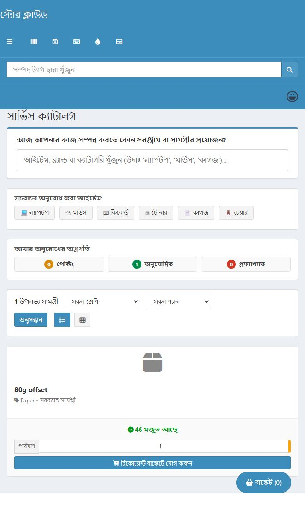

# Custom requests refactor execution record

4 October 2026. Implements the [dated gap analysis](../gap-analysis/custom-requests-package-gap-analysis.md). This record separates implementation, local verification and operational work still required. The original analysis remains historical evidence.

## Implemented

The package now has separate services for routing, inventory reservations, request numbering, requester transitions, returns and transactional notices. Approval and fulfillment use a shared workflow vocabulary. Mutations lock and reload the request, check the actor and office, validate all supplied line and stock IDs, and recheck state inside the transaction. Unexpected failures use the existing safe reference-ID response.

| Gaps | Result |
| --- | --- |
| 1 | New requests receive `office_id` from the working tenant context. Queues, actions and clearance use this office. Optional delivery is separately validated against existing locations and the actor's jurisdiction. Historical unresolved offices are quarantined from mutations. |
| 2–3 | Requester-role automatic approval removed. Self-approval and primary/final decisions by the same person are refused, including for superusers and in shadow mode. Explicit primary/final GovAccess abilities are checked per stage. Stage role enforcement follows the existing access mode; see rollout below. |
| 4 | Policies resolve item override, category and default, including asset models and historical component/license identities. The policy workspace supports item overrides and thresholds through the existing national review process. |
| 5 | Independent office approvers are assigned using responsibilities and unexpired G1 cover grants. Missing primary cover for a primary-only request can route to an independent final approver. Missing cover otherwise stays pending and alerts the office administrator. Durable in-app notices, optional mail delivery and deduplicated three-weekday escalation are implemented. Quantity/value thresholds raise approval to two stages; unknown value cannot bypass a value threshold. |
| 6 | Every relevant line needs a valid decision. Primary quantity cannot exceed requested quantity; final quantity cannot exceed the primary allowance. Unknown line IDs, invalid statuses and replay fail. |
| 7–8 | Bulk stock changes only through the existing system Goods Issue service. Request adapters write action history and create no consumable/accessory checkout pivots. A read-only reconciliation command exposes historical differences. |
| 9 | Completion is recalculated across all stored approved lines after each session, so a second session can finish the request. |
| 10 | New requests support asset models, accessories and consumables. Unsupported components/licenses are hidden and rejected at basket entry. Availability includes native checkouts and committed reservations. |
| 11 | Selected serials are locked, checked for office/company/model/requestability/deployable status and issued through native `Asset::checkOut`. Status uses a current locking read. Each serial receives a Goods Issue line. Direct legacy asset-adapter assignment is disabled. |
| 12 | Approval reserves remaining quantity. Issue, cancellation and closure release reservations. Catalog/basket availability reflects those reservations. MySQL locking reads prevent stale repeatable-read snapshots from approving already committed demand. |
| 13 | Substitution requires the same category, known cost no higher than the approved item and sufficient alternative stock. It is disallowed after the first issue. Events record both names and IDs. Asset-model search is supported. Higher-value substitutes require a new approval rather than a storekeeper override. |
| 14 | Force close requires an approved open request and a server-validated reason. It preserves the approval decision, releases unissued reservations and rejects replay. |
| 15 | Owners can withdraw before a decision/issue, acknowledge a completed issue once, and request return of all issued bulk lines once. A storekeeper can create a linked draft receipt through store-operations. Drafting does not add stock; normal physical receipt, metadata, evidence and posting controls remain required. Active returns block clearance until the receipt is posted. |
| 16–18 | Required date and cost center are saved; seven request types, supported item types, existing stock and integer quantity limits are validated. Expiry applies on reads/edits/submission and scheduled maintenance. Counters use current states; decision attribution includes rejections. |
| 19 | Dead submission route, duplicate admin route, legacy service/model/event/listener, empty role model and dead views removed. The unused historical table is retained for reviewed archival. |
| 20 | Destructive baseline `up()` drops removed; deprecated organization role-table ownership removed. Existing migration identities are preserved. Three additive forward migrations upgrade installed databases. |
| 21 | Requester/event-user deletion now restricts rather than cascades; new office/decider/notice/return-document references restrict deletion. Soft-deleted actor relations remain readable. New events use translated event keys and structured details. |
| 22 | Locked annual sequences include soft-deleted historical numbers. A no-op upsert serializes creation of a previously absent year without MySQL lock-upgrade deadlocks. |
| 23 | Isolated workflow and route tests added to the existing CI job. Separate opt-in MySQL checks exercise competing reservations and concurrent numbering. Experiment fixtures/reset ownership include the new workflow data. |
| 24–25 | Shared-layout view composition replaces response-body rewriting; widget counts real unexpired basket lines. Catalog filtering and pagination run before bounded hydration, with aggregate stock/reservation queries. |
| 26 | Package views, confirmations, menus, exceptions and request-type labels translated. External deferred JavaScript replaces the package's inline scripts and CSRF-token script nonce. Forms are separated correctly and inputs/view controls have labels. Missing native product images receive a fallback icon. |
| 27 | Package dependencies declared. Custom requests registers its own clearance rule, removing the office-membership reverse dependency. |

Three forward migrations (`2026_10_04_000001` through `000003`) were applied individually to the authorized local database. No reset or broad seeding was performed. `office_id` remains nullable at schema level to avoid inventing historical office assignments; new submission requires a valid working office.

## Verified locally

Installed PHP 8.4.15 was used, with Xdebug disabled. Results after the final service changes:

| Check | Result |
| --- | --- |
| `php vendor/bin/phpunit tests/Feature/GovStore` | 54 tests, 815 assertions passed; includes G1 authorization and workflow tests using isolated SQLite memory. |
| Opt-in `RequestMysqlConcurrencyTest` | 2 tests, 25 assertions passed on a separate schema clone. Four workers allocate 100 unique numbers for a previously absent year. A competing approval sees the newly committed reservation despite an earlier repeatable-read snapshot and rolls back. |
| Isolated `ExperimentTest` | 8 tests, 71 assertions passed on the separate clone, including fixture verification and ownership-aware reset. |
| Blade compilation and PHP syntax | All 15 package views passed. English/Bengali translation key parity: 280 keys. |
| Browser/JavaScript | Bengali catalog rendered; grid pressed-state, Enter search, server type filtering and empty state checked. No browser console errors observed. JavaScript syntax checked. |

The serial positive test exercises native checkout and observes its checkout event plus Goods Issue persistence. Its native listener is faked: acceptance/EULA/mail delivery is not independently demonstrated by that test. Policy and return negative tests verify scope, roles, quantities, replay and transaction rollback. Tests do not establish CI success, WCAG compliance or production readiness.

### Authorized local HTTP exercise

Followed [local live testing](../testing/local-live-testing.md) with the existing experiment fixtures in office 160. Separate in-memory HTTP cookie sessions used native login and CSRF forms for requester, primary approver and storekeeper. The user's browser login was preserved. No access-mode settings or grants were changed. These were HTTP workflow checks; they are not claimed as browser clicks.

The [safe structured report](custom-requests-live-report.json) records request **1091 / SR-2026-000287**:

- Fractional basket quantity returned 422. Submission without delivery assigned office 160 and reached primary approval.
- Approval succeeded; another office's detail request returned 404.
- Two fulfillment sessions changed `partially_issued` to `issued`.
- Consumable 1602 issued 3: native stock **98 → 95**, checkout pivots **0 → 0**.
- Accessory 1065 issued 2: native stock **100 → 98**, checkout pivots **0 → 0**.
- Receipt acknowledgement and return request succeeded. Linked return receipt **01a10751-b56e-7361-a218-359f1c22a06f** remains **DRAFT**; drafting did not increase stock.

Retained local data: this request, its issue documents and inventory movements, acknowledgement/return events, notices/audits, and the linked draft receipt. These records preserve the test's stock and audit history. The draft needs ordinary receipt review and physical/evidence validation before posting. No receipt was posted based on invented evidence. Temporary helpers and the owned isolated test schema were removed after verification.

## Open operational work and limits

1. **Historical repair.** [Read-only reconciliation for office 160](custom-requests-reconciliation.json) found **286 unresolved-office requests across the database**, no completed-but-partial or self-approved rows among the already office-assigned requests in office 160, and no matching legacy consumable checkout rows in that office. Most fixture items have no ledger movements. Issued accessory 1065 shows ledger -2 versus native remaining 98; consumable 1602 shows ledger -3 versus remaining 95. These differences reflect unaligned opening stock/history; the new issue changes native quantities once but does not invent an opening ledger balance. Historical self-approvals with unresolved office cannot be cleared by the office-scoped report. Review office-at-the-time evidence, opening balances, duplicates and historic decisions with a backup before any repair. Do not infer historical ownership from present-day `users.location_id` alone.
2. **Role rollout.** Local office access remains **shadow** under the existing G1 policy. Tenant, object, state, self-approval and same-decider checks always refuse invalid actions. Primary/final role denials are audited in shadow and enforced when the authorized rollout switches to enforce. Queues/UI offer decisions only to eligible independent approvers. This work does not complete the required real-world shadow observation period or change the rollout setting.
3. **Operations.** Ensure the existing Laravel scheduler runs the hourly `gov-requests:maintain` job. Mail defaults to disabled; configure the authorized mail transport and explicitly enable `govstore-requests.mail_enabled` before expecting email delivery. Durable notices survive failed delivery; email retry is at least once. Maintenance was verified in isolation and was not run globally against unrelated local baskets.
4. **Deliberate boundaries.** Cover uses the existing reviewed G1 temporary-grant workflow; no unreviewed parent-office approval scope or second delegation system was added. Bulk return currently includes all issued bulk lines once; partial/multiple returns need further design. Serial return uses native asset check-in. Components/licenses need proper adapters before exposure. Higher-value substitutions need a fresh approval. The obsolete table requires reviewed archival; installed migration history was not squashed. Historical delivery-location cleanup/FK addition requires first resolving invalid references. The shared native layout's separate legacy script nonce behavior is outside this package refactor.
5. **Deployment.** Review and deploy the additive migrations with a backup, run CI, verify native checkout acceptance/mail listeners in the target environment, review opening ledger balances, and perform the G1 observation/approval process before declaring production readiness.

