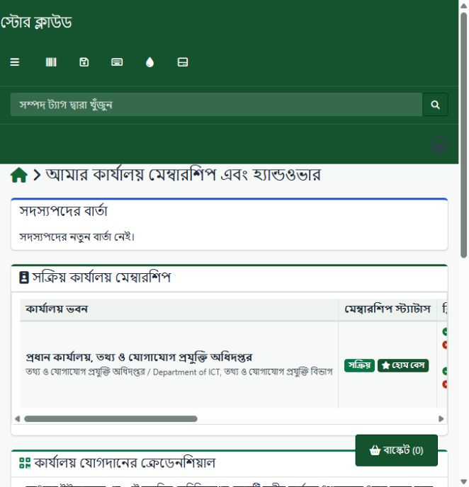

# Office Membership implementation and verification

8 October 2026 (Asia/Dhaka), local working tree. Covers OM-1 through OM-5 in the
[package gap inventory](../gap-analysis/gov-store-package-gap-analysis.md).

## Implemented

| Gap | Local implementation |
| --- | --- |
| OM-1 | All 18 membership routes declare one registered ability. Self-service, office staff administration and national override permissions remain distinct. Both handshake and legacy assignment services use the same actor, supported-role, active/unexpired membership, office lifecycle, current-owner and participant checks. Location/profile, user/membership, proposal and role rows are locked; acceptance rechecks the stored proposal and current owner. Duplicate pending proposals across both stores, self-delegation and replay fail. Office-admin handover is supported through the current handshake UI. Cancelled assignments retain their history. |
| OM-2 | Clearance covers native assets (including nested assets and default-return office), accessories assigned to a user or carried asset, components installed in carried assets, licence seats, office administrator responsibilities and active temporary cover. Mutation-time holding/role/request reads lock current records. Release request, office-admin sign-off and receiving-office claim recheck clearance and state. A claim requires one signed-off home membership and the receiving company boundary; it cannot relocate an arbitrary user. |
| OM-3 | The membership package continues to own only its base rules and extension interface. Custom Requests and Committee register their own rules. Request return clearance now checks a posted receipt belonging to the releasing office, independently of the actor's selected office. Deleted unresolved requests remain obligations. |
| OM-4 | Transactional, durable per-recipient notices cover proposals, acceptance, rejection, cancellation, membership requests/decisions, release and claim. They become visible on commit and roll back with failed transitions. My memberships shows only the signed-in person's recent notices and their office. Optional mail consumes the committed outbox; delivery failure preserves the notice for retry. |
| OM-5 | English/Bangla menu, role, handover, release and notice strings; shared-layout membership/context menu; route breadcrumbs; labelled handover modal and action explanations. Removed the unused response-body injection middleware and its script. Colleague choices contain only display identifiers and use text-safe option construction. |

Admission by office code, approval/rejection and single-use verification-token
consumption now run inside locked transactions. Suspended offices refuse new
intake and accepted handovers, while cancellation and release remain possible.
Membership switching validates expiry and no longer overwrites the native home
office pointer when choosing secondary access. The membership model now persists
`valid_until`; invitation dates are cast by their owning organization model.

Emergency overrides remain superuser-only, including in shadow mode. They use the
existing national frozen-input review, reason, typed CHANGE, expiry, fingerprint
and durable replay-consumption controls. The fingerprint includes the target's
memberships, responsibilities, temporary grants and office-admin assignments.
Stripping roles also revokes temporary cover. Unexpected HTTP failures use safe
reference IDs; raw exceptions are no longer flashed by transfer controllers.

The historical membership migration no longer drops installed memberships,
handshakes, assignment history or override audits on rerun. The new additive
migration supplies the missing legacy assignment store and notice outbox without
rewriting existing records.

## Holding semantics and boundaries

- `consumables_users` records consumed allocations, with no native recoverable
  balance or check-in state. These records remain consumption history and do not
  permanently block release. Unresolved requests and requested returns block
  through the Custom Requests rule until a matching posted receipt exists.
- Native licences have company ownership without an office column. A directly
  assigned user seat conservatively blocks releases in its company (also for
  unattributed licences); seats attached to carried assets use the asset's office.
  This does not introduce an invented licence-office attribution.
- Checked-out deleted assets and ambiguous legacy user assignments remain custody
  obligations. A numeric location/asset assignment is not mistaken for a user.
- Employee clearance does **not** authorize office closure or merger. Organization
  still refuses terminal transitions pending office-wide inventory and consumer
  clearance. The original ORG-1 row remains partial.
- Temporary cover is not a transferable permanent responsibility. Active cover
  blocks release; it must expire or be revoked through authorized access controls.

## Verified

Installed PHP 8.4.15, Xdebug disabled. The following five suites used SQLite in
memory; no automated suite reset or seeded the existing development database:

```text
php vendor/bin/phpunit tests/Feature/GovStore/OfficeMembershipWorkflowTest.php tests/Feature/GovStore/G1AuthorizationTest.php tests/Feature/GovStore/TenantScopeTest.php tests/Feature/GovStore/OrganizationWorkflowTest.php tests/Feature/GovStore/CustomRequestsWorkflowTest.php
```

**105 tests / 1,894 assertions passed.** The membership suite is **14 tests / 140
assertions**. Coverage includes both transfer paths, forged sender/foreign office,
unsupported role, self-delegation, expired/inactive recipient, ownership changes,
participant restrictions, cancellation history, replay, holding types, role/cover
clearance, return receipt scope, release/sign-off/claim, join review, token replay,
native home-pointer preservation, notice rollback, safe HTTP failures, override
review tampering/staleness/replay, optional mail failure/retry and migration rerun.
The G1 route inventory now includes membership surfaces. Five membership Blade
templates compiled and passed PHP syntax checks; bilingual key parity passed.

Isolated MySQL/InnoDB exercises used the exact task-owned databases
`govstore_membership_test_20261008022000` and
`govstore_membership_test_20261008022001`, with minimal synthetic schema and users.
Two concurrent acceptances on each proposal path produced one success and one
409 refusal, one success audit, one recipient responsibility and four notices
(two for proposal, two for completion). A second handshake concurrency run passed
after the final locking corrections. Transactional holding queries also executed
successfully on MySQL, allowing empty custody and refusing assigned stock.
Both databases were dropped by their exact verified names; helpers were removed.
These exercises do not establish every possible race against native checkout,
queue, office configuration or inventory workflows.

## Local application verification and retained state

The resolved development database was verified as `snipeit` before applying only
`2026_10_08_000002_create_membership_notices.php`. The live access mode was shadow
and remained shadow; new membership and national permissions enforce explicitly.
No access-mode changes, test grants, passwords or business membership/role
transfers were made in the existing database.

Using the existing authenticated storekeeper browser session at
`http://snipeit.local/`, verified the Bengali My memberships page, breadcrumb,
clearance results, disabled release explanation and handover dialog with eligible
colleagues. The existing office showed one responsibility and two pending request
obligations; those were preserved. Staff administration showed the bilingual
authorization denial. No browser error messages were recorded. The browser
returned to My memberships; the existing actor and context were preserved.



Retained development changes are the additive schema and ordinary access/failure
audit records from the live checks. No live mail was sent. No live business test
fixtures were created. Automated and MySQL synthetic records were removed with
their isolated databases.

## Deployment and work still open

1. Apply the additive migration on other environments before serving the changed
   package; refresh cached routes/config/views and restart affected workers.
2. Positive office-admin and recipient browser mutations were verified through
   isolated services/tests, not by transferring real live users. Complete a
   disposable end-to-end administrator/recipient UI exercise before rollout.
3. Mail is off by default. Enable `GOVSTORE_MEMBERSHIP_MAIL_ENABLED` and schedule
   `govstore:membership-mail` only when mail delivery is intended. Delivery is at
   least once: a crash after sending and before recording success can duplicate
   an email. Durable in-app notices remain authoritative.
4. CI, the full application regression suite, accessibility/usability sessions,
   production deployment and the real G1 observation period are not established
   by these local checks. Office-wide closure/merge and cross-company permanent
   transfer policy remain separate work.

The original five package gaps are mitigated locally; this is implementation
closure of those rows, not production or office-lifecycle closure.
