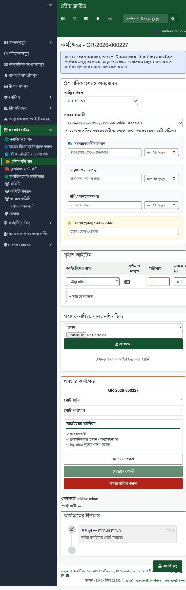
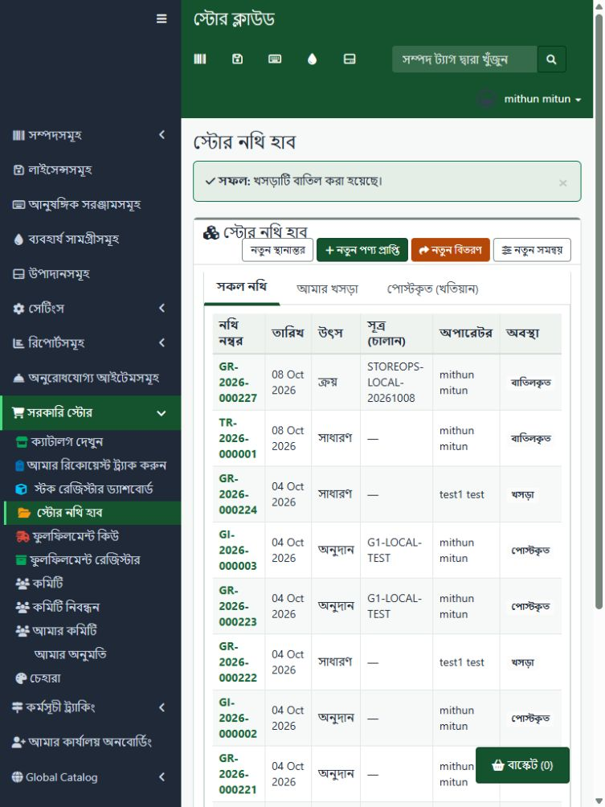
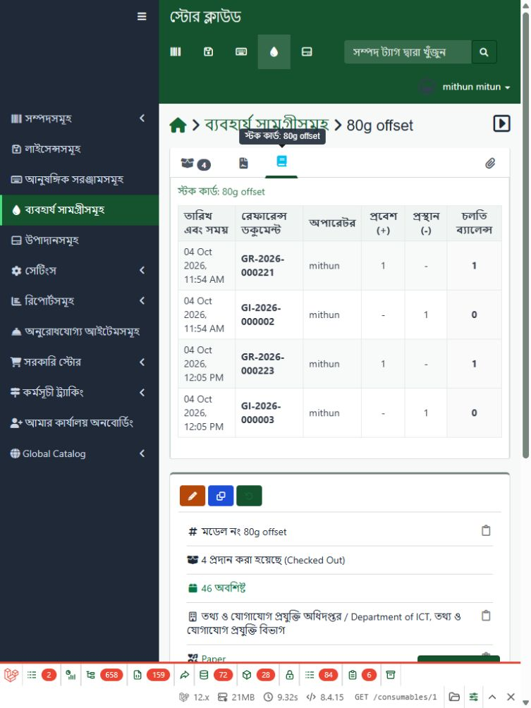

# Store Operations implementation and verification

8 October 2026 (Asia/Dhaka), working tree. This record supersedes the implementation claims for this package in the earlier static gap reviews. It is local evidence, not a production or CI sign-off.

## Implemented

- Additive profile upgrades retain core-owned tables, IDs, legacy capability links, definitions, assignments and lineage. Legacy rows are not automatically published or assigned nationally. Fresh and installed upgrades share the same helper; rollback does not drop core-owned data.
- Bulk inter-office transfers authorize actual posting rights in both offices, including shadow mode. Both offices must belong to the same company and have reviewed ledger openings. Matching destination stock IDs are validated, stock rows are locked in deterministic order, and source OUT/destination IN plus the paired receipt commit together. Replay and insufficient stock fail without a partial transfer. The same actor must have authority in both offices; a separate receiving-acceptance workflow is not supplied.
- Ledger posting locks stock and balance rows inside its transaction, requires exact office/company ownership for bulk stock, uses canonical keys, and rolls back failed native audit writes. Opened-office stock guards cover native checkout/checkin, quantity changes, deletion, restoration and Eloquent bulk updates/inserts. Native permissions remain in force. Raw SQL remains a privileged maintenance boundary.
- A read-only `govstore:ledger-reconcile` command compares movement sums, latest balances and native remaining quantities for opened offices; it is scheduled nightly. It reports explicitly when there are no opened ledgers. Opening refuses unresolved legacy aliases or negative native remaining stock.
- Receipts capture an active native supplier; Purchase requires it on the server. Serialized receipts preserve native tags/status behavior, supplier, creator and per-unit warranty, including zero months. Tracking preflight runs before document locks and the saved allocation is compared again inside the transaction.
- Draft takeover records a reason and a durable notice for the previous manager while retaining original creator/drafter attribution. Hub filters, references and notices are scoped to the working office/company.
- Workspace/rules scripts are external production assets. Product search, save queue, stale-response handling, authoritative checklist, tracking failure handling and safe text rendering replace inline handlers. English/Bangla strings and tablet controls were expanded. Per-item stock cards use authorized server-rendered native tabs rather than rewriting response HTML. Rules previews use a cloned selected-office context and preserve the shared context object.
- Removed unused legacy receipt/issue controllers and create screens, obsolete sync-fields plumbing and the unused transfer capability. Compatibility models/tables used by request fulfillment remain. Required package dependencies and optional integrations are declared.
- Native verification exposed namespaced theme components capturing unprefixed Snipe-IT tabs/box/table components. The theme provider now registers an anonymous component namespace; regression coverage verifies native slots and namespaced theme controls independently.

## Verified

The focused Store Operations, G1, tracking and request suites passed **89 tests / 1,704 assertions**. The expanded run including tenant and relevant theme checks passed **143 tests / 2,238 assertions** after the native component correction. Tests use isolated SQLite in memory, never the development database. Coverage includes fresh/legacy schema preservation, paired transfer/replay/rollback, revoked destination authority in shadow mode, company mismatch, native observer/bulk guards, takeover attribution/notices, suppliers, serialized asset receipt/tracking/rollback, warranty and selected-office rule previews.

```text
php vendor/bin/phpunit tests/Feature/GovStore/StoreOperationsIntegrityTest.php tests/Feature/GovStore/G1AuthorizationTest.php tests/Feature/GovStore/TrackingWorkflowTest.php tests/Feature/GovStore/CustomRequestsWorkflowTest.php tests/Feature/GovStore/TenantScopeTest.php tests/Feature/GovStore/Theming/GeneralKitComponentsTest.php tests/Feature/GovStore/Theming/LayoutRenderingTest.php tests/Feature/GovStore/Theming/SnipeItContractTest.php
```

Opt-in MySQL test:

```text
php tests/Feature/GovStore/store-operations-mysql-concurrency.php run
```

It clones schema only into a uniquely named test database, inserts fictional fixtures, and invokes the actual posting services in competing processes. Opposite transfers both completed with quantities 10/10. Two simultaneous seven-unit transfers from one ten-unit source produced exactly one success and one insufficient-stock failure, quantities 3/17, eight total movements and three posted transfers. No negative balance or partial posting occurred. The test database and two earlier failed fixture databases were removed by exact name; source data was never seeded or reset.

The two Store Operations JavaScript bundles and CSS built successfully with installed Laravel Mix/Webpack. PHP syntax, compiled Blade syntax and Composer manifest/lock validation were checked. The full unrelated application asset build was not run. A clean Composer install/solver run remains unverified: an unrelated private SCIM VCS dependency was unavailable in the local cache, so only the installed Store Operations package's lock metadata was synchronized.

## Authorized local exercise and cleanup

Verified `http://snipeit.local/` and database `snipeit` before mutation, following the local live-testing guide. Applied only `2026_10_08_000001_preserve_profile_schema_and_add_supplier.php`; the existing 70 profiles and 115 assignments were retained. Access mode stayed `shadow`. No access grants, membership changes or office ledger openings were introduced.

At 768 × 1024, the Bengali receipt workspace saved and reloaded supplier 49, consumable 1, quantity 1 and `STOREOPS-LOCAL-20261008`. The checklist passed and posting remained disabled with an opening-stock explanation. The actual native item page and stock-card tab rendered after the component correction. Native quantity remained 50 (46 remaining after its four existing assignments); the new drafts produced zero movements.

Retained audit evidence: `TR-2026-000001` (`01a11a6f-af48-73c1-9c9a-1facdd5bcac2`) and `GR-2026-000227` (`01a11a82-d125-700d-bffb-e7af6d0d5eda`) were cancelled through the normal draft-void UI. Both have null posting times. Their document/timeline records and consumed sequence numbers are intentionally retained. Task helpers and temporary build outputs were removed; the viewport override was reset.







## Remaining work

- Local opening markers remain **zero**, with **15 legacy class-name movement aliases**. Reconciliation reported no opened office ledgers; that is not evidence that historical stock balances agree. Review historical normalization/recomputed balances and office opening stock separately before cut-over. No historical balances or attribution were rewritten here.
- Serialized asset issue/handover and custody-level reconciliation remain deeper gap 6 work. Asset-model receipts do not establish a complete serialized custody register. Workspace issue/adjustment/transfer selectors and posting reject unsupported asset-model mutations; transfers currently support bulk stock.
- Receipt committee inspection (phase 4 / deeper gap 22) remains explicitly deferred under the earlier recorded user decision. Generic report uploads and READY status do not prove inspection. Posted receipts stay final; adjustments remain the correction path.
- Remaining English fragments, full register/print/rules localization and keyboard verification across both locales remain under SO-7. The live exercise covers the Bengali workspace/hub and one native item; administrative rule mutation/publishing and every native stock class were not exercised live. Stock cards show the latest 100 movements, not complete history pagination.
- Clean installation, deployed scheduler monitoring, required real-world shadow observation, CI and broader accessibility verification remain open. Existing public historical evidence files still require the established authorized protection/repair procedure.
