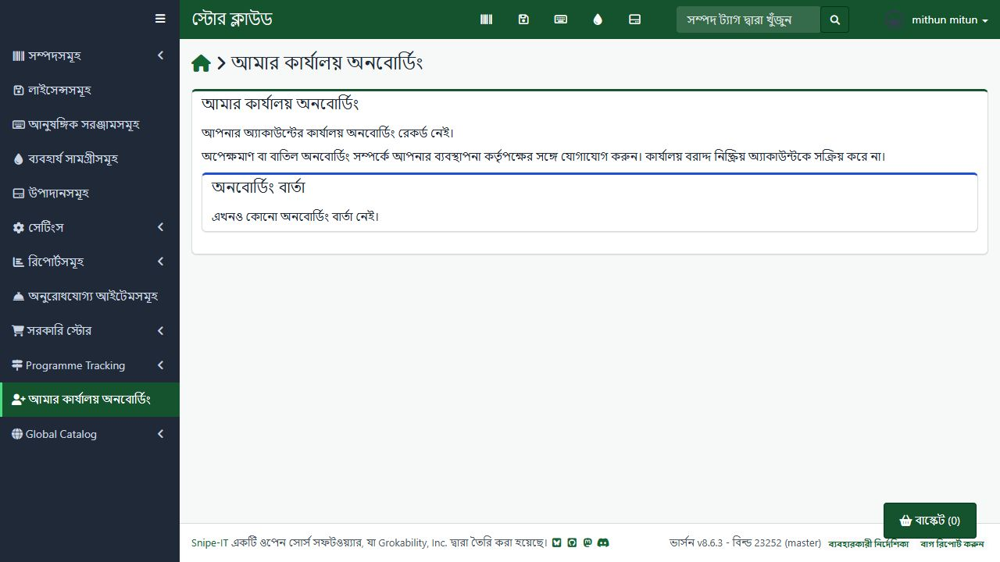

# User Onboarding implementation and verification

8 October 2026 (Asia/Dhaka), local working tree. Covers UO-1 through UO-4 in the
[package gap inventory](../gap-analysis/gov-store-package-gap-analysis.md).

## Implemented

| Gap | Local implementation |
| --- | --- |
| UO-1 | Unauthenticated/native system-created accounts now receive one WAITING SYSTEM record, with nullable creator and owner instead of a fabricated user ID or office. Office administrators create consistent first-office records; company administrators and single-jurisdiction ICT creators route to their own bounded queues. Ambiguous routing remains SYSTEM. The legacy native membership observer defers first membership to onboarding when its schema is installed. |
| UO-2 | Authorized cancel, reject, manager reassignment and reopen transitions retain queue records, reasons, actor, before/after state and history. Rejection and cancellation use CANCELLED with distinct history events. Reopen is explicit; completed accounts must use the membership workflow. Assignment locks office/profile, subject and queue, rechecks authority, lifecycle, company, existing office/membership and WAITING state. Duplicate completion returns 409. |
| UO-3 | Durable in-app notices for account creation and every decision commit with history and membership changes. Completion reaches the employee, creator/managing administrator and destination office administrator, deduplicating recipients. Personal onboarding displays only the signed-in person's updates; private review reasons stay in the authorized administrative queue. Notice failure rolls back assignment, native pointers, membership and success history. No mail delivery was introduced or sent. |
| UO-4 | English/Bangla strings cover queue tabs, first-office and manager choices, labelled forms, actions, history, personal status, notices, menu, breadcrumb and access-denial ability labels. Three templates compile and pass PHP syntax checks. Actual queue fragments render with escaped review reasons. |

All four routes declare one registered GovAccess ability. Both onboarding abilities
explicitly enforce even in shadow mode. Native admin permission is not a global
onboarding authorization. Self access and administrative access remain distinct.

Queue ownership is explicit: company administrators must still administer the
subject's company; ICT owners must still cover the stored geography; office owners
must still administer the managed office with an active, unexpired membership.
SYSTEM records with unknown routing belong to the superuser review queue. A
manager cannot acquire an unrelated queue record by submitting its ID. Office
choices and the server mutation apply the same authority and lifecycle boundaries.
Reassignment checks the new manager's live assignment and excludes the subject.

First-office assignment preserves activation, credentials and permissions and
synchronizes the native company pivot. A disabled account remains disabled.
Company attribution already present on the subject cannot be replaced by a foreign
company, even for superusers. Existing memberships cannot be relocated through
onboarding; the narrowly supported importer case may complete a WAITING record
whose native office and active home membership already exactly match the target.

The additive migration makes SYSTEM ownership nullable and adds managed-office
metadata, decision history and notices. Its rollback preserves these structures
and historical data; it does not fabricate owners to restore non-null columns.
Existing records and historical missing onboarding accounts are not bulk rewritten.
Native authentication and user-creation policies still apply outside this package.
A native account-creation caller requiring all-or-nothing creation must wrap its
User save and observer work in a transaction; observers cannot roll back a native
insert that an unrelated caller already committed.

## Verified

Installed PHP 8.4.15 with Xdebug disabled. All automated tests below use isolated
SQLite in memory, including native model creation and both onboarding migrations:

```text
php vendor/bin/phpunit tests/Feature/GovStore/UserOnboardingWorkflowTest.php tests/Feature/GovStore/G1AuthorizationTest.php tests/Feature/GovStore/OfficeMembershipWorkflowTest.php tests/Feature/GovStore/TenantScopeTest.php tests/Feature/GovStore/OrganizationWorkflowTest.php tests/Feature/GovStore/CustomRequestsWorkflowTest.php
```

**115 tests / 2,014 assertions passed.** The onboarding suite covers system creation,
company and ICT ownership/bounds, office-admin creation, native admin/staff denial
in shadow mode, foreign supplied company and office IDs, suspension, expired office
membership and revoked ICT assignment, cancellation/rejection/reopen/reassignment,
replay, native activation/permission preservation, existing membership refusal,
transaction rollback, recipient isolation, translation parity, route declarations,
compiled Blade PHP and real queue-fragment rendering/HTML escaping.

An isolated MySQL/InnoDB exercise used the exact task-owned database
`govstore_onboarding_test_20261008040000`. It applied the historical and additive
onboarding migrations to a minimal synthetic schema. Concurrent assignment of one
WAITING record produced one committed completion and one 409 refusal: one home
membership, one assignment event, three deduplicated assignment notices and the
correct native office pointer. This verifies that particular contention path,
not every race with native account editing or organization administration.
The isolated database and task helper were removed after verification.

## Local application and retained state

Verified the resolved local database as `snipeit` before applying only
`2026_10_08_000003_add_onboarding_history_and_notices.php`.

| Aggregate | Before | After migration and live checks |
| --- | ---: | ---: |
| Native user rows | 503 | 503 |
| Office membership rows | 465 | 465 |
| Onboarding rows | 469 | 469 |
| Nondeleted users without native office and without onboarding | 16 | 16 |

The last count is discovery, not proof that all 16 should be onboarded: the
experiment provider intentionally excludes oversight accounts. No broad backfill,
real account creation, password change, role assignment or membership transfer was
performed. Access mode remained shadow. Retained changes are the additive schema
and ordinary authorization-denial audit evidence; no live business test fixtures
or live onboarding notices were created.

Using the existing authenticated non-manager session at `http://snipeit.local/`,
verified Bengali My office onboarding, its sidebar link and breadcrumb, the honest
no-record/no-updates state, and the bilingual administration-queue denial with a
reference ID. No browser errors were recorded. The same session/context was kept,
and the browser returned to the personal page.



## Remaining deployment and operational work

1. Apply the additive migration elsewhere before deploying the package; refresh
   cached routes/config/views and restart affected workers.
2. Complete a disposable administrator/recipient browser mutation exercise.
   Positive workflows and queue rendering were verified in isolated tests and
   MySQL; the existing live session was used only for personal rendering and denial.
3. Review historical missing or ownerless records individually, distinguishing
   deliberate oversight accounts from employees requiring first-office onboarding.
   Do not sweep them into a guessed office or assign a fictitious system owner.
4. Experiment fixture ownership/cleanup adapters for the new history and notice
   tables belong to the remaining experimentation packaging work (EX-3). No
   experiment population/wipe or full application regression was performed here.
5. CI, full application regression, accessibility/usability sessions, production
   deployment and the real G1 observation period remain unverified by local checks.

All four original user-onboarding gaps are mitigated locally. This records local
implementation and verification, not production or enforced-rollout readiness.
