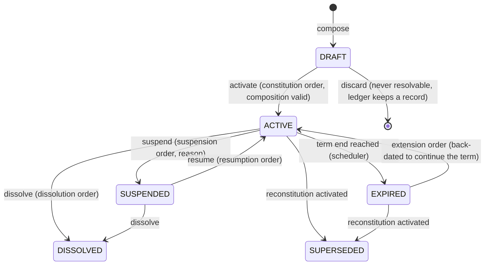
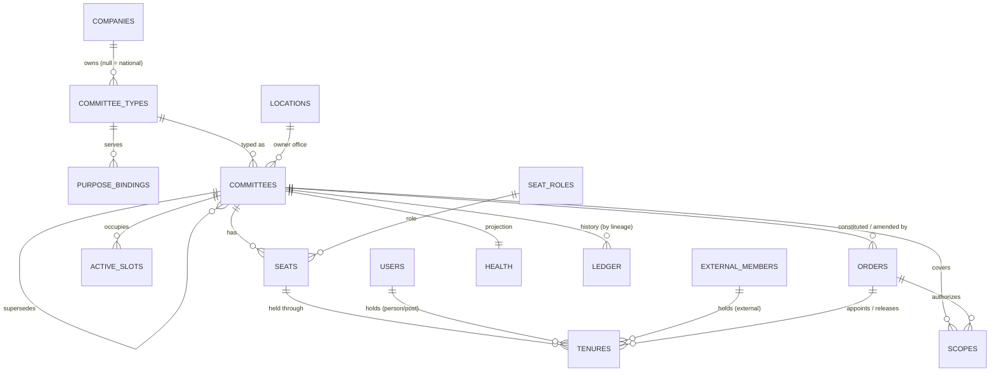
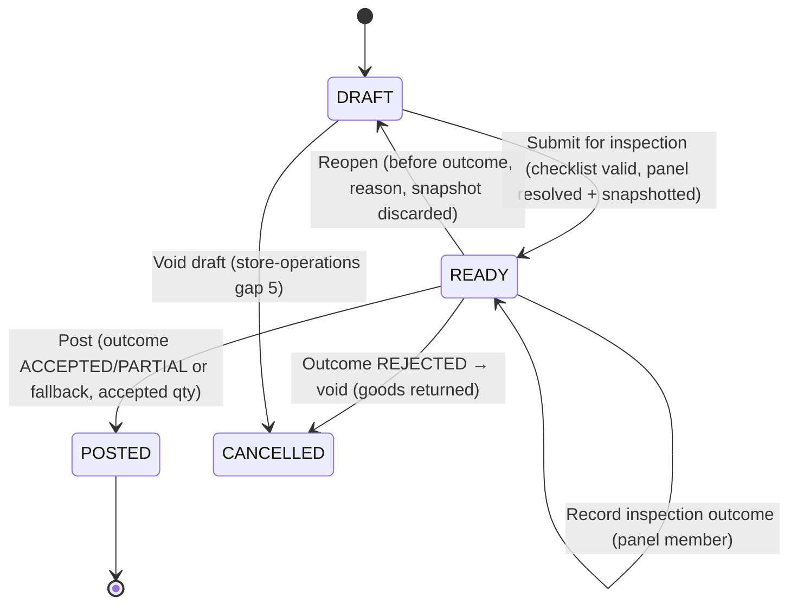
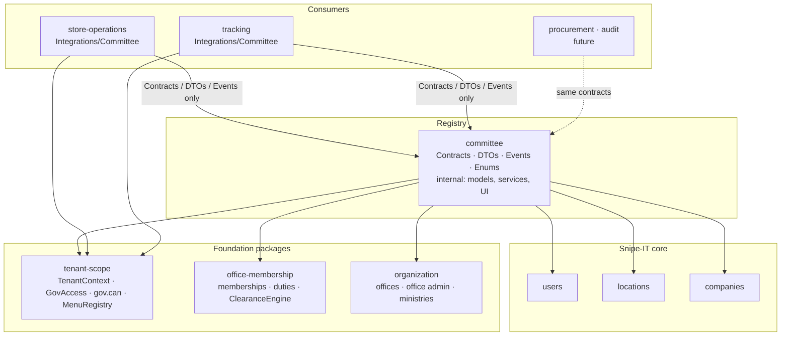
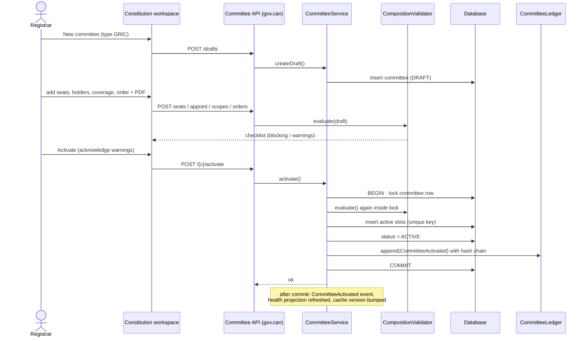
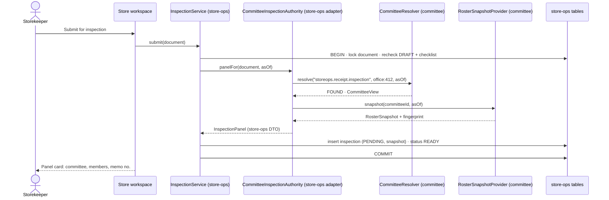
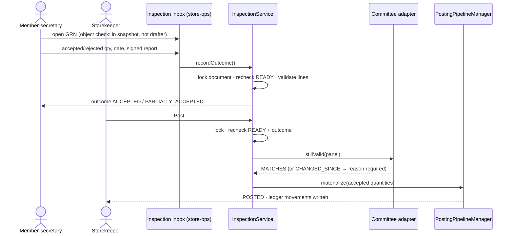
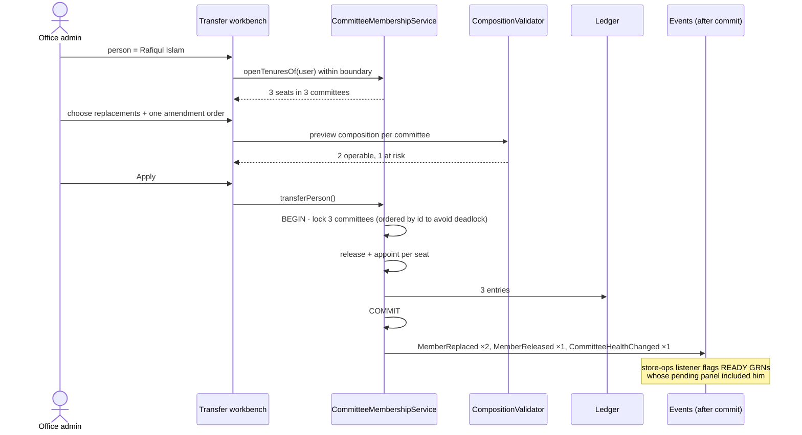
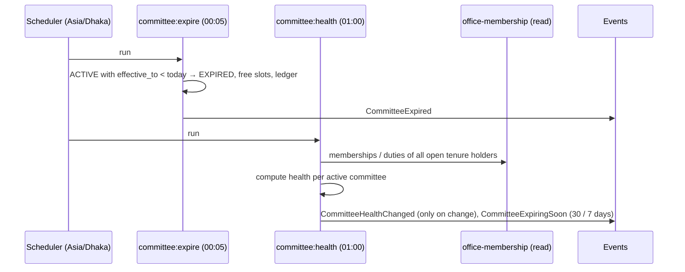

# Committee Registry (`gov-store/committee`) — Architecture and Design

| | |
|---|---|
| **Package** | `packages/gov-store/committee` · namespace `GovStore\Committee` |
| **Status** | Inventory/asset registry implemented and locally verified. See [README](README.md) and [verification record](../../../docs/verification/committee-implementation-2026-10-05.md) for delivered scope and remaining rollout work. G7 is not declared closed. |
| **Brief** | [`plan.md`](plan.md) in this folder (unchanged). The brief's constraints are kept in full; see [Appendix A](#appendix-a--brief-traceability). |
| **Date** | Design: 4 October 2026. NIAR scope correction and implementation: 5 October 2026. |
| **Reads with** | [G1 analysis](../../../docs/gap-analysis/g1-unprotected-actions-analysis.md), [store-operations gap analysis](../../../docs/gap-analysis/store-operations-package-gap-analysis.md), [security rules](../../../docs/security/govstore-agent-security.md) |

---

## 0. Summary

**Current NIAR scope.** NIAR means Inventory and Asset Register. This release
serves receipt and inspection of goods, technical inspection of assets, stock
verification, survey/condemnation and disposal. Tender opening (`TOC`), tender
evaluation (`TEC`) and tender technical sub-committees (`TSC`) are excluded.
They are neither seeded nor accepted by the type catalogue. Wider extension
examples elsewhere in this design are future sketches, not shipped operations.
Consumer inspection workflows in §15 belong to store-operations and remain a
separate integration phase.

The committee package is an **official register of government committees**. It answers one question for every other GovStore package:

> *Which committee was officially constituted for this purpose, in this scope, on this date, and who sat on it?*

It records the legal facts behind a committee (office order, memo number, issuing authority, term, seats and the people holding them) and keeps a full, tamper-evident history of every change. It does **not** run meetings, collect votes, route approvals or sign anything.

Five decisions shape the design:

1. **Consumers ask by *purpose*, not by committee type.** Store-operations asks for "the committee for `storeops.receipt.inspection` at office 412 on 15 Sep 2026". The ministry decides which committee type serves that purpose. Store-operations never learns committee-type codes, and a ministry can rename or split its committee types without touching store-operations.
2. **Everything is effective-dated.** Committees, coverage and members all carry *from/to* dates, and every query takes an `asOf` date. An inspection done on 15 September is checked against the committee that existed on 15 September, even if it was reconstituted on 1 October.
3. **Seats, not just members.** A committee has seats (chairperson, member-secretary, member, external member, observer). People hold a seat for a tenure. A seat can be filled by a named officer, by whoever holds a post (*ex officio*, পদাধিকারবলে), or by an external member who has no GovStore account. Officers in Bangladesh are transferred often, so replacing the person in a seat is a first-class operation with its own office-order reference.
4. **Consumers receive a frozen roster snapshot.** When store-operations records an inspection, it stores a `RosterSnapshot` with a SHA-256 fingerprint, the same way it already freezes `compiled_profile_snapshot` on a document. The snapshot remains valid evidence even after the committee changes.
5. **The boundary runs one way.** Store-operations depends on a small, published contract surface (`Contracts`, `DTOs`, `Events`). The committee package never references store-operations, tracking or custom-requests. Inspection itself (recording the outcome, accepted quantities and the signed report) is a store-operations feature. It is designed in §15 so the two packages fit together, but it is implemented in store-operations. When committee is not installed or its use is switched off, store-operations behaves exactly as it does today.

---

## 1. Bounded context

### 1.1 What the package owns

| Owns | Meaning |
|---|---|
| **Committee type catalogue** | Configurable types (national templates plus ministry-specific types) with a *composition policy*: minimum and maximum strength, required seats, external-member rules, incompatible office duties, quorum figure, and whether a declaration of impartiality is needed |
| **Purpose catalogue and bindings** | Purposes declared by consuming packages, and which committee types may serve each purpose, nationally or for a ministry |
| **Committees** | The constituted body: name, type, owning office, term, status, version lineage |
| **Legal instruments** | Office orders and memos (অফিস আদেশ / স্মারক) behind every constitution, amendment, extension, suspension, dissolution and corrigendum, with the scanned order stored privately |
| **Coverage** | Which scopes (office, ministry, store, initiative, procurement package) a committee serves, and for which dates |
| **Seats and tenures** | Who held which seat from when to when, why they left, and who replaced them |
| **External members** | People outside GovStore (another ministry, a university, the district accounts office) |
| **Constitution health** | Whether a committee is currently operable, at risk or inoperable, and why |
| **History ledger** | An append-only, hash-chained record of every change |

### 1.2 What the package does not own

The brief excludes these, and they stay out:

| Excluded | Where it belongs |
|---|---|
| Meetings, agenda, minutes, attendance | A future meetings package |
| Voting, resolutions | A future meetings or procurement package |
| Approval chains, workflow routing, delegation | custom-requests (approvals), store-operations (document states) |
| Digital signatures | A future e-signature integration |
| Notifications (email, SMS, push) | A future notification package. The committee package **emits events**. Whoever wants to notify listens. |
| Recording that a committee inspected, accepted or rejected something | The consuming package (store-operations for goods receipts, §15) |
| Deciding *whether* a document needs a committee | The consuming package |

**The line in one sentence:** the committee package states facts about who was officially appointed. What those people did, and whether a document needed them, belongs to the package that owns the document.

### 1.3 Relationship to its neighbours (context map)

| Neighbour | Relationship | Direction |
|---|---|---|
| tenant-scope | Shared kernel: `TenantContext`, `GovAccess`, `gov.can`, `MenuRegistry`, `abilities.php` | committee → tenant-scope |
| office-membership | Supplier: office memberships and duties are read to check member eligibility and health. Committee contributes a clearance rule to its `ClearanceEngine`. | committee → office-membership |
| organization | Supplier: offices (`locations`, `gov_location_profiles`), office admin, ministries (`companies`) | committee → organization |
| store-operations | Customer. Uses an anti-corruption adapter inside store-operations (§15). | store-operations → committee contracts |
| tracking | Customer. Registers the `initiative` scope type and its purposes. | tracking → committee contracts |
| procurement, audit (future) | Customers on the same terms | future → committee contracts |

Committee uses the **published language** pattern: consumers see only versioned contracts and DTOs, never Eloquent models.

---

## 2. Bangladesh government context

The design follows how committees actually work in Bangladesh government offices.

### 2.1 How a committee comes to exist

1. The competent authority (head of office, approving authority, or ministry) issues an **office order** (অফিস আদেশ) carrying a **memo number** (স্মারক নং) and **nothi number**, usually from D-Nothi, dated in both the Gregorian and Bangla calendars.
2. The order names the committee, its purpose, its **members by designation** (often *ex officio*), the **convener or chairperson** (আহ্বায়ক / সভাপতি) and **member-secretary** (সদস্য সচিব), and sometimes **co-opted** members (কো-অপ্ট সদস্য).
3. The term is a fixed period, a fiscal year (1 July – 30 June), a single matter (one stock verification or asset survey), or "until further order" (পরবর্তী আদেশ না দেওয়া পর্যন্ত).
4. Changes come as further orders: **amendment** (সংশোধন), **reconstitution** (পুনর্গঠন), **extension** (মেয়াদ বৃদ্ধি), **dissolution** (বিলুপ্তি).

### 2.2 Rules that the composition policy must be able to express

Inventory and asset committees follow their competent authority's office orders
and reviewed ministry policy. The package expresses the following as
**configurable policy**, without claiming that an illustrative seed establishes
the applicable legal composition:

- minimum and maximum strength, and exact presiding and secretary seats;
- minimum external members and *how far outside* they must be (another office, another ministry);
- whether members are nominated by post or by name;
- whether a declaration of impartiality is required per member;
- the quorum figure (exposed to consumers, never counted here, because attendance is excluded);
- office duties that conflict with membership (for example, the store custodian on the committee inspecting their own receipts).

> **Review before activation.** The figures in §12.2 are illustrative. Templates are seeded inactive. The responsible inventory/asset authority must review the applicable office orders and ministry instructions before enabling a template. They are data, so correcting them needs no code change.

### 2.3 Common committee types (seed catalogue)

| Code | English | বাংলা | Typical purpose | Term |
|---|---|---|---|---|
| `GRIC` | Goods Receiving & Inspection Committee | পণ্য গ্রহণ ও পরিদর্শন কমিটি | Receive and inspect delivered goods | Fiscal year |
| `TIC` | Technical Inspection Committee | কারিগরি পরিদর্শন কমিটি | Inspect technical goods such as ICT equipment and vehicles | Fiscal year |
| `SVC` | Stock Verification Committee | মজুদ যাচাই কমিটি | Annual physical verification of stores | Single matter or FY |
| `BOS` | Board of Survey / Condemnation Committee | বোর্ড অব সার্ভে / অকেজো ঘোষণা কমিটি | Declare items unserviceable | Single matter |
| `DSP` | Disposal Committee | নিষ্পত্তি কমিটি | Dispose of condemned items | Single matter |

### 2.4 Seat roles (seed)

| Code | English | বাংলা | Presiding | Secretary | Counts toward strength |
|---|---|---|---|---|---|
| `convener` | Convener | আহ্বায়ক | ✓ | | ✓ |
| `chairperson` | Chairperson | সভাপতি | ✓ | | ✓ |
| `member_secretary` | Member-Secretary | সদস্য সচিব | | ✓ | ✓ |
| `member` | Member | সদস্য | | | ✓ |
| `technical_expert` | Technical Expert Member | কারিগরি বিশেষজ্ঞ সদস্য | | | ✓ |
| `co_opted` | Co-opted Member | কো-অপ্ট সদস্য | | | configurable |
| `observer` | Observer | পর্যবেক্ষক | | | ✗ |

"External" is not a seat role. It is a property of whoever holds the seat (§4.4), so an external member can be the chairperson.

### 2.5 Practical realities the design must handle

| Reality | Design response |
|---|---|
| Officers are transferred often, sometimes holding several seats | *Transfer Members* workbench replaces a person in all their seats under one amendment order (§13, US-CM-09) |
| Upazila offices may have only two or three officers | District-level committees can cover several offices (§4.5); external members from nearby offices are allowed; consumers get a clear `NO_COMMITTEE` reason so they can apply their own small-office fallback (§15.6) |
| Memo numbers are written in Bangla or English digits | Stored as written, also normalized to ASCII for search and duplicate checks (§12.3) |
| Orders are dated in both calendars | Gregorian is stored; Bangla calendar date is shown alongside where the office opts in |
| Committees often run on the fiscal year | `fiscal_year` term basis sets 1 July – 30 June automatically |
| Office orders come from D-Nothi | Nothi number and order PDF are captured; D-Nothi import is an extension point (§18) |
| Auditors (C&AG, internal audit) ask "who was on the committee on that date?" | `asOf` queries, roster snapshots and the hash-chained ledger (§5.10) |

---

## 3. Package structure

Follows the existing package conventions (`Providers/`, `Routes/`, `resources/lang/{en-US,bn-BD}`, `Database/migrations`, `tests/`). Only `Contracts/`, `DTOs/`, `Events/` and `Enums/` are public. Everything else is internal and may change without notice to consumers.

```text
packages/gov-store/committee/
├── plan.md                        # Original brief (unchanged)
├── DESIGN.md                      # This document
├── composer.json                  # requires gov-store/tenant-scope, office-membership, organization
├── src/
│   ├── Contracts/                 # PUBLIC — stable, versioned
│   │   ├── CommitteeResolver.php          # resolve(purpose, scope, asOf)
│   │   ├── CommitteeQueries.php           # read API (members, isMember, holdsRole…)
│   │   ├── RosterSnapshotProvider.php     # snapshot + fingerprint verification
│   │   ├── PurposeRegistry.php            # consumers declare purposes
│   │   ├── ScopeTypeRegistry.php          # consumers declare scope types
│   │   ├── ScopeTypeResolver.php          # implemented per scope type
│   │   ├── CommitteeTabRegistry.php       # consumers add tabs to Committee Details
│   │   ├── SnapshotUsageReporter.php      # consumers report reliance on past rosters
│   │   └── PostHolderDirectory.php        # optional port (HRMS/PMIS), null by default
│   ├── DTOs/                      # PUBLIC — immutable readonly classes
│   │   ├── ScopeRef.php                   # (type key, id)
│   │   ├── CommitteeView.php
│   │   ├── SeatView.php
│   │   ├── MemberView.php
│   │   ├── CommitteeResolution.php
│   │   ├── RosterSnapshot.php
│   │   ├── HealthReport.php
│   │   └── PurposeDefinition.php
│   ├── Enums/                     # PUBLIC
│   │   ├── CommitteeStatus.php            # DRAFT, ACTIVE, SUSPENDED, DISSOLVED, EXPIRED, SUPERSEDED
│   │   ├── ResolutionStatus.php           # FOUND, NOT_FOUND, INOPERABLE, AMBIGUOUS, CONFLICT
│   │   ├── HealthStatus.php               # OPERABLE, AT_RISK, INOPERABLE
│   │   ├── HolderKind.php                 # PERSON, POST, EXTERNAL
│   │   ├── TermBasis.php                  # FIXED, FISCAL_YEAR, SINGLE_MATTER, UNTIL_FURTHER_ORDER
│   │   ├── OrderKind.php                  # CONSTITUTION, AMENDMENT, RECONSTITUTION, EXTENSION, SUSPENSION, RESUMPTION, DISSOLUTION, CORRIGENDUM
│   │   └── ReleaseReason.php              # TRANSFER, RETIREMENT, PROMOTION, RESIGNATION, REMOVAL, DEATH, TERM_END, RECONSTITUTION, CORRECTION
│   ├── Events/                    # PUBLIC — dispatched after commit
│   ├── Domain/                    # internal: value objects and policies
│   │   ├── CompositionPolicy.php          # parsed from type JSON
│   │   ├── CompositionFinding.php         # code, severity, bn/en message, seat ref
│   │   ├── Term.php
│   │   └── MemoNumber.php                 # normalization, Bangla digits
│   ├── Models/                    # internal Eloquent models
│   ├── Repositories/              # interfaces + Eloquent implementations
│   ├── Services/                  # internal application services
│   │   ├── CommitteeService.php
│   │   ├── CommitteeMembershipService.php
│   │   ├── CommitteeAssignmentService.php
│   │   ├── CompositionValidator.php
│   │   ├── CommitteeHealthService.php
│   │   ├── CommitteeResolverService.php   # implements Contracts\CommitteeResolver
│   │   ├── CommitteeQueryService.php      # implements Contracts\CommitteeQueries
│   │   ├── RosterSnapshotService.php      # implements Contracts\RosterSnapshotProvider
│   │   ├── CommitteeLedger.php            # hash-chained history writer
│   │   ├── CommitteeNumberService.php     # locked sequence
│   │   ├── OrderAttachmentStore.php       # private disk, SHA-256
│   │   └── ImpactAnalyzer.php             # "what loses coverage if…"
│   ├── Scopes/                    # internal
│   │   ├── CommitteeBoundaryScope.php     # explicit tenant boundary
│   │   └── Types/                         # built-in ScopeTypeResolvers: office, ministry, store
│   ├── Policies/CommitteePolicy.php       # object checks (office, state, type)
│   ├── Clearance/NoUnplannedSeatVacancyRule.php  # implements office-membership IClearanceRule
│   ├── Http/
│   │   ├── Controllers/                   # Workspace controllers (Blade)
│   │   ├── Controllers/Api/               # JSON for AJAX, select2, search
│   │   ├── Requests/                      # FormRequests (validation)
│   │   └── Transformers/                  # JSON shape, never raw models
│   ├── Console/Commands/
│   │   ├── CommitteeHealthCommand.php     # committee:health (daily)
│   │   ├── CommitteeExpireCommand.php     # committee:expire (daily, 00:05 Asia/Dhaka)
│   │   └── CommitteeLedgerVerifyCommand.php # committee:verify-ledger
│   ├── Listeners/                 # internal reactions to own events
│   ├── Providers/CommitteeServiceProvider.php
│   ├── Routes/web.php
│   ├── Database/
│   │   ├── migrations/            # additive only, one migration per table
│   │   ├── seeders/               # seat roles, national type templates, purposes
│   │   └── factories/
│   ├── config/committee.php
│   └── resources/
│       ├── lang/{en-US,bn-BD}/committee.php
│       └── views/                 # workspaces, partials, print
└── tests/
    ├── Unit/                      # policy, term, memo normalization, fingerprint
    ├── Feature/                   # services, resolver as-of, concurrency, HTTP authz
    └── Architecture/              # boundary tests (§19.2)
```

**Lessons carried over from the gap analyses:** additive migrations only, never dropping earlier tables (store-operations gap 16); dependencies declared in `composer.json` (gap 21); sequences generated from a locked row (gap 21); every string in both language files (gap 20); tests written with the code, not after (gap 17).

---

## 4. Domain model

### 4.1 Aggregates

```text
CommitteeType (aggregate root)          Purpose binding
 └─ CompositionPolicy (value)           └─ purpose code → [type, type…] per ministry

Committee (aggregate root, one version of a lineage)
 ├─ Term (value)
 ├─ CoverageAssignment*  (scope + dates)
 ├─ Seat*
 │   └─ Tenure*  (person | post-holder | external member, from/to, orders)
 └─ OrderReference*  (legal instruments)

ExternalMember (aggregate root, reusable across committees)
CommitteeLedgerEntry (append-only)
```

A **lineage** is the continuing identity of a committee across reconstitutions. "GRIC of Sreepur UHC" is one lineage. Its FY 2025-26 and FY 2026-27 constitutions are two **versions**. Consumers that need "the same committee over the years" use `lineage_id`; consumers that need "the exact constitution" use `committee_id`.

### 4.2 Committee lifecycle



| Status | Resolvable by consumers | Editable |
|---|---|---|
| `DRAFT` | No | Freely, by users with `committee.manage` |
| `ACTIVE` | Yes, for dates within its term | Only through orders (amendment, extension, corrigendum) |
| `SUSPENDED` | Returned as `INOPERABLE` with reason `SUSPENDED` | Only resume or dissolve |
| `EXPIRED`, `DISSOLVED`, `SUPERSEDED` | Yes, **for historical dates only** | No |

The status describes *now*. Historical queries use the dated rows, not the status: a committee dissolved on 1 October is still returned for an `asOf` of 15 September.

### 4.3 Seats and tenures

A **seat** is a position written into the order ("Member-Secretary: Assistant Engineer, UHC"). A **tenure** is one occupant's time in that seat.

```text
Seat #3  member_secretary  "Assistant Engineer (Civil), UHC Sreepur"  holder_kind=POST
  ├─ Tenure  Md. Rafiqul Islam   2025-07-01 → 2026-02-14  released: TRANSFER   (order 45.12…-221)
  └─ Tenure  Engr. Sharmin Sultana  2026-02-15 → (open)                         (order 45.12…-238)
```

Rules:

- At most one open tenure per seat on any date (enforced in the service under a row lock, and by an overlap check in the database layer).
- A tenure is never deleted or edited after activation. Corrections are new tenures marked `corrects_tenure_id`, issued under a corrigendum order.
- A tenure keeps snapshots of the holder's **designation** (পদবি) and **home office** at appointment, because these change after transfer and the record must show what they were then.
- One person may hold only one seat on the same committee at a time, and may never be both presiding and secretary.

### 4.4 Holder kinds

| Kind | Holder | Example | Notes |
|---|---|---|---|
| `PERSON` | A GovStore user, by name | "Dr. Nasrin Akter, RMO" | Most common |
| `POST` | Whoever holds a post (*ex officio*) | "Upazila Accounts Officer" | Stores the post title in both languages. Without an HR directory the current holder is filled in by the registrar. With the optional `PostHolderDirectory` port (HRMS/PMIS), the system can *suggest* the current holder. It never silently changes a seat. |
| `EXTERNAL` | An `ExternalMember` record | "Associate Professor, Dept. of EEE, DUET" | No GovStore account needed. Can be linked to a user later. |

A `POST` or `PERSON` seat holder from a different office or ministry also counts as **external** for composition rules. External status is computed from the holder's home office and ministry against the committee's owning office and ministry, so the registrar does not tick a box by hand.

### 4.5 Coverage (scope assignments)

A committee is **owned** by the office that issued its order and may **cover** one or more scopes.

| Scope type key | Resolves to | Registered by | Parent (for fallback) |
|---|---|---|---|
| `office` | `locations.id` with a `gov_location_profiles` row | committee (built-in) | `ministry` |
| `store` | A sub-location (`locations.parent_id` set) such as a warehouse or medical store | committee (built-in) | `office` |
| `ministry` | `companies.id` (ministry, division or agency) | committee (built-in) | — |
| `initiative` | `gov_initiatives.id` | tracking | `ministry` (owner company) |
| `procurement_package` | Future procurement package reference | procurement (future) | `office` |

Each scope type has a `ScopeTypeResolver` that answers: does this id exist, what is its label in both languages, which office and ministry own it (for tenant boundaries), and what is its parent. The committee package therefore never imports `Initiative` or any other consumer model.

**Example — a district committee covering upazila offices.** The Civil Surgeon's office forms one Technical Inspection Committee and assigns coverage to seven upazila offices. Resolution for any of those offices finds it by exact coverage, with no fallback guessing.

### 4.6 Purposes and bindings

A **purpose** is the consumer's vocabulary: `storeops.receipt.inspection`. A **binding** maps a purpose to the committee types that may serve it, in priority order, either nationally or for one ministry.

| Purpose (declared by) | National default binding | Example ministry override |
|---|---|---|
| `storeops.receipt.inspection` (store-operations) | `GRIC` | — |
| `storeops.receipt.inspection.technical` (store-operations) | `TIC`, then `GRIC` | Health Services Division: `TIC` only, no fallback to `GRIC` |
| `storeops.stock.verification` (store-operations) | `SVC` | — |
| `storeops.disposal.survey` (store-operations, future) | `BOS` | — |
| `tracking.initiative.monitoring` (tracking) | `PMC` | — |

> **Note.** Rules such as "ICT goods above Tk 5 lakh need the technical committee" depend on document content (category, value). The committee package does not see document content, so that decision stays with the consumer, which asks for a more specific purpose (`…inspection.technical`). This keeps business thresholds in the package that owns the document.

### 4.7 Health

Health answers "can this committee act today?" and is computed from facts the package already holds, plus office-membership and user status.

| Issue code | Meaning | Default severity |
|---|---|---|
| `PRESIDING_VACANT` | No open tenure in the presiding seat | Inoperable |
| `BELOW_MIN_STRENGTH` | Fewer counted members than the policy minimum | Inoperable |
| `EXTERNAL_SHORTFALL` | Fewer external members than required | Inoperable |
| `MEMBER_LEFT_OFFICE` | Holder's office membership is no longer active (transfer) | At risk, or inoperable if it causes one of the above |
| `MEMBER_ACCOUNT_DISABLED` | Holder's user account is deactivated or deleted | Same as above |
| `SECRETARY_VACANT` | Policy requires a member-secretary and none is seated | At risk |
| `DECLARATION_PENDING` | A member has not filed the required declaration | At risk |
| `TERM_EXPIRING` | Term ends within the warning window (30 and 7 days) | At risk |
| `SUSPENDED` | Committee is suspended | Inoperable |

`HealthStatus` is the worst severity found. Health is computed on demand for any `asOf` date and cached for "today" in a projection table refreshed on every change and by the daily `committee:health` command.

### 4.8 Onboarding members from outside the office

Many committee members do not work in the office that forms the committee, and some have no NIAR account. The package handles this **without creating accounts or office memberships**. Those stay with the existing onboarding and office-membership packages. The registrar only has to *identify* the person, and there are three paths.

| Situation | How the registrar adds them | Seat holder kind |
|---|---|---|
| **A. Same office, has a NIAR account** | Picks them from the office's people picker | `PERSON` or `POST` |
| **B. Another office, has a NIAR account** | **Verification code:** the member opens *My memberships*, generates their existing short verification code (office-membership), and gives it to the registrar by phone or letter. The registrar enters it under *Add member from another office*. The system shows name, designation, home office and ministry, and the registrar confirms. Offices inside the registrar's own boundary (for example, upazila offices covered by a district office) can also be picked directly. | `PERSON` or `POST` |
| **C. No NIAR account** | Recorded as an **external member**: name, designation, organisation, optional mobile and email. No NID. Marked *expected to join NIAR* when the person is a government officer who will get an account later. | `EXTERNAL` |

**Rules for path B**

- The code lookup is **exact match only**. Nobody can browse or search another office's staff. It is rate-limited, and every lookup is logged with who looked up whom.
- Committee only *reads* the code: it must be unexpired and belong to an active user with an active office membership somewhere. Committee does not mark the code used and does not add the person to the committee's office.
- The tenure records `identified_via = VERIFICATION_CODE` and snapshots the person's designation, home office and ministry. External status for composition rules is computed from those, as in §4.4.

**Linking an external member to a NIAR account later (path C → B)**

1. The person gets a NIAR account through the normal process in **their own** office (user-onboarding, then office-membership).
2. The registrar opens the external member record and chooses *Link to NIAR account*, entering the person's verification code. A matching email can *suggest* the link, but only the code confirms it.
3. `linked_user_id`, `linked_at` and `linked_by` are set, and an `ExternalMemberLinked` ledger entry and event are written.
4. **No tenure is rewritten.** The seat and its history continue unchanged. Queries such as `isMember()`, `committeesOf()` and the store-operations panel check treat a linked external member as that user from then on.

**What each kind of member can do**

| | Same office (A) | Other office (B) | No account (C) | C after linking |
|---|---|---|---|---|
| Counts toward composition rules | ✓ | ✓ (external if outside office or ministry) | ✓ | ✓ |
| Sees the committee under *My committees* | ✓ | ✓ | ✗ | ✓ |
| Files a declaration in the app | ✓ | ✓ | Registrar files on their behalf | ✓ |
| Records an inspection in store-operations | ✓ | ✓ (only that committee's documents, §15.7) | ✗: signs the paper report, which the member-secretary uploads | ✓ |
| Gets any other access to the committee's office | Through their normal roles | ✗ | ✗ | ✗ |

**Health.** For path B the daily sweep checks the person's membership in **their own** office. For path C there is nothing to check, so external members never raise `MEMBER_LEFT_OFFICE`. The registrar releases them under an order when they leave.

---

## 5. Database schema

Conventions: prefix `gov_committee_`; UUID primary keys for committees (matching `gov_documents`); integer foreign keys to core Snipe-IT tables (`users`, `locations`, `companies`), consistent with other gov-store packages. **No foreign keys to or from any consumer package's tables.** Dates are `DATE` in Asia/Dhaka; instants are `TIMESTAMP` in UTC.

The owning office column is named `owner_location_id`, not `location_id`. This is deliberate: `MinistryLocationScope` filters any table with a `location_id` column to the current working office, which would hide district committees from the upazila offices they cover and hide "My Committees" from members in other offices. The package applies its own explicit `CommitteeBoundaryScope` instead (§11.3), which the security rules require whenever the standard scope is not used.

### 5.1 `gov_committee_seat_roles`

| Column | Type | Notes |
|---|---|---|
| `id` | increments | |
| `code` | string(40) unique | `chairperson`, `member_secretary`, … |
| `name_en`, `name_bn` | string(100) | |
| `is_presiding` | boolean | |
| `is_secretary` | boolean | |
| `counts_toward_strength` | boolean | Observers: false |
| `sort_order` | smallint | |
| `is_active` | boolean | |
| timestamps | | |

### 5.2 `gov_committee_types`

| Column | Type | Notes |
|---|---|---|
| `id` | increments | |
| `code` | string(20) | Unique per owner (`owner_company_id`, `code`) |
| `owner_company_id` | int null → `companies` | `NULL` = national template |
| `derived_from_type_id` | int null → self | Ministry type based on a national template |
| `name_en`, `name_bn` | string(150) | |
| `description_en`, `description_bn` | text null | |
| `category` | string(30) | `inventory`, `audit`, `disposal`, `other` (inventory/asset operations only) |
| `default_term_basis` | string(30) | `TermBasis` |
| `default_term_months` | smallint null | For `FIXED` |
| `allowed_scope_types` | json | e.g. `["office","store"]` |
| `allow_concurrent` | boolean | Normally `false` for GRIC (one per office); configurable for distinct concurrent asset matters |
| `composition_policy` | json | §12.2, validated against a schema on save |
| `policy_version` | int | Bumped on every policy change |
| `is_active` | boolean | Inactive types cannot be used for new committees |
| `created_by`, `updated_by` | int → users | |
| timestamps | | |

### 5.3 `gov_committee_purpose_bindings`

| Column | Type | Notes |
|---|---|---|
| `id` | increments | |
| `purpose_code` | string(80) index | Must be a declared purpose |
| `owner_company_id` | int null | `NULL` = national default; a ministry row overrides |
| `committee_type_id` | int → types | |
| `priority` | smallint | Lower is tried first |
| `allow_ancestor_fallback` | boolean | Walk scope parents if no exact coverage |
| `is_active` | boolean | |
| `changed_by`, `change_reason` | | Reason required (G1 national-change rule for national rows) |
| timestamps | | |

Unique: (`purpose_code`, `owner_company_id`, `committee_type_id`).

### 5.4 `gov_committees`

| Column | Type | Notes |
|---|---|---|
| `id` | uuid PK | |
| `lineage_id` | uuid index | Same across versions |
| `version_no` | smallint | 1, 2, 3 … within lineage |
| `supersedes_id` | uuid null → self | |
| `committee_number` | string(30) unique | `CM-{office code}-{FY}-{seq}`, e.g. `CM-412-2627-0007` |
| `committee_type_id` | int → types | |
| `type_policy_version` | int | Policy version validated at activation |
| `name_en`, `name_bn` | string(200) | Defaults from type, editable to match the order wording |
| `terms_of_reference` | text null | Purpose text from the order (কার্যপরিধি), display only |
| `owner_company_id` | int → companies | |
| `owner_location_id` | int → locations | Issuing office |
| `status` | string(20) index | `CommitteeStatus` |
| `term_basis` | string(30) | |
| `effective_from` | date | |
| `effective_to` | date null | `NULL` = until further order |
| `fiscal_year` | char(7) null | `2026-27` |
| `ended_on` | date null | Actual end (dissolved, expired, superseded) |
| `end_reason` | string(30) null | |
| `constitution_order_id` | bigint null → orders | Required to activate |
| `activated_at`, `activated_by` | | |
| `lock_version` | int | Optimistic lock for draft editing |
| `created_by` | int → users | |
| timestamps, `deleted_at` | | Soft delete for **drafts only** |

Indexes: (`owner_location_id`, `status`), (`committee_type_id`, `status`), (`lineage_id`, `version_no`) unique, (`effective_from`, `effective_to`).

### 5.5 `gov_committee_orders` (legal instruments)

| Column | Type | Notes |
|---|---|---|
| `id` | bigIncrements | |
| `committee_id` | uuid → committees | |
| `kind` | string(20) | `OrderKind` |
| `office_order_no` | string(100) null | অফিস আদেশ নং as printed |
| `memo_no` | string(150) | স্মারক নং as written (Bangla or English digits) |
| `memo_no_normalized` | string(150) index | ASCII digits, unified separators (§12.3) |
| `nothi_no` | string(150) null | |
| `issued_on` | date | |
| `issued_on_bangla` | string(60) null | Optional display text, e.g. "২০ আশ্বিন ১৪৩৩" |
| `issuing_location_id` | int → locations | |
| `issuing_authority_name` | string(150) | |
| `issuing_authority_designation_en`, `_bn` | string(150) | |
| `corrects_order_id` | bigint null → self | For corrigenda |
| `attachment_disk` | string(20) default `local` | **Private** disk (G1 rule: evidence is never public) |
| `attachment_path` | string null | |
| `attachment_sha256` | char(64) null | |
| `attachment_mime`, `attachment_size` | | PDF/JPEG/PNG only, size limit in config |
| `remarks` | text null | |
| `recorded_by` | int → users | Who typed it in (not the signatory) |
| `recorded_at` | timestamp | |

Unique: (`issuing_location_id`, `memo_no_normalized`, `kind`, `committee_id`). A second committee citing the same memo number raises an advisory finding rather than an error, because one order sometimes constitutes several committees.

### 5.6 `gov_committee_scopes` (coverage)

| Column | Type | Notes |
|---|---|---|
| `id` | bigIncrements | |
| `committee_id` | uuid → committees | |
| `scope_type` | string(40) | Registered key |
| `scope_id` | string(64) | String so UUID scopes work |
| `scope_label_snapshot` | string(255) | Label at assignment, for history |
| `effective_from` | date | |
| `effective_to` | date null | |
| `order_id` | bigint → orders | |
| `assigned_by` | int → users | |
| timestamps | | |

Index: (`scope_type`, `scope_id`, `effective_from`).

### 5.7 `gov_committee_active_slots` (exclusivity guard)

Makes "one active GRIC per office" a **database guarantee**, not just a service check, for types with `allow_concurrent = false`.

| Column | Type | Notes |
|---|---|---|
| `committee_type_id` | int | |
| `scope_type` | string(40) | |
| `scope_id` | string(64) | |
| `committee_id` | uuid | |

Primary key: (`committee_type_id`, `scope_type`, `scope_id`). The row is inserted inside the activation transaction and deleted when the committee ends or the coverage is withdrawn. A concurrent second activation fails on the key, and the user sees a plain-language conflict naming the existing committee. Reconstitution swaps the row in the same transaction.

### 5.8 `gov_committee_seats` and `gov_committee_tenures`

`gov_committee_seats`

| Column | Type | Notes |
|---|---|---|
| `id` | bigIncrements | |
| `committee_id` | uuid | |
| `seat_role_code` | string(40) | → seat roles |
| `seat_no` | smallint | Display order as in the order |
| `holder_kind` | string(10) | `HolderKind` |
| `post_title_en`, `post_title_bn` | string(200) null | For `POST` seats |
| `post_location_id` | int null | Office where the post sits |
| `is_required` | boolean | Vacancy affects health |
| `created_by` | | |
| timestamps | | |

`gov_committee_tenures`

| Column | Type | Notes |
|---|---|---|
| `id` | bigIncrements | |
| `seat_id` | bigint → seats | |
| `committee_id` | uuid | Denormalized for queries |
| `user_id` | int null → users | `PERSON` or `POST` |
| `external_member_id` | bigint null → external members | `EXTERNAL` |
| `designation_snapshot_en`, `_bn` | string(200) | পদবি at appointment |
| `home_location_id_snapshot` | int null | |
| `home_company_id_snapshot` | int null | |
| `is_external` | boolean | Computed at appointment (§4.4) |
| `identified_via` | string(20) | `PICKER`, `VERIFICATION_CODE`, `EXTERNAL_RECORD` (§4.8) |
| `from_date` | date | |
| `to_date` | date null | |
| `status` | string(15) | `ACTIVE`, `ENDED` |
| `appointment_order_id` | bigint → orders | |
| `release_order_id` | bigint null → orders | |
| `release_reason` | string(20) null | `ReleaseReason` |
| `release_note` | text null | |
| `succeeded_by_tenure_id` | bigint null → self | |
| `corrects_tenure_id` | bigint null → self | Corrigendum chain |
| `declaration_status` | string(15) | `NOT_REQUIRED`, `PENDING`, `FILED` |
| `declaration_filed_on` | date null | |
| `declaration_attachment_path`, `_sha256` | null | Private disk |
| `remarks` | text null | |
| `created_by` | int | |
| timestamps | | |

Check (service and test): no two tenures of one seat overlap; no user holds two open tenures in one committee.

### 5.9 `gov_committee_external_members`

| Column | Type | Notes |
|---|---|---|
| `id` | bigIncrements | |
| `owner_company_id` | int → companies | Visible within the ministry that recorded them |
| `full_name_en`, `full_name_bn` | string(150) | |
| `designation_en`, `designation_bn` | string(150) | |
| `organization_name_en`, `_bn` | string(200) | |
| `organization_kind` | string(30) | `GOVERNMENT`, `AUTONOMOUS`, `UNIVERSITY`, `PRIVATE_EXPERT`, `DEVELOPMENT_PARTNER`, `OTHER` |
| `mobile`, `email` | string null | Contact only. **No NID or other identity numbers** (data minimization). |
| `expected_to_onboard` | boolean | Government officer expected to get a NIAR account (§4.8) |
| `linked_user_id` | int null → users | Set when linked to a NIAR account by verification code (§4.8) |
| `linked_at`, `linked_by` | timestamp null, int null | |
| `created_by` | int | |
| timestamps | | |

### 5.10 `gov_committee_ledger` (append-only, hash-chained)

| Column | Type | Notes |
|---|---|---|
| `id` | bigIncrements | |
| `lineage_id` | uuid index | |
| `committee_id` | uuid null | |
| `event_type` | string(50) | Same names as domain events |
| `payload` | json | Canonical JSON of what changed (ids, dates, order ref, before/after) |
| `order_id` | bigint null | |
| `actor_id` | int | |
| `actor_roles` | json | Roles held at the time (from `GovAccess::roles`) |
| `actor_location_id` | int null | Working office at the time |
| `reason` | text null | |
| `occurred_at` | timestamp(6) | |
| `prev_hash` | char(64) | Hash of previous entry in this lineage |
| `hash` | char(64) | `sha256(prev_hash ‖ canonical(row without hash))` |

Written inside the same transaction as the change, never by an after-commit listener, so history cannot miss a committed change. No update or delete paths exist; a database trigger rejecting `UPDATE`/`DELETE` is recommended where the DBA allows. `committee:verify-ledger` recomputes chains and reports breaks.

### 5.11 `gov_committee_health` (projection)

| Column | Type |
|---|---|
| `committee_id` | uuid PK |
| `status` | string(15) |
| `issues` | json |
| `computed_at` | timestamp |

### 5.12 `gov_committee_sequences`

| Column | Type |
|---|---|
| `owner_location_id` | int |
| `fiscal_year` | char(7) |
| `last_no` | int |

Primary key (`owner_location_id`, `fiscal_year`); incremented under `lockForUpdate`.

---

## 6. Entity relationships



Consumer packages appear nowhere in this diagram. They hold committee ids, lineage ids and roster snapshots in **their own** tables, with no foreign key into these tables.

---

## 7. Services and published contracts

The brief asks for design, not implementation, so this section gives signatures and behaviour only.

### 7.1 Published contracts (consumers may use these, and only these)

**`Contracts\CommitteeResolver`**: the main question.

```php
resolve(string $purpose, ScopeRef $scope, DateTimeInterface $asOf): CommitteeResolution
resolveAll(string $purpose, ScopeRef $scope, DateTimeInterface $asOf): CommitteeResolution // concurrent types
```

`CommitteeResolution` (readonly DTO)

| Field | Meaning |
|---|---|
| `status` | `FOUND`, `NOT_FOUND`, `INOPERABLE`, `AMBIGUOUS`, `CONFLICT` |
| `committee` | `?CommitteeView` when exactly one was found |
| `candidates` | `CommitteeView[]` for `AMBIGUOUS` (concurrent committees for distinct asset matters) |
| `resolvedVia` | `EXACT` or `ANCESTOR:{scope type}` |
| `reasons` | Codes with bilingual messages, e.g. `NO_BINDING`, `NO_COVERAGE`, `EXPIRED_ON:2026-06-30`, `PRESIDING_VACANT` |
| `nearestHint` | Optional: "The last GRIC for this office expired on 30 Jun 2026" so the consumer can show something useful |
| `asOf` | The date resolved for |

**Resolution algorithm**

1. Load bindings for the purpose: the scope's ministry override if any, otherwise the national default. None → `NOT_FOUND / NO_BINDING`.
2. For each bound type in priority order, find committees that are **not DRAFT**, whose term contains `asOf`, and that have a coverage row for the exact scope containing `asOf`.
3. If none and the binding allows it, repeat on the scope's parent chain (store → office → ministry), recording `resolvedVia`.
4. Zero found → `NOT_FOUND` with `nearestHint`. More than one of a non-concurrent type → `CONFLICT` (a data defect; logged with a reference ID). More than one of a concurrent type → `AMBIGUOUS` with candidates; the consumer chooses and stores its choice.
5. Exactly one → compute health **as of that date**. Inoperable → `INOPERABLE` with reasons, and the committee is still returned so the consumer can explain. Otherwise → `FOUND`.

The resolver is an **in-process trusted read**. It does not apply the caller's `TenantContext`, because the consumer has already authorized access to its own object (for example, the GRN) and needs the committee for that object's office. HTTP endpoints never expose the resolver without their own boundary check (§11.3).

**`Contracts\CommitteeQueries`**: read API for everything else the brief lists.

```php
find(string $committeeId): ?CommitteeView
findByNumber(string $committeeNumber): ?CommitteeView
activeOfType(string $typeCode, ScopeRef $scope, DateTimeInterface $asOf): array   // CommitteeView[]
membersOf(string $committeeId, DateTimeInterface $asOf): array                     // MemberView[]
isMember(int $userId, string $committeeId, DateTimeInterface $asOf): bool
holdsRole(int $userId, string $committeeId, string $seatRole, DateTimeInterface $asOf): bool
isPresiding(int $userId, string $committeeId, DateTimeInterface $asOf): bool       // "is user chairman?"
committeesOf(int $userId, DateTimeInterface $asOf): array                          // "my committees"
health(string $committeeId, DateTimeInterface $asOf): HealthReport
quorumOf(string $committeeId): ?int     // the figure only; counting attendance is the consumer's job
lineage(string $lineageId): array       // all versions, oldest first
```

`CommitteeView` carries: id, lineage id, version, number, type code and names (en/bn), owner office and ministry ids and names, status, term, constitution memo number and date, and seats with current holders. `MemberView` carries: tenure id, seat role (code and names), holder kind, user id or external member id, display name and designation (both languages, as at appointment), home office name, `isExternal`, from/to dates, declaration status. Neither DTO exposes contact details of external members.

**`Contracts\RosterSnapshotProvider`**

```php
snapshot(string $committeeId, DateTimeInterface $asOf): RosterSnapshot
verify(RosterSnapshot $snapshot): SnapshotVerification   // MATCHES | CHANGED_SINCE (with ledger refs) | UNKNOWN_COMMITTEE
```

`RosterSnapshot` is a self-contained, serializable record: committee id, lineage, version, number, type, names, owning office, constitution order (memo number, date, issuing authority), `asOf`, every seat with its holder on that date, and `fingerprint = sha256(canonical JSON)`. Consumers store it as-is. `verify()` recomputes the roster for the same `asOf` and compares fingerprints, so a later corrigendum that rewrote that date's roster is detected and explained.

**`Contracts\PurposeRegistry`** and **`Contracts\ScopeTypeRegistry`**

```php
PurposeRegistry::declare(PurposeDefinition $purpose): void
// code, label_en, label_bn, description, allowed scope types, suggested default type codes, declaring package

ScopeTypeRegistry::register(string $key, ScopeTypeResolver $resolver): void

interface ScopeTypeResolver {
    exists(string $id): bool
    label(string $id, string $locale): string
    ownerLocationId(string $id): ?int
    ownerCompanyId(string $id): ?int
    parent(string $id): ?ScopeRef
    search(string $term, TenantContext $context, int $limit): array   // for the scope picker
}
```

Consumers call these from their own service provider, guarded so they still boot when committee is absent:

```php
if (interface_exists(\GovStore\Committee\Contracts\PurposeRegistry::class)) { … }
```

A purpose that is bound but no longer declared (its package was removed) shows as "orphaned" on the bindings screen and never resolves.

**`Contracts\CommitteeTabRegistry`**: lets a consumer add a tab to *Committee Details* (for example, store-operations' "Inspections" tab). The tab content is loaded by AJAX from the **consumer's** route and authorized by the **consumer**. This is the same pattern as store-operations' own `TabRegistry`.

**`Contracts\SnapshotUsageReporter`** (optional, implemented by consumers): `snapshotsTakenAfter(string $committeeId, DateTimeInterface $date): array` returning counts with a label such as "2 goods receipt inspections". Consumers register an implementation; committee calls every registered reporter when a back-dated change is about to be saved, so the registrar can see who relied on the old roster. Committee still never reads consumer tables.

**`Contracts\PostHolderDirectory`** (optional port): `currentHolder(postTitle, locationId, asOf): ?int`. Bound to a null implementation. An HRMS or PMIS integration can implement it later to suggest holders for `POST` seats.

### 7.2 Internal application services

| Service | Responsibilities | Key rules |
|---|---|---|
| `CommitteeService` | `createDraft`, `updateDraft`, `discardDraft`, `activate`, `suspend`, `resume`, `extendTerm`, `dissolve`, `startReconstitution` (clones the active version into a new draft with diff tracking), `expireDue` | Every state change: lock the committee row, recheck status and office boundary, require an order, write the ledger entry, refresh health, dispatch events after commit. `activate` runs `CompositionValidator` and refuses on any blocking finding. |
| `CommitteeMembershipService` | `addSeat`, `removeSeat` (draft only), `appoint`, `release`, `replace` (release + appoint in one transaction), `transferPerson` (replace one person across many seats under one order), `recordDeclaration`, `correctTenure` | No overlapping tenures; replacement date = release date + 1 day by default; re-validate composition after every change. A change that leaves the committee inoperable needs a typed acknowledgement and a reason. |
| `CommitteeAssignmentService` | `assignScope`, `withdrawScope`, `listCoverage` | Scope type must be allowed by the committee type; coverage cannot start before the term; exclusivity via `gov_committee_active_slots`; scope owner must be inside the actor's boundary (§11.3) |
| `CompositionValidator` | `evaluate(Committee, asOf): CompositionFinding[]` | Pure function over the committee, its seats and tenures, the type policy and office-membership data. Drives the live checklist in the UI and the activation gate. |
| `CommitteeHealthService` | `computeFor(id, asOf)`, `refreshProjection(id)`, `sweep()` | `sweep()` runs daily; emits `CommitteeHealthChanged` when a status changes |
| `CommitteeResolverService` | implements `CommitteeResolver` | §7.1 |
| `CommitteeQueryService` | implements `CommitteeQueries` | Read-only; uses repository read models |
| `RosterSnapshotService` | implements `RosterSnapshotProvider` | Canonical JSON: sorted keys, ISO dates, NFC-normalized Bangla |
| `CommitteeLedger` | `append(...)`, `verifyChain(lineageId)` | Called inside the mutation transaction |
| `ImpactAnalyzer` | `ifEnded(committeeId)`, `ifScopeWithdrawn(...)`, `ifPersonReleased(userId)` | Returns purposes × scopes that would lose an operable committee. Uses only committee data and the purpose registry, never consumer data. |
| `CommitteeNumberService` | `next(ownerLocationId, fiscalYear)` | Locked sequence row |
| `OrderAttachmentStore` | `store(UploadedFile)`, `stream(order)` | Private disk, MIME allow-list, size limit, SHA-256, authorized streaming only |

---

## 8. Repository layer

Repositories sit between services and Eloquent so that reads used by consumers can be tuned (and cached) without touching services. Each has an interface in `Repositories/` and an Eloquent implementation bound in the provider.

| Repository | Main methods |
|---|---|
| `CommitteeRepository` | `lockForUpdate(id)`, `findVersion(id)`, `findByNumber`, `activeInScope(typeIds, ScopeRef, asOf)`, `lineageVersions(lineageId)`, `searchRegistry(Filters, Boundary)` |
| `TenureRepository` | `openTenure(seatId, asOf)`, `rosterAsOf(committeeId, asOf)`, `openTenuresOf(userId)`, `overlaps(seatId, from, to)` |
| `OrderRepository` | `findByMemo(normalized, issuingLocationId)`, `forCommittee(id)` |
| `ScopeRepository` | `coverageAsOf(committeeId, asOf)`, `committeesCovering(ScopeRef, asOf)` |
| `BindingRepository` | `bindingsFor(purpose, companyId)` |
| `TypeRepository` | `visibleTo(companyId)`, `findForUse(id, companyId)` |
| `LedgerRepository` | `append`, `chain(lineageId)` |

**Performance targets.** `resolve()` makes at most four indexed queries and no per-row queries (learning from store-operations gap 18). Results for *today* may be cached for 60 seconds, keyed by purpose, scope and a per-lineage version counter that every mutation bumps, so a change is visible on the next request. Historical `asOf` queries are not cached.

---

## 9. REST and AJAX APIs

All routes sit under `gov-store/committees`, with middleware `web`, `auth`, `InitializeTenantContext`, and **exactly one** `gov.can:<ability>` per route, as the G1 route-coverage test requires. The prefix is added to that test (§19.2). Every route has a breadcrumb. JSON responses go through Transformers; failures return the shared access-denied payload or a safe error with a reference ID.

### 9.1 Workspace pages (Blade)

| Method | Path | Ability | Page |
|---|---|---|---|
| GET | `/` | `committee.view` | Dashboard |
| GET | `/registry` | `committee.view` | Registry |
| GET | `/mine` | `committee.self` | My committees |
| GET | `/new` | `committee.manage` | Constitution workspace (new draft) |
| GET | `/{committee}` | `committee.view` | Details (draft opens in constitution workspace) |
| GET | `/{committee}/history` | `committee.view` | History |
| GET | `/{committee}/reconstitute` | `committee.manage` | Reconstitution wizard |
| GET | `/{committee}/print` | `committee.view` | Constitution sheet (Bangla/English) |
| GET | `/transfers` | `committee.manage` | Transfer Members workbench |
| GET | `/search` | `committee.view` | Search |
| GET | `/admin/types` | `committee.types.view` | Committee type studio |
| GET | `/admin/purposes` | `committee.purposes.view` | Purpose bindings matrix |

### 9.2 Commands (AJAX, POST, CSRF, JSON)

| Method | Path | Ability | Body (main fields) |
|---|---|---|---|
| POST | `/drafts` | `committee.manage` | type id, name, owner office (defaults to working office) |
| PUT | `/{c}/draft` | `committee.manage` | fields + `lock_version` |
| DELETE | `/{c}/draft` | `committee.manage` | reason |
| POST | `/{c}/seats` | `committee.manage` | seat role, holder kind, post title |
| DELETE | `/{c}/seats/{seat}` | `committee.manage` | draft only |
| POST | `/{c}/seats/{seat}/appoint` | `committee.manage` | user id / external member id, from date, order id |
| POST | `/{c}/seats/{seat}/replace` | `committee.manage` | outgoing release reason, incoming holder, effective date, order |
| POST | `/{c}/tenures/{t}/release` | `committee.manage` | reason, date, order |
| POST | `/{c}/tenures/{t}/declaration` | `committee.declare` | file, filed on (own tenure only; registrar may file on behalf with reason) |
| POST | `/{c}/scopes` | `committee.manage` | scope type, scope id, from date, order |
| POST | `/{c}/scopes/{s}/withdraw` | `committee.manage` | date, order, reason |
| POST | `/{c}/orders` | `committee.manage` | kind, memo no., office order no., nothi no., issued on, authority, file |
| POST | `/{c}/activate` | `committee.activate` | constitution order id, acknowledged advisory finding codes + reason |
| POST | `/{c}/suspend` | `committee.activate` | order id, reason |
| POST | `/{c}/resume` | `committee.activate` | order id |
| POST | `/{c}/extend` | `committee.activate` | new end date, order id |
| POST | `/{c}/dissolve` | `committee.activate` | order id, reason, typed committee number |
| POST | `/transfers/apply` | `committee.manage` | person, per-seat replacements, one amendment order |
| POST | `/external-members` | `committee.manage` | §5.9 fields |
| POST | `/external-members/{m}/link` | `committee.manage` | verification code (§4.8) |
| POST | `/admin/types` · PUT `/admin/types/{t}` | `committee.types.manage` | policy JSON, reason |
| POST | `/admin/purposes/bindings` · PUT `…/{b}` | `committee.purposes.manage` | purpose, type, priority, fallback, reason |

### 9.3 Queries (AJAX GET, JSON)

| Path | Ability | Returns |
|---|---|---|
| `/api/registry` | `committee.view` | Paginated bootstrap-table rows (server-side filters: type, status, scope, FY, member, expiring) |
| `/api/{c}/composition?as_of=` | `committee.view` | Findings for the live checklist |
| `/api/{c}/roster?as_of=` | `committee.view` | Seats and holders on a date |
| `/api/{c}/impact?action=dissolve` | `committee.view` | Purposes × scopes that lose coverage |
| `/api/coverage?scope=office:412&as_of=` | `committee.view` | Purpose coverage matrix for the dashboard |
| `/api/people?q=` | `committee.manage` | select2 users **inside the actor's boundary** plus external members of the ministry |
| `/api/people/by-code` (POST) | `committee.manage` | Exact-match lookup of a user from another office by verification code; returns name, designation, home office and ministry for confirmation; rate-limited and logged (§4.8) |
| `/api/scopes/{type}?q=` | `committee.manage` | select2 via the scope type's `search()` |
| `/api/search?q=` | `committee.view` | Committees by number, name, memo no. (Bangla or English digits), member name |
| `/orders/{order}/file` | `committee.view` | Authorized stream of the order PDF, never a public URL |
| `/tenures/{t}/declaration/file` | `committee.view` | Same, for declarations |

There is **no HTTP resolver endpoint** for consumers. Consumers call the contract in-process. This removes the class of defect found in the tracking handshake, where a loopback HTTP call failed open (store-operations gap 7).

---

## 10. Internal events

All events are in `GovStore\Committee\Events` (public), implement `ShouldDispatchAfterCommit`, and carry only ids, dates, codes and order references. They carry no Eloquent models, so listeners in other packages never touch committee internals.

| Event | Payload (beyond committee id, lineage id, actor id, occurred at) |
|---|---|
| `CommitteeActivated` | type code, owner office, term, scopes, constitution memo no. |
| `CommitteeAmended` | order id, change summary |
| `CommitteeReconstituted` | previous committee id, new committee id, effective date |
| `CommitteeSuspended` / `CommitteeResumed` | order id, reason, date |
| `CommitteeTermExtended` | old end, new end, order id |
| `CommitteeDissolved` | date, reason, order id |
| `CommitteeExpired` | end date |
| `CommitteeScopeAssigned` / `CommitteeScopeWithdrawn` | scope type, scope id, dates |
| `MemberAppointed` | tenure id, seat role, user id or external id, from date |
| `MemberReleased` | tenure id, seat role, user id, to date, reason |
| `MemberReplaced` | outgoing tenure id, incoming tenure id, date |
| `ExternalMemberLinked` | external member id, user id, linked by |
| `CommitteeHealthChanged` | old status, new status, issue codes |
| `CommitteeExpiringSoon` | days left (30, 7) |

**Inside the package**, listeners refresh the health projection, bump the cache version, and write a Snipe-IT `action_logs` entry so the change also appears in native activity reports.

**Outside the package**, anyone may listen. Store-operations' listener is described in §15.7. A future notification package can turn `CommitteeExpiringSoon` into an SMS. The committee package itself sends nothing.

**Inbound.** Office-membership currently dispatches no events. The package instead (a) contributes a clearance rule to `ClearanceEngine` so the office admin sees a person's seats *before* releasing them (§15.9), and (b) detects departures in the daily health sweep. If office-membership later dispatches `MembershipReleased`, a listener can replace part of the sweep.

---

## 11. Permissions

### 11.1 Abilities (added to `tenant-scope/src/config/abilities.php`)

| Ability | Roles | Flags | Purpose |
|---|---|---|---|
| `committee.view` | `office_admin`, `committee_registrar`, `storekeeper`, `primary_approver`, `final_approver`, `company_admin`, `ict_officer` | | See committees in the working office's boundary |
| `committee.self` | `authenticated` | `enforce` | "My committees", own seats only |
| `committee.declare` | `authenticated` | `enforce` | File a declaration on one's own tenure (object check) |
| `committee.manage` | `office_admin`, `committee_registrar` | | Compose drafts, seats, orders, coverage, replacements |
| `committee.activate` | `office_admin`, `committee_registrar` | | Activate, suspend, resume, extend, dissolve |
| `committee.types.view` | `company_admin`, `office_admin` | | Read the type catalogue |
| `committee.types.manage` | `company_admin` (own ministry types), `superuser` (national templates) | national for templates | Edit composition policies |
| `committee.purposes.view` | `company_admin`, `office_admin` | | |
| `committee.purposes.manage` | `company_admin` (ministry overrides), `superuser` (national defaults) | national for defaults | Bind purposes to types |
| `committee.audit` | `superuser` (auditor role when it exists) | national | Ledger verification, cross-ministry history |

**New office duty: `committee_registrar`** (কমিটি নিবন্ধক). In most offices the establishment or administration section keeps office orders, not the office head. The registrar is assigned through the existing `RoleAssignmentService` and handshake flow like any other duty, including time-limited cover through `gov_access_grants`. Offices that do not assign one fall back to the office admin, so small offices need no extra step.

**Why no maker-checker on activation.** The legal decision is the signed office order, already made outside the system by the competent authority. Activation *records* that decision. Requiring a second GovStore user to approve the record would be an approval workflow, which the brief excludes, and would block one-person offices. The ledger records who entered the order and who the signatory was, which is what an auditor needs.

### 11.2 Object rules (`CommitteePolicy`)

Every command checks, in order: ability (via `GovAccess`) → committee exists inside the actor's boundary (else **404**, so foreign committees are not disclosed) → status allows the action (else **409** with a plain explanation) → every supplied id belongs where it should (seat to committee, tenure to seat, order to committee, scope inside boundary, user inside boundary or the ministry's external list).

### 11.3 Boundary (`CommitteeBoundaryScope`)

| Actor | Sees | May change |
|---|---|---|
| Office user with `committee.view` | Committees owned by the working office, plus committees whose coverage includes it (read-only) | — |
| Office admin or registrar | Same | Committees **owned** by the working office only |
| Company admin | All committees of the ministry (read) | Ministry types and bindings; not individual office committees, which belong to their office |
| Member (any role) | Through `committee.self`: committees where they hold or held a tenure, read-only, in any office | Own declarations only |
| Superuser | All | National templates and default bindings |

Native admin access is **not** treated as superuser (G1 rule). Shadow mode follows the existing `GOVSTORE_ACCESS_MODE`: office-role abilities log without blocking during rollout, while boundaries and state checks are always enforced.

---

## 12. Validation rules

### 12.1 Input validation (FormRequests)

| Field | Rules |
|---|---|
| Name (en/bn) | required, 5–200 characters; Bangla name required when the office locale is `bn-BD` |
| Type | exists, active, visible to the owner ministry, scope types compatible |
| Effective from | required date, not more than 5 years in the past, not after effective to |
| Effective to | required for `FIXED`; derived for `FISCAL_YEAR`; must be null for `UNTIL_FURTHER_ORDER` |
| Memo number | required, 5–150 characters, Bangla or ASCII digits, `.`, `-`, `/`, spaces; normalized (§12.3) |
| Issued on | required date, not in the future, not after the effective date of the change it authorizes (a back-dated effective date is allowed, with a warning) |
| Issuing authority | name and designation required |
| Order file | PDF/JPEG/PNG, max size from config (default 10 MB), MIME sniffed, never executable |
| Seat role | exists and active |
| Holder | exactly one of user / external member; user active and has an office membership; holder not already seated on this committee |
| Dates in tenures | inside the committee term; no overlap with the seat's other tenures |
| Release reason | required enum; `CORRECTION` only through a corrigendum order |
| Scope | registered type, allowed by the committee type, `exists()` true, inside the actor's boundary |
| Every id in a body | must belong to the committee in the URL (G1 rule 3) |

### 12.2 Composition policy (per type, JSON validated by schema)

```json
{
  "strength": { "min": 3, "max": 5, "odd_only": false },
  "presiding": { "exactly": 1, "roles": ["chairperson", "convener"] },
  "secretary": { "min": 0, "max": 1 },
  "external": { "min": 0, "outside": "office" },
  "technical_expert": { "min": 0 },
  "incompatible_duties": [ { "duty": "storekeeper", "severity": "WARN" } ],
  "declaration_required": false,
  "quorum": { "min_present": 2 },
  "nomination": "BY_POST_OR_NAME",
  "max_term_months": 12
}
```

Illustrative seeds (to be confirmed, §2.2):

| Type | Strength | Presiding | Secretary | External | Declaration | Incompatible duty |
|---|---|---|---|---|---|---|
| GRIC | 3–5 | 1 | ≤ 1 | 0 | No | `storekeeper` (WARN) |
| TIC | 3–5 | 1 | ≤ 1 | ≥ 1 outside office | No | `storekeeper` (WARN) |
| SVC | 3–5 | 1 | ≤ 1 | ≥ 1 outside office | No | `storekeeper` (BLOCK) |
| BOS | 3–5 | 1 | 1 | ≥ 1 outside office | No | `storekeeper` (BLOCK) |
| DSP | 3–5 | 1 | ≤ 1 | 0 | No | `storekeeper` (BLOCK) |

**Finding severities**

| Severity | Effect |
|---|---|
| `BLOCK` | Activation refused. The checklist explains what to fix. |
| `WARN` | Activation allowed after the user acknowledges each warning with a reason, recorded in the ledger (for example, "Storekeeper on GRIC: office has three officers in total") |
| `INFO` | Shown only |

Built-in checks besides the policy: a person cannot hold two seats on one committee; presiding and secretary must be different people; every member's account is active; `PERSON`/`POST` holders have an active office membership on the effective date; external members outside the required boundary are counted correctly; the term does not exceed `max_term_months`; coverage is not empty.

### 12.3 Memo number normalization

1. Convert Bangla digits ০–৯ to 0–9.
2. Trim; collapse whitespace; map `।`, `–`, `—` to `.` or `-` as configured.
3. Upper-case Latin letters.
4. Store the original for display and print, and the normalized form for search and duplicate checks.

So `৫৬.০৪.০০০০.০১০.১৬.০০১.২৫-১২৩` and `56.04.0000.010.16.001.25-123` match each other in search.

### 12.4 Date and term rules

- `FISCAL_YEAR`: from 1 July to 30 June of the chosen fiscal year. A committee formed mid-year runs from its effective date to 30 June.
- `committee:expire` runs at 00:05 Asia/Dhaka. A committee whose `effective_to` was yesterday becomes `EXPIRED`. An extension order recorded within the grace period (config, default 30 days) brings it back to `ACTIVE` with an unbroken term, and the ledger shows both events.
- Back-dated changes are allowed because orders are often entered late. A change dated earlier than existing consumer snapshots for that committee is shown with an impact warning: "Store-operations recorded 2 inspections after this date." That count comes from consumers through the optional `SnapshotUsageReporter` contract (§7.1), never from committee reading consumer tables. When no reporter is registered, a generic warning is shown.

---

## 13. UI and UX workspaces

> **Superseded (5 October 2026).** The screens and workflows in this section are replaced by the human-centred, operation-first redesign in [UX-REDESIGN.md](UX-REDESIGN.md). The rules below on language, accessibility and AdminLTE still apply.

### 13.1 Design rules

- AdminLTE 2 / Bootstrap 3 classes only, shared Blade components, scripts bundled through Mix, no inline styles (store-operations gap 20).
- **Bangla first, English beneath** on all confirmations and denials; every string in both `en-US` and `bn-BD`.
- Uses the G1 `<x-gov-action>` component, so a button the user cannot use shows its reason instead of disappearing.
- Status is never colour alone: every badge has text and an icon.
- AJAX-first: every command returns JSON and the page updates in place; full reload only after activation and dissolution.
- Works on a 10-inch tablet (store rooms) and on low bandwidth: registry pages paginate on the server; no page loads more than 50 rows by default.
- Keyboard reachable; `aria-describedby` on disabled actions; pa11y in CI.
- Names over codes everywhere: "Ask Nasrin Akter (office admin)", not "requires committee.activate".

### 13.2 Navigation

Registered through `MenuRegistry` under the `gov-store` parent:

| Menu item | Route | Qualifier |
|---|---|---|
| Committees (কমিটি) | Dashboard | `committee.view` |
| — Registry | Registry | `committee.view` |
| — Transfer members | Transfers | `committee.manage` |
| — Committee types | Type studio | `committee.types.view` |
| — Purpose bindings | Bindings | `committee.purposes.view` |
| My committees (আমার কমিটি) | user menu | `committee.self` |

### 13.3 Workspaces

**1. Committee Dashboard (কমিটি ড্যাশবোর্ড).** The page opens with **Purpose coverage for this office**: one row per declared purpose relevant to the office.

```text
┌ Purpose coverage — Upazila Health Complex, Sreepur ─────────────── as of 04 Oct 2026 ┐
│ Goods receipt inspection     ✔ GRIC  CM-412-2627-0003   Operable    till 30 Jun 2027 │
│ Technical goods inspection   ⚠ TIC   CM-118-2627-0001   At risk: secretary vacant    │
│                                       (covered by Civil Surgeon office, Gazipur)      │
│ Annual stock verification    ✖ No committee   [ Form committee ]                      │
│ Disposal survey              — Not used by any installed package                      │
└───────────────────────────────────────────────────────────────────────────────────────┘
```

Below that are four counters (Active · Expiring in 30 days · Needs attention · Declarations pending), a "Needs attention" list with one-click fixes (replace member, extend, reconstitute), and recent changes from the ledger.

**2. Committee Registry.** A bootstrap-table with server-side filters (type, status, term, fiscal year, scope, member, "expiring", "inoperable"), saved filter in the URL, export to CSV and Excel through the table export plugin already bundled. Row actions follow the user's abilities.

**3. Constitution Workspace (কমিটি গঠন).** One page for a draft, with four sections down the left and a sticky **composition checklist** on the right, modelled on store-operations' validation-checklist partial:

1. *Type and term*: type, names (prefilled), owning office (working office), term basis, dates, terms of reference.
2. *Seats and members*: seat table in order-of-precedence; "Add seat"; for each seat choose holder kind, then person (select2, people inside the boundary), post title, or external member (search or create inline).
3. *Coverage*: scope picker by type, with "this office" preselected.
4. *Office order*: memo no., office order no., nothi no., dates, signatory, upload PDF; preview of the upload.

The checklist updates on every change (AJAX `/composition`) and lists blocking items first, each with a "Fix" link that scrolls to the field. **Activate** is enabled only when no blocking item remains, and opens a confirmation dialog showing exactly what will become official: committee name, term, seats with names, coverage, and memo number.

A **Draft office order** button produces a Bangla text (and English) of the order from the draft (committee name, members by designation, terms of reference) that the registrar can paste into D-Nothi. This saves typing and keeps the system and the signed order consistent. The registrar then uploads the signed order.

**4. Committee Details (কমিটির বিবরণ).** Header: name in both languages, number, type, status badge, health badge with issues, term ribbon (days remaining), constitution memo and a link to the order PDF. Tabs:

| Tab | Content |
|---|---|
| Members | Current seats and holders; per row: replace, release, declaration status. Toggle "Show on date…" to see the roster on any past date. |
| Coverage | Scopes with dates; assign / withdraw |
| Orders | Every legal instrument in date order with PDFs |
| History | Ledger timeline (see 9) |
| Contributed tabs | For example "Inspections (store)" from store-operations, loaded from its own route |

**5. Members workspace (inline on Details).** *Replace member* opens a modal with: outgoing holder (fixed), release reason, effective date, incoming holder, order (pick existing amendment order or record a new one). The checklist preview shows the composition after the change before saving.

**6. Transfer Members workbench (বদলিজনিত সদস্য প্রতিস্থাপন).** For the common case "Mr. X has been transferred".

```text
Person: Md. Rafiqul Islam, Assistant Engineer  — transferred, release date 14 Feb 2026
┌──────────────────────────────┬──────────────────┬───────────────────────────────┐
│ Committee                    │ Seat             │ Replacement                   │
├──────────────────────────────┼──────────────────┼───────────────────────────────┤
│ GRIC CM-412-2526-0003        │ Member-Secretary │ [ Engr. Sharmin Sultana   ▼ ] │
│ SVC  CM-412-2526-0007        │ Member           │ [ Leave vacant            ▼ ] │
│ BOS  CM-412-2526-0009        │ Member           │ [ Dr. Abul Kalam          ▼ ] │
└──────────────────────────────┴──────────────────┴───────────────────────────────┘
Amendment order: [ 45.12.0000.003.11.002.26-238  dated 12 Feb 2026  📎 ]
Result preview:  2 committees stay operable · 1 becomes AT RISK (SVC: 2 of min 3)
                                                         [ Apply all replacements ]
```

All replacements apply in one transaction under one order, with one ledger entry per committee.

**7. Deactivate (suspend / dissolve).** A dialog with an **impact preview** from `ImpactAnalyzer`: "After dissolution, these offices will have no committee for *Goods receipt inspection*: Sreepur UHC, Kapasia UHC." Dissolution requires the order, a reason, and typing the committee number (permanent action). Suspension needs the order and reason.

**8. Reconstitution wizard (পুনর্গঠন).** Starts from the active version, opens as a draft with a **diff column** (kept / added / removed / changed seat), the new term, and the new order. On activation, the old version becomes `SUPERSEDED` on the day before the new effective date and the exclusivity slot moves across in the same transaction.

**9. Committee History (ইতিহাস).** Vertical timeline across all versions of the lineage: each entry shows what changed, the order, who recorded it, roles at the time, and the reason. An "Audit chain intact ✓" badge (from ledger verification); a superuser or auditor can run a full verification. **"Roster on date"** picker reconstructs exactly who sat on the committee on any date, printable.

**10. Search (অনুসন্ধান).** One box: committee number, name, memo number in Bangla or English digits, member name or designation. Results grouped as Committees, Members, Orders.

**11. My Committees (আমার কমিটি).** For every user: current seats (committee, role, office, term, health), past seats, declarations to file (upload button), and expiring terms. Read-only otherwise.

**12. Committee Type Studio.** National templates (superuser) and ministry types (company admin). Policy edited through a form, not raw JSON: strength, presiding, secretary, external rules, incompatible duties, declaration, quorum, term. Saving a change shows the impact (committees of this type that would become non-compliant under the new policy) and requires a reason. Existing active committees keep the policy version they were activated under until reconstituted; the dashboard flags them as "policy updated since activation".

**13. Purpose Bindings matrix.** Rows: declared purposes (with the declaring package). Columns: national default and each ministry override. Cells: ordered type list and the fallback flag. Changing a national default is a national change: impact summary, reason, and typed confirmation (G1 Layer 5).

**14. Print views.** *Constitution sheet* in Bangla (default) or English: committee, term, seats by precedence with designations, coverage, orders. *Roster on date* for audit files. Drafts print with a "খসড়া / DRAFT" watermark.

---

## 14. User stories

### 14.1 Personas

| Persona | Role in GovStore | Office |
|---|---|---|
| **Nasrin Akter**, Upazila Health & Family Planning Officer | `office_admin` | Upazila Health Complex (UHC), Sreepur, Gazipur |
| **Abdul Mannan**, Administrative Officer | `committee_registrar` | UHC Sreepur |
| **Kamal Hossain**, Storekeeper | `storekeeper` | UHC Sreepur |
| **Engr. Sharmin Sultana**, Assistant Engineer | Member-secretary of GRIC (no store role) | UHC Sreepur |
| **Dr. Abul Kalam**, Resident Medical Officer | GRIC chairperson | UHC Sreepur |
| **Md. Rafiqul Islam**, Assistant Engineer | Member of several committees, being transferred | UHC Sreepur → UHC Kapasia |
| **Farhana Yasmin**, Programmer | `company_admin` | Health Services Division (ministry) |
| **Tanvir Ahmed**, National system administrator | `superuser` | DoICT |
| **Associate Professor, Dept. of EEE, DUET** | External member, no account | — |
| **Audit team, Foreign Aided Project Audit Directorate** | Future `auditor` (superuser views until the role exists) | — |

Status vocabulary follows [`user_stories.md`](../../../user_stories.md). All stories below are **Planned**.

### 14.2 Epic A — Constitute committees

**US-CM-01 — Record a new committee from a signed office order.**
*As* Abdul Mannan (registrar), *I want* to enter the Goods Receiving & Inspection Committee exactly as the office order describes it, *so that* GovStore knows who is officially responsible for inspecting deliveries.
- Given I have `committee.manage` in UHC Sreepur, when I choose *New committee* and pick "Goods Receiving & Inspection Committee", then the name fills in both languages, the owning office is UHC Sreepur, and the term defaults to the current fiscal year (1 Jul 2026 – 30 Jun 2027).
- When I add three seats (chairperson, member-secretary, member), choose holders, upload the signed order and enter memo number `৪৫.১২.০০০০.০০৩.১১.০০২.২৬-২০১`, then the checklist shows all items passed and *Activate* becomes available.
- When I activate, then the committee is `ACTIVE`, numbered `CM-412-2627-000n`, resolvable for `storeops.receipt.inspection` at UHC Sreepur, and a ledger entry records me as recorder and the UHFPO as signatory.
- A draft is never returned to any consumer.

**US-CM-02 — Understand what is missing before activation.**
*As* the registrar, *I want* the checklist to tell me in Bangla what stops activation, *so that* I can fix it without calling the ICT officer.
- Given the type requires one presiding seat and I added none, then the checklist shows "সভাপতি/আহ্বায়ক নির্ধারণ করা হয়নি (No chairperson or convener)" as blocking, with a *Fix* link to the seats section.
- Given the storekeeper is a member and the policy marks that as `WARN`, then *Activate* asks me to acknowledge the warning with a reason, and the reason appears in History.

**US-CM-03 — Appoint a member by post (ex officio).**
*As* the registrar, *I want* to record "Upazila Accounts Officer (পদাধিকারবলে)" as a seat, *so that* the system reflects the order's wording.
- When I add a `POST` seat, I enter the post title in both languages and pick the current holder; the tenure keeps the holder's designation and home office at that date.
- When an HR directory integration exists, the current holder is suggested; it is never changed without a recorded order.

**US-CM-04 — Add an external member who has no account.**
*As* the registrar, *I want* to record a DUET professor as technical expert member, *so that* a Technical Inspection Committee meets the external-member rule.
- I can search existing external members of the Health Services Division or create one inline with name, designation, organization and optional contact. No NID is requested.
- The checklist counts the member as external because their organization is outside the ministry.
- External members never appear in user pickers of other ministries.

**US-CM-05 — One committee for several offices.**
*As* the Civil Surgeon's office registrar in Gazipur, *I want* our Technical Inspection Committee to cover all upazila health complexes in the district, *so that* small offices without engineers still have a lawful inspection committee.
- I add coverage for each UHC (only offices inside my boundary are offered).
- Store-operations at UHC Kapasia resolves `storeops.receipt.inspection.technical` to our committee with `resolvedVia = EXACT`.
- Office users at UHC Kapasia see the committee read-only on their dashboard as "covered by Civil Surgeon office".

**US-CM-06 — Prevent two active committees for the same purpose.**
*As* the office admin, *I want* the system to stop a second active GRIC for my office, *so that* there is never doubt about who inspects.
- Given an active GRIC covers UHC Sreepur, when someone activates another GRIC covering it with an overlapping term, then activation fails with "UHC Sreepur already has an active Goods Receiving & Inspection Committee (CM-412-2627-0003). Use *Reconstitute* to replace it."
- Two simultaneous activations cannot both succeed (database-enforced).

**US-CM-28 — Add a member from another office.**
*As* Abdul Mannan (registrar, UHC Sreepur), *I want* to appoint the Upazila Accounts Officer, who works in a different office, *so that* the committee matches the order.
- The officer generates their verification code from *My memberships* and gives it to me. I enter it under *Add member from another office* and see their name, designation, home office and ministry before confirming.
- A wrong or expired code shows "No matching officer", and nothing about any other user is revealed. I can never browse another office's staff.
- The officer sees the committee under *My committees*, but gets no other access to UHC Sreepur.

**US-CM-29 — Record a member without a NIAR account, and link them later.**
*As* the registrar, *I want* to record a district engineer who has no NIAR account yet, *so that* the committee can be activated now.
- I create an external member marked *expected to join NIAR*; the member counts toward the composition rules and their signature goes on the paper report.
- After they are onboarded in their own office, I choose *Link to NIAR account* and enter their verification code. Their seat and history stay the same, and they now see the committee and can record inspections in the app.

### 14.3 Epic B — Keep committees current

**US-CM-07 — Replace a member after transfer.**
*As* the registrar, *I want* to replace the member-secretary under an amendment order, *so that* the committee stays operable and history shows both people.
- The outgoing tenure ends on the release date with reason `TRANSFER`; the incoming tenure starts the next day; both cite the amendment order.
- A roster query for a date before the change returns the old member; after it, the new one.

**US-CM-08 — Replace a transferred officer in all their committees at once.**
*As* Nasrin Akter, *I want* to handle Rafiqul Islam's transfer in one place, *so that* I don't miss a committee.
- *Transfer Members* lists his open seats in every committee owned by my office, with the effect of leaving each vacant.
- I choose replacements (or "leave vacant"), attach one amendment order, and apply. All changes succeed or none do.
- Committees owned by other offices where he sits are listed as "Ask [office name] to replace", not changed by me.

**US-CM-09 — Reconstitute for the new fiscal year.**
*As* the registrar, *I want* to start the FY 2027-28 committee from the current one, *so that* I only change what the new order changes.
- *Reconstitute* creates a draft version 2 in the same lineage with seats copied and a diff column.
- On activation dated 1 Jul 2027, version 1 becomes `SUPERSEDED` effective 30 Jun 2027; consumers resolving 30 June get version 1, and 1 July get version 2.

**US-CM-10 — Extend a term.**
*As* the registrar, *I want* to record a মেয়াদ বৃদ্ধি order, *so that* the committee does not lapse while the new one is being formed.
- Extending before expiry changes the end date; extending within the grace period after expiry restores `ACTIVE` with no gap in the term.

**US-CM-11 — Suspend during an inquiry.**
*As* the office admin, *I want* to suspend a committee under an order, *so that* nobody relies on it while an inquiry runs.
- Consumers receive `INOPERABLE / SUSPENDED` for dates during the suspension, with the committee shown so they can explain.
- *Resume* requires a resumption order.

**US-CM-12 — Dissolve with full knowledge of the impact.**
*As* the office admin, *I want* to see what loses coverage before dissolving, *so that* I don't leave the store without an inspection committee.
- The dialog lists purposes and offices that will have no operable committee, requires the order, a reason, and typing the committee number.

**US-CM-13 — Correct a mistake without rewriting history.**
*As* the registrar, *I want* to fix a wrongly typed appointment date, *so that* records match the order.
- A correction requires a corrigendum order (or the original order with reason "data entry correction"), creates a correcting tenure, and keeps the original in History marked "corrected".
- If store-operations has taken roster snapshots after the corrected date, I see "2 goods receipt inspections relied on the earlier record" before saving.

### 14.4 Epic C — Find and use committee information

**US-CM-14 — See coverage gaps at a glance.**
*As* Nasrin Akter, *I want* the dashboard to show which purposes have no operable committee, *so that* I fix gaps before stock arrives.
- Each declared purpose shows operable, at risk (with reason), or missing, with a *Form committee* or *Fix* action.

**US-CM-15 — Search by memo number in either script.**
*As* the registrar, *I want* to find a committee by typing the memo number in English digits even though it was entered in Bangla, *so that* I can answer queries quickly.
- `45.12.0000.003.11.002.26-201` finds the order entered as `৪৫.১২.০০০০.০০৩.১১.০০২.২৬-২০১`.

**US-CM-16 — See my own committees.**
*As* Engr. Sharmin Sultana, *I want* a list of committees I sit on, in any office, *so that* I know my responsibilities.
- *My committees* shows current and past seats, role, office, term and health; nothing else about those offices is exposed.

**US-CM-17 — File my declaration of impartiality.**
*As* an asset committee member whose reviewed policy requires a declaration, *I want* to upload my signed declaration, *so that* the committee is not flagged.
- Only the tenure holder (or the registrar on their behalf, with reason) can file it; the file is private and served through an authorized route.

**US-CM-18 — Reconstruct a committee as of a past date for audit.**
*As* an auditor, *I want* to see exactly who was on the GRIC on 15 September 2026 and confirm the record was not altered, *so that* I can rely on inspection certificates.
- *Roster on date* shows seats, holders, designations at the time, and the orders behind each.
- *Verify chain* reports "intact" or the first broken entry.

**US-CM-19 — Print a constitution sheet in Bangla.**
*As* the registrar, *I want* a printable Bangla sheet and a draft office-order text, *so that* paper files and D-Nothi stay consistent with the system.

### 14.5 Epic D — Configure types and purposes

**US-CM-20 — Define a national committee template.**
*As* Tanvir Ahmed (superuser), *I want* to review an exact national inventory committee policy change, *so that* each ministry starts from a reviewed template.
- Saving requires a reason and shows the number of active committees that would not comply; existing committees keep their activated policy version.

**US-CM-21 — Add a ministry-specific committee type.**
*As* Farhana Yasmin (company admin), *I want* a "Medical Equipment Technical Committee" for the Health Services Division, derived from TIC, *so that* our offices use our naming and rules.
- The type is visible only to offices of the Health Services Division.

**US-CM-22 — Bind a purpose to committee types.**
*As* the company admin, *I want* `storeops.receipt.inspection.technical` to use our medical equipment committee first, *so that* store-operations asks the right body without code changes.
- The ministry override takes precedence over the national default for offices of the ministry only.

### 14.6 Epic E — Health and safety nets

**US-CM-23 — Detect a member who has left the office.**
*As* Nasrin Akter, *I want* the system to notice when a member's office membership ends, *so that* I learn before a delivery arrives.
- The daily sweep marks the committee *at risk* or *inoperable* with "Md. Rafiqul Islam no longer serves at UHC Sreepur (membership ended 14 Feb 2026)", and the dashboard offers *Replace*.

**US-CM-24 — See committee seats before releasing an officer.**
*As* the office admin releasing an officer from my office, *I want* the clearance screen to list his committee seats, *so that* I arrange replacements.
- The clearance check lists each seat and links to *Transfer Members*. Whether it advises or blocks is configurable (§15.9).

**US-CM-25 — Be told about expiry in advance.**
*As* the registrar, *I want* committees expiring in 30 and 7 days to appear on my dashboard, *so that* I can arrange extension or reconstitution.
- `CommitteeExpiringSoon` events are emitted for any future notification package.

### 14.7 Epic F — Security and access

**US-CM-26 — Office isolation.**
*As* a registrar at UHC Kapasia, I cannot open, change, or learn of UHC Sreepur's committees unless one covers my office or I hold a seat on it. Direct URLs return 404; ids in POST bodies from another office are refused.

**US-CM-27 — Helpful denials.**
*As* a storekeeper without `committee.manage`, when I try to add a member I see, in Bangla and English, why I can't, who in my office can (by name), and a *Request access* button.

### 14.8 Epic G — Store-operations stories (implemented in store-operations, consuming committee)

**US-SO-CM-01 — Submit a goods receipt for inspection.**
*As* Kamal Hossain (storekeeper), *I want* to send a completed GRN to the inspection committee, *so that* it is inspected before it reaches the ledger.
- Given inspection mode is `advisory` or `required` and the checklist passes, when I click *Submit for inspection*, then the document moves DRAFT → READY, lines lock, and the panel card shows "Goods Receiving & Inspection Committee CM-412-2627-0003 · Chairperson Dr. Abul Kalam · Member-Secretary Engr. Sharmin Sultana · Memo ৪৫.১২…২০১".
- The panel is a frozen roster snapshot stored on the document.

**US-SO-CM-02 — Record the inspection outcome.**
*As* Engr. Sharmin Sultana (member-secretary), *I want* to record what the committee accepted, *so that* only accepted goods are posted.
- The GRN appears in my *Inspection inbox* even though I have no storekeeper role.
- I enter accepted and rejected quantity per line with remarks, the inspection date, the outcome, and upload the signed *Committee Acceptance Report*.
- I cannot record an inspection for a GRN I drafted.

**US-SO-CM-03 — Post only accepted quantities.**
*As* the storekeeper, *I want* posting to use the accepted quantities, *so that* the ledger matches what the committee accepted.
- In `required` mode, *Post* is disabled with the reason "Waiting for the inspection committee's report" until an accepted or partially accepted outcome exists.
- Rejected quantities are recorded for return to the supplier and never posted.

**US-SO-CM-04 — Small office without a committee.**
*As* the storekeeper at a community clinic with no committee, *I want* to proceed through an office-head certification, *so that* I am not blocked.
- When the resolver returns `NOT_FOUND` or `INOPERABLE`, the panel card says why ("No Goods Receiving & Inspection Committee covers this office — last one expired 30 Jun 2026") and offers the configured fallback.
- The office admin records a certification with a reason; the GRN is listed in the exceptions register.

**US-SO-CM-05 — Committee changed while my GRN waits.**
*As* the storekeeper, *I want* to know if the panel changed before inspection was recorded, *so that* the right people inspect.
- When a member is released or the committee is dissolved, READY documents still awaiting inspection show "The committee changed on [date]. Refresh the panel?"; refreshing takes a new snapshot and records why.

**US-SO-CM-06 — The GRN print shows the committee.**
- The printed GRN states "Received and inspected by the Goods Receiving & Inspection Committee constituted vide memo no. ৪৫.১২…২০১ dated …", lists members from the snapshot, and the outcome.

**US-SO-CM-07 — Try it out before enforcing.**
*As* a ministry, *we want* advisory mode first, *so that* we see how many receipts would have been held without blocking anyone.
- In `advisory` mode, nothing is blocked; the store-operations shadow report counts posts that would have needed inspection or fallback.

**US-SO-CM-08 — Inspections visible from the committee.**
*As* the chairperson, *I want* the committee page to show the GRNs we inspected, *so that* I have one record of our work.
- An *Inspections (store)* tab, provided and authorized by store-operations, lists them.

### 14.9 Epic H — Tracking

**US-TR-CM-01 — Monitoring committee for an initiative.**
*As* a project head in tracking, *I want* to see the Project Monitoring Committee for my initiative, *so that* deliveries against the programme are checked by the right people.
- Tracking registers the `initiative` scope type and the purpose `tracking.initiative.monitoring`; a committee covering the initiative resolves on the initiative workspace.

---

## 15. Integration contracts

### 15.1 Principles

1. **Committee never imports consumer code.** Not models, services, events or route names.
2. **Consumers import only the published surface:** `GovStore\Committee\Contracts`, `DTOs`, `Events`, `Enums`. All such imports live in one folder per consumer (`Integrations/Committee/`).
3. **Consumers translate.** Each consumer keeps its own vocabulary (store-operations says *inspection panel*, not *committee*) through an anti-corruption adapter.
4. **No shared tables, no cross foreign keys.** Consumers store committee ids and roster snapshots as values.
5. **Consumers never change committee state.** There is no write contract.
6. **Absent means off.** A consumer must work unchanged when committee is not installed.
7. **Boundaries are enforced by tests**, not by convention (§19.2).

### 15.2 Store-operations: what changes and what doesn't

Store-operations today: `DRAFT → POSTED`, with `READY` reserved and treated like DRAFT for posting. The store-operations analysis records "posting has no workflow in this iteration" and "committee features arrive with the committee package" as design decisions. This section is the design those decisions were waiting for. **Whether to switch it on is the product owner's decision** (§20, D-1), and with the mode set to `off` nothing in store-operations behaves differently.

Proposed receipt lifecycle, when inspection mode is not `off`:



Issue documents are unaffected. The same pattern later serves stock verification (`storeops.stock.verification`) and disposal (`storeops.disposal.survey`) documents when store-operations adds those types.

### 15.3 Store-operations side: port and adapter

All of this lives **in store-operations**:

```text
store-operations/src/
├── Contracts/InspectionAuthority.php          # store-ops' own port
├── DTOs/InspectionPanel.php                   # store-ops' own language
├── Services/Inspection/
│   ├── InspectionService.php                  # submit, recordOutcome, reopen, certifyFallback
│   └── NullInspectionAuthority.php            # default: NOT_CONFIGURED
└── Integrations/Committee/                    # the ONLY folder importing GovStore\Committee\*
    ├── CommitteeInspectionAuthority.php       # implements InspectionAuthority via CommitteeResolver + RosterSnapshotProvider
    ├── StoreOpsCommitteeRegistrations.php     # declares purposes; registers tab + usage reporter
    ├── InspectionsTab.php
    ├── InspectionUsageReporter.php            # implements SnapshotUsageReporter
    └── Listeners/FlagPanelChanges.php         # MemberReleased, MemberReplaced, CommitteeDissolved, CommitteeSuspended
```

The port, in store-operations' terms:

```php
interface InspectionAuthority {
    panelFor(Document $document, DateTimeInterface $asOf): InspectionPanelResult; // FOUND | NONE | UNAVAILABLE + reason text
    isPanelMember(int $userId, InspectionPanel $panel, array $roles = []): bool;  // checks the frozen snapshot, not live data
    stillValid(InspectionPanel $panel): PanelValidity;                            // wraps RosterSnapshotProvider::verify
}
```

The provider binds `NullInspectionAuthority` by default and swaps in the committee adapter only when `interface_exists(\GovStore\Committee\Contracts\CommitteeResolver::class)` **and** inspection mode is not `off`. This replaces the `class_exists` + loopback-HTTP pattern that caused the fail-open tracking check (store-operations gap 7): the call is in-process, and an unavailable authority produces an explicit reason, never a silent pass.

Purpose selection stays in store-operations: `storeops.receipt.inspection` by default, or `storeops.receipt.inspection.technical` when the document's lines meet the store-operations rule for technical inspection (for example, an ICT category or a value threshold). Committee never sees the lines.

### 15.4 Configuration (store-operations)

```php
// store-operations config (sketch)
'inspection' => [
    'mode'     => env('STOREOPS_INSPECTION_MODE', 'off'),  // off | advisory | required
    'as_of'    => 'inspection_date',                       // date used to resolve the committee
    'recorder_roles' => ['member_secretary', 'chairperson', 'convener'],
    'fallback' => 'office_head_certification',             // block | office_head_certification | allow_flagged
    'technical_purpose_rule' => [...],                     // when to ask for ...inspection.technical
],
```

Per-ministry or per-office overrides belong in store-operations' own settings, so a ministry can move from `advisory` to `required` without a deploy, following the G1 rollout model.

### 15.5 Store-operations data

`gov_document_inspections` (store-operations table)

| Column | Notes |
|---|---|
| `id`, `document_id` (uuid) | One current inspection per document; superseded rows kept |
| `panel_source` | `COMMITTEE` or `FALLBACK` |
| `committee_id`, `committee_lineage_id`, `committee_version`, `committee_number` | **Values, no foreign key** |
| `constitution_memo_no`, `constitution_issued_on` | For print |
| `roster_snapshot` (json), `roster_fingerprint` (char 64) | From `RosterSnapshotProvider` |
| `resolved_as_of` | |
| `outcome` | `PENDING`, `ACCEPTED`, `PARTIALLY_ACCEPTED`, `REJECTED` |
| `inspected_on` | |
| `report_attachment_id` | The existing `Committee_Report` attachment type |
| `recorded_by`, `recorded_at` | Must be a panel member and not the drafter |
| `concurrences` (json, optional) | Per member: confirmed in app, or "signed on paper report" |
| `fallback_certified_by`, `fallback_reason` | When `FALLBACK` |
| `superseded_at`, `supersede_reason` | When the panel was refreshed or reopened |

`gov_document_inspection_lines`: `inspection_id`, `document_item_id`, `received_qty`, `accepted_qty`, `rejected_qty`, `remarks`. Check: accepted + rejected = received.

Posting reads accepted quantities from the current inspection. The original `gov_document_items.quantity` stays as the delivered quantity, so the record shows both.

### 15.6 Store-operations rules

| Step | Rule |
|---|---|
| Submit (DRAFT → READY) | Checklist valid (existing `evaluateDocument`); resolve panel as of the expected inspection date; `FOUND` → snapshot stored; `NONE`/`UNAVAILABLE` → reason shown, and fallback offered per config |
| Record outcome | Inside a transaction with the document row locked; actor is in the snapshot with a recorder role; actor ≠ drafter; report attached; line quantities valid; date not before receipt |
| Reopen (READY → DRAFT) | Only before an outcome; reason required; inspection row marked superseded |
| Post | `required`: current inspection `ACCEPTED`/`PARTIALLY_ACCEPTED`, or a fallback certification. `stillValid()` → if `CHANGED_SINCE`, show what changed and require a reason to continue (recorded), rather than blocking work done in good faith. `advisory`: never blocks; logs would-be outcome to the shadow report. |
| Fallback | Office admin certifies with reason; listed in an exceptions register; counted per office on the dashboard. Never stops a one-storekeeper office from posting (G1 principle 5). |
| Print | Committee reference and members from the snapshot; fallback documents print "Certified by head of office in the absence of a committee: reason …" |

### 15.7 Access for panel members (store-operations security work)

Inspection committee members usually hold no store role and may serve in another office (a district committee, an external officer). Today `DocumentPolicy` returns 404 for any document outside the user's working office. Store-operations therefore needs one narrow, explicit exception:

- A new route group `gov-store/operations/inspections` (*Inspection inbox*) with ability `storeops.inspections.record` (roles: `authenticated`, `enforce`).
- The object check is **"the user appears in this document's current roster snapshot with an allowed role"**, evaluated from the stored snapshot. Nothing else about the office becomes visible.
- The inbox shows only READY documents awaiting an outcome where the user is on the panel; the document opens read-only with the inspection form.
- New ability `storeops.inspections.certify` (role `office_admin`) for the fallback.
- Both are added to the G1 route-coverage test, with feature tests for: non-member 404; member from another office can view only that document; drafter cannot record; replayed submission fails; state rechecked inside the lock.

### 15.8 Committee events store-operations listens to

| Event | Store-operations reaction |
|---|---|
| `MemberReleased`, `MemberReplaced` | READY documents with a pending inspection whose snapshot includes that tenure get a "panel changed" flag |
| `CommitteeSuspended`, `CommitteeDissolved` | Same, with the reason |
| `CommitteeReconstituted` | Same, if the new version takes effect on or before the expected inspection date |

The listener only sets a flag. It never changes the document state, so a listener failure cannot corrupt store data.

### 15.9 office-membership

- Committee registers `NoUnplannedSeatVacancyRule` with `ClearanceEngine` through `afterResolving(ClearanceEngine::class, …)`. No office-membership code changes.
- Config `committee.clearance.mode`: `advise` (default; passes and lists seats, if `ClearanceResult` can carry a message on a passing result, otherwise passes silently and relies on the dashboard) or `block_if_inoperable` (fails only when the release would leave an active committee inoperable and no replacement is recorded). A transfer order cannot be refused, so blocking is opt-in; the existing superadmin override still applies.
- Health reads `gov_office_memberships` and `gov_office_responsibilities` through office-membership's models, read-only.

### 15.10 tracking

- Tracking registers scope type `initiative` (resolver uses `Initiative` with `owner_company_id` as the ministry and no office owner) and purpose `tracking.initiative.monitoring`, from `Integrations/Committee` in tracking.
- The initiative workspace shows the resolved committee read-only. Tracking's `OperationUnit` team (HEAD, OFFICER, SUPPORT, MONITOR) remains tracking's own concept; a committee is the formally constituted body, not the project team.

### 15.11 custom-requests and future packages

- custom-requests: no integration now. Approvals stay with `ApprovalRouting`. A future "purchase committee approves local purchase above Tk X" would be a custom-requests feature that *asks* committee who the members are, through the same contracts.
- Procurement (future): registers `procurement_package` scope and the TOC/TEC/TSC purposes. TEC is a concurrent type (one per tender), so procurement resolves with `resolveAll()` and stores its choice. Recusal for a specific tenderer is procurement's concern.
- Audit (future): reads committee history through `CommitteeQueries::lineage` and the auditor role.

### 15.12 Compatibility guarantees

| Guarantee | How |
|---|---|
| Store-operations unchanged when committee is absent | Null authority bound by default; integration folder only loaded when the interface exists |
| Store-operations unchanged when mode is `off` | No READY transition offered; posting rules identical to today; existing G1 tests unchanged |
| Committee unchanged when store-operations is absent | Committee has no reference to it; store purposes simply are not declared |
| Contracts are stable | Semantic versioning of the published surface; additive changes only within a major version; DTOs gain optional fields only |
| No data coupling | No foreign keys either way; snapshots are values |

---

## 16. Package dependency diagram



**Forbidden edges** (each enforced by an architecture test):

- `committee → store-operations | tracking | custom-requests | classification | metadata | experimentation`
- `store-operations | tracking → committee internals` (`Models`, `Services`, `Repositories`, `Http`, `Domain`)
- Any foreign key between committee tables and consumer tables

---

## 17. Sequence diagrams

### 17.1 Constitute and activate



### 17.2 Goods receipt: submit for inspection (store-operations)



### 17.3 Record outcome and post



### 17.4 Officer transfer



### 17.5 Daily sweep



---

## 18. Future extension points

| Extension | Hook already in this design |
|---|---|
| Meetings, minutes, attendance, quorum counting | `CommitteeQueries::membersOf`, `quorumOf`, events. A meetings package consumes these. |
| Voting and resolutions | Same; votes are a meetings or procurement concept |
| Digital signatures on reports | Consumer side (store-operations inspection report); committee supplies who should sign |
| Notifications (SMS, email) | Listen to `CommitteeExpiringSoon`, `CommitteeHealthChanged`, `MemberAppointed` |
| HRMS / PMIS post holders | `PostHolderDirectory` port |
| D-Nothi import of office orders | `OrderAttachmentStore` + order fields map to D-Nothi metadata; an importer can pre-fill a draft |
| e-GP linkage for TEC | Procurement package scope type `procurement_package` |
| Auditor role | `committee.audit` ability already defined; switch roles when the role exists |
| "As known at" (bitemporal) queries | Ledger holds recording times; an `asKnownAt` parameter can be added to queries without schema change |
| Clone a committee from another office | Reconstitution engine works on any source the user can read |
| Proactive disclosure (RTI Act 2009) | Read-only public list of committee names and terms per office, from `CommitteeQueries`, without personal contact data |
| Per-matter recusal | Consumer concern; committee could later expose an optional `RecusalRegistry` contract if several consumers need it |

---

## 19. Delivery plan and verification

### 19.1 Phases (rough estimate, one developer)

| Phase | Work | Done when | Estimate |
|---|---|---|---|
| 0. Decisions | Settle §20; inventory/asset authority reviews seed policies; add abilities and `committee_registrar` duty | Decisions recorded in this file | 2 days |
| 1. Registry core | Migrations, models, repositories, `CommitteeService`, seats and tenures, orders and private files, `CompositionValidator`, resolver, queries, snapshots, ledger, number sequence | Unit, feature and architecture tests green; resolver as-of matrix passes | 9–11 days |
| 2. Workspaces | Dashboard, registry, constitution workspace, details, history, search, My committees, print, type studio, bindings | Pages in both languages; pa11y AA on dashboard, constitution workspace and dialogs | 8–10 days |
| 3. Change management | Replace, Transfer workbench, reconstitution, extension, suspension, dissolution with impact, health sweep, expiry, clearance rule | Concurrency and history tests green | 6–8 days |
| 4. Store-operations integration *(store-operations work)* | Port, adapter, inspection tables, submit / record / reopen / fallback, inspection inbox and policy, print, shadow report — mode `advisory` | G1 tests unchanged with mode `off`; new inspection tests green | 8–10 days |
| 5. Observe and enforce | Two weeks of `advisory` per ministry, usability sessions with registrars, storekeepers and committee members, then `required` where the ministry agrees; tracking integration | Shadow report quiet; usability participants can explain the screens back | 3 days + observation |

UX writing and usability testing: about 3 additional days across phases 2–5.

### 19.2 Tests

**Architecture (boundary) tests**, run in CI:

- No file under `committee/src` contains `GovStore\StoreOperations`, `GovStore\Tracking`, `GovStore\CustomRequests`, `GovStore\Classification`, `GovStore\Metadata` or `GovStore\Experimentation`.
- Under `store-operations/src` and `tracking/src`, `GovStore\Committee\` appears only inside `Integrations/Committee/` and only for `Contracts`, `DTOs`, `Events`, `Enums`.
- No committee migration references a non-core, non-committee table; no consumer migration references `gov_committee_*`.
- Every route under `gov-store/committees` (and `gov-store/operations/inspections`) declares exactly one registered `gov.can` ability (extend the existing G1 coverage test).

**Feature tests** (isolated SQLite in memory, per AGENTS.md):

- Resolver matrix: exact vs ancestor fallback; ministry override vs national default; draft never resolved; suspended → `INOPERABLE`; the day before and the day of a reconstitution; back-dated extension; concurrent type → `AMBIGUOUS`.
- Exclusivity: two parallel activations for the same slot, exactly one succeeds.
- Tenures: overlap refused; one person one seat; presiding ≠ secretary; correction chain.
- Health: membership ended → issue raised; user disabled; expiry windows.
- Boundary: other office 404 on every page and command, including ids in POST bodies; covered office read-only; member sees only own seats; shadow mode logs office-role denials but still enforces boundaries and states.
- Files: order and declaration files are private, streamed only after authorization, SHA-256 matches.
- Ledger: tampering with any row is detected by `committee:verify-ledger`.
- Snapshot: fingerprint is stable across PHP runs and locales; Bangla text NFC-normalized.
- Memo search: Bangla and ASCII digits match.
- Outside members (§4.8): code lookup is exact-match, rate-limited and logged; expired code or inactive user refused; no office membership created; linking an external member keeps the tenure unchanged and makes `isMember()` true for the linked user.
- Store-operations (with mode `off`): existing `G1AuthorizationTest` passes unchanged.

**Live verification** follows [docs/testing/local-live-testing.md](../../../docs/testing/local-live-testing.md): two offices, a registrar, a storekeeper, a committee member from another office, one external member.

---

## 20. Open decisions for the product owner

| # | Question | Recommendation |
|---|---|---|
| D-1 | Should goods receipts require committee inspection at all, and from when? | Yes, as `advisory` first, then `required` per ministry after observation |
| D-2 | Which receipts need it: all, above a value, or certain categories? | All receipts for `required` ministries, with the technical purpose for ICT and medical equipment; thresholds set by store-operations config |
| D-3 | Default fallback where no committee exists | Office-head certification with reason, never a block |
| D-4 | Who may record the outcome: member-secretary only, presiding member, any member? | Member-secretary or presiding member |
| D-5 | Is a signed paper report enough, or must each member confirm in the app? | Signed report required; in-app confirmation optional per ministry |
| D-6 | Can the storekeeper sit on the receiving committee? | `WARN` for GRIC and TIC, `BLOCK` for stock verification and board of survey |
| D-7 | Introduce the `committee_registrar` duty? | Yes, falling back to office admin |
| D-8 | Should the clearance rule advise or block? | Advise |
| D-9 | Do policy changes apply to existing committees immediately? | No; flag them and apply at reconstitution |
| D-10 | Seed policies for NIAR operations | Inactive illustrative templates; inventory/asset authority reviews applicable orders and instructions before enabling |
| D-11 | Retention period for order and declaration files | Follow the office's records-retention schedule; never delete while the committee's history is referenced |
| D-12 | Identify outside members with office-membership's existing verification code, or a separate committee code? | Reuse the existing code (read-only), so officers learn one mechanism |

---

## Appendix A — Brief traceability

| Brief requirement ([`plan.md`](plan.md)) | Where addressed |
|---|---|
| Answer "who is the official committee for a purpose" only | §0, §1 |
| No workflow, voting, meetings, minutes, agenda, resolutions, delegation, signatures, notifications | §1.2; events only (§10); extension points (§18) |
| Usable by store-operations, tracking, procurement, inventory, audit without modification | Purposes and scope types registered by consumers (§4.5, §4.6, §7.1); §15 |
| Name, type, office order no., memo no., effective date, expiry date, status | §5.4, §5.5 |
| One organizational scope; Office, Organization, Warehouse, Initiative, Procurement, Inventory Store | Owning office plus coverage scopes (§4.5, §5.6); `office`, `ministry`, `store`, `initiative`, `procurement_package` |
| Generic polymorphic assignment | Scope type registry with `ScopeRef` (§4.5, §7.1), chosen over raw Eloquent morphs so committee never imports consumer models |
| Configurable committee types, organizations may add types | §5.2, §13.3 (12), US-CM-20, US-CM-21 |
| Members: user, designation within committee, appointment date, release date, status, remarks | Seats and tenures (§4.3, §5.8) |
| CommitteeService, Resolver, AssignmentService, MembershipService, Queries | §7 |
| Questions: active committee for office / initiative, list members, is member, is chairman, by type | `CommitteeResolver::resolve`, `CommitteeQueries` (§7.1) |
| Models, repositories, services, policies, validation, controllers, views, AJAX and search APIs, permissions, seeders, config, routes, migrations, factories, events, listeners | §3, §5, §7–§13 |
| Workspaces, not CRUD: dashboard, registry, details, members, assign, transfer, deactivate, history, search | §13.3 |
| Create, assign scope, assign members, activate, deactivate, replace, search, history; AJAX-first | §9, §13 |
| Package structure; bounded context; domain model; schema; relationships; services; repository; REST; events; permissions; validation; UI; user stories; integration contracts; dependency diagram; sequence diagrams; extension points | §3; §1; §4; §5; §6; §7; §8; §9; §10; §11; §12; §13; §14; §15; §16; §17; §18 |
| No implementation code | Signatures and configuration sketches only |

## Sources

- [Public Procurement Rules 2008 (English)](https://cdn3.ogrlegal.com/files/public-procurement/other/Public-Procurement-Rules-2008-English.pdf): committee formation, external members, member-secretary, declaration of impartiality, quorum, technical sub-committee
- [BSS News: committee to review PPA 2006 and PPR 2025](https://www.bssnews.net/news/national/402807): confirms PPR 2025 is the current rules
