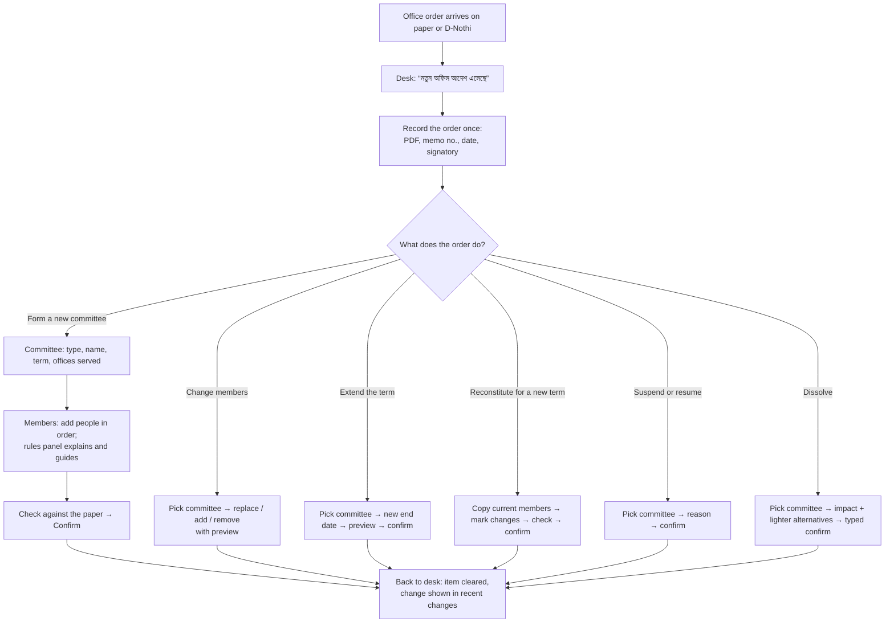

# Committee UI and workflow redesign — human-centred, operation-first

| | |
|---|---|
| **Package** | `packages/gov-store/committee` |
| **Replaces** | [DESIGN.md §13](DESIGN.md#13-ui-and-ux-workspaces) (UI and UX workspaces). The registry model, services, security and routes in DESIGN.md are unchanged. |
| **Design files on disk** | [`design/`](design/README.md): 12 screens as standalone HTML + PNG, `tokens.json`, component map for AdminLTE 2 — start here when implementing |
| **Visual design** | Design canvas *Committee Desk — human-centred redesign* (12 screens): https://claude.ai/artifact/LU6iwFGvZZFLjWXrwDnELL — private to its owner until shared from the canvas's Share menu |
| **Date** | 5 October 2026 |
| **Reads with** | [Implementation record](../../../docs/verification/committee-implementation-2026-10-05.md), [G1 human-centred principles](../../../docs/gap-analysis/g1-unprotected-actions-analysis.md#human-centered-principles) |

---

## 1. Why the current UI needs to change

The delivered workspace (`workspace.blade.php`, screenshots in the implementation record) exposes the data model rather than the work:

| What a registrar sees today | Why it hurts |
|---|---|
| One long page with every form open at once: seats, appoint, replace, release, coverage, orders, lookup, external member | Nobody knows where to start; every action looks equally important |
| Eight navigation buttons on every page (dashboard, registry, new, mine, transfers, types, purposes, search) | Admin settings sit beside daily work; members see links they can't use |
| The office order is recorded *after* building the committee, then picked by ID from an `order_id` dropdown in every form | Real work starts from the paper order. The system asks for it last and in many places. |
| Words from the database: holder kind `PERSON / POST / EXTERNAL`, *scope type*, *seat role code*, *tenure*, *release reason* | Registrars think in "who", "which office", "which order", not in table names |
| History shows `CommitteeActivated · 2026-10-04 18:46:47.419761 · 3` | Event codes, microseconds and a user ID mean nothing to a person or an auditor |
| The checklist says what is wrong but not why, or how to fix it | People guess, or phone the ICT officer |
| An "as of date" picker sits at the top of every committee page | A rare audit question is placed in the way of daily work |

## 2. Principles

1. **Start from the paper.** Every change to a committee comes from an office order. The flow begins by recording that order once (number, date, signatory, PDF) and then asks *what the order does*. The order is carried through the rest of the flow, never picked again from a dropdown.
2. **Organise by job, not by table.** Screens are named after what people come to do: *a new order arrived*, *someone was transferred*, *replace a member*, *is my office covered?*
3. **Tell people what needs them.** The home screen is a short to-do list with one clear action per item, not a dashboard of counters.
4. **Explain every rule in plain words, with its reason.** A blocked choice says what the rule is, why it exists (in words written by the ministry), and how to fix it.
5. **Show the result before it happens.** Every change previews the committee *after* the change ("will be ready to work", "will need attention") before the user confirms.
6. **Permanent things feel permanent; routine things feel light.** Only dissolution asks for the typed committee number. Replacing a member is one screen with one confirmation.
7. **Never lose work.** Drafts save themselves; leaving a flow keeps the draft; nothing is lost if the session ends.
8. **Show only what the person can use.** Members never see registrar tools; registrars never see national settings; actions a person cannot do are shown disabled with the reason (G1 principle 2), not hidden, when they have a legitimate reason to be on the screen.
9. **Bangla first, plain language, accessible.** Bangla wording leads, using the words offices already use (সভাপতি, সদস্য সচিব, পদাধিকারবলে, স্মারক নং). Dates show Bangla digits, with the Bangla calendar date where the order uses it. Status is never colour alone. Every target is at least 44 px. Every screen works on a tablet and a phone.

## 3. Information architecture

Navigation shrinks from eight buttons to **three tabs**, plus settings only for ministry admins:

| Tab | Who sees it | What it answers |
|---|---|---|
| **কমিটি ডেস্ক** (Committee desk) | Office admin, registrar | "What needs me today, and is my office covered?" |
| **সব কমিটি** (All committees) | Anyone with `committee.view` | "Find a committee or a person" (list with search built in) |
| **আমার কমিটি** (My committees) | Everyone | "Which committees am I on, and in what role?" |
| **নিয়মাবলি** (Rules), inside admin settings | Company admin, superuser | "What rules do our committees follow?" (types and purposes) |

Removed as separate destinations: *new* (now "a new office order arrived" on the desk), *transfers* (now "someone was transferred" on the desk), *search* (built into All committees and the desk), *types* and *purposes* (under Rules).

## 4. Screens

Each row links a canvas artboard to the existing routes it uses. The backend is reused; §7 lists the few additions.

| # | Screen (canvas artboard) | Who | Purpose | Existing routes reused |
|---|---|---|---|---|
| 1A | **Committee desk** (`Main`) | Office admin, registrar | Three start buttons (new order · someone transferred · find); *needs your attention* list; *which committee covers which job* table; recent changes as sentences | `committee.dashboard`, `api/coverage`, health projection |
| 1B | **Committee page** (`Committee`) | `committee.view` | Who sits on it (people cards in order of precedence), term bar with days left, status in words, the orders, which offices it serves; one row of verbs: change members, add, extend, reconstitute, print, *more* | `committee.show`, `api/{c}/roster` |
| 1C | **History** (`History`) | `committee.view` | Changes grouped by order, in sentences, with who recorded them; "who was on it on a date?" with print; "records intact" badge | `committee.history`, ledger verification |
| 2A | **A new office order** (`Order`) | Registrar | Step 1: upload the signed order, memo number (duplicate check inline), date (with Bangla calendar), signatory (suggested); then choose *what this order does* | `committee.command.create`, `committee.command.order` |
| 2B | **Who sits on it** (`Form`) | Registrar | Step 3: members in order of precedence, role per person, live *rules for this committee* panel with reasons and fix links | `seats`, `appoint`, `changeDraftHolder`, `api/{c}/composition` |
| 2C | **Add a person** (`AddPerson`) | Registrar | One drawer, three tabs: *this office* (search), *another office* (verification code, "is this the right person?"), *not on NIAR* (name and designation). *Appointed by post* is a checkbox, not a holder-kind field. | `api/people`, `api/people/by-code`, `committee.command.external` |
| 2D | **Check and confirm** (`Confirm`) | Registrar | Step 4: the committee laid out like the order, to compare against the paper; *what happens when you confirm*; one confirm button | `committee.command.activate` |
| 3A | **Replace a member** (`Replace`) | Registrar | Who's leaving and why (chips) → who's coming → which order → preview of the committee after the change | `replace`, `release`, `appoint` |
| 3B | **Someone was transferred** (`Transfer`) | Registrar | Start from the person; all their seats; a replacement per seat with its effect; seats in other offices' committees say who to tell; one order; one save for all | `api/transfers`, `transfers/apply` |
| 3C | **Dissolve** (`Dissolve`) | Office admin, registrar | Suggests the lighter alternative first (replace or reconstitute); shows what loses cover; order, reason, typed number | `api/{c}/impact`, `dissolve` |
| 4A | **My committees** (`Mine`, phone) | Every member | New responsibilities first; one card per committee with *your role*, office, term and status; other-office committees labelled; past committees folded | `committee.mine` |
| 4B | **Committee rules** (`Rules`) | Company admin | The composition policy written as editable sentences, including the *reason* registrars will see; the impact before saving; reason for change | `admin/types` commands |

## 5. Workflows

### 5.1 The main loop: an office order arrives

The order captured in step C is attached to every change made in that flow. When the user starts from a committee page instead (for example *Change members* on 1B), the first step asks for the order in the same compact form, or offers an order already recorded today for that committee.

### 5.2 Job catalogue

| Job | Trigger | Steps the person takes | What the system does for them | Ends with |
|---|---|---|---|---|
| **J1 Daily check** | Registrar opens NIAR | Reads the desk | Builds the to-do list from health, expiry (30 and 7 days) and missing coverage; each item has one action | Nothing left that blocks an office job |
| **J2 Record an order** | Order arrives | Upload, type memo no., date, signatory; choose what it does | Duplicate memo check; Bangla/English digits accepted; signatory suggested from the office's previous orders | The order is held for the rest of the flow |
| **J3 Form a committee** | Order says "form" | Choose the committee from plain descriptions ("Checks goods when they arrive"); term as a choice (*this fiscal year / fixed dates / until further order / one task*); offices served (this office preselected); add members | Name filled from the type in both languages; FY dates computed; rules panel live | Confirm screen → active committee; desk warning cleared |
| **J4 Add a person** | Inside J3, J5, J6 | Choose *this office / another office / not on NIAR* | Code lookup shows the person to confirm; external status computed and explained; *appointed by post* reminder on transfer | Person placed in the chosen order position |
| **J5 Replace one member** | Desk item, or committee page | Who's leaving + reason chip; who's coming; which order | Leaving date prefilled from office-membership end date; preview of the committee after; vacancy gap noted for history | Committee status updates on the desk |
| **J6 Someone was transferred** | Transfer order for an officer | Find the person; choose a replacement or *leave vacant* per seat; one order | Lists every seat; effect per seat; seats in other offices' committees show who to tell, with a copyable note | One save; all succeed or none |
| **J7 Term ending** | Desk item 30 and 7 days before | *Extend* (needs an order) or *let it end* | *Let it end* simply dismisses the reminder; expiry happens on schedule | Item cleared |
| **J8 New fiscal year** | Reconstitution order | Start from the current committee; mark who changes | Copies members; diff shows kept, added, removed; old one ends the day before | New version active; history links both |
| **J9 Suspend / resume** | Inquiry or similar | Reason and order | Consumers see the committee as unable to act during suspension | Status shown in words on the desk |
| **J10 Dissolve** | Dissolution order | Read the impact; consider the lighter options offered; type the number | Lists offices and jobs left without cover | Committee closed; history kept |
| **J11 Correct a mistake** | Wrong date or name entered | *More → Correct a mistake* | Requires a corrigendum order or a reason; keeps the original; warns if store records relied on the old roster | Correction shown in history as a correction |
| **J12 Member checks their committees** | Member opens *My committees* | Reads | Shows new appointments first; read-only; other offices' committees labelled | Member knows their roles |
| **J13 "Who was on it on that date?"** | Audit query | History → pick a date → print | Roster as on that date with designations at the time and the orders behind them | Printed roster for the file |
| **J14 Ministry admin sets rules** | New circular or policy | Edit rule sentences; write the reason registrars will see; give a reason for the change | Shows how many active committees would not meet the new rule (not shut down; applies at reconstitution) | Rules saved; national changes still go through national review |

### 5.3 What each person's day looks like

- **Registrar (Abdul Mannan):** opens the desk, sees three items, clears the urgent one with *Replace member* in under two minutes, records a new order when one arrives. Never sees a table or an ID.
- **Office admin (Nasrin Akter):** same desk; also the person named when someone without permission tries an action (G1 "who can help").
- **Member (Engr. Sharmin Sultana):** opens *My committees* on her phone to see a new appointment and its order. Nothing else to manage.
- **Ministry admin (Farhana Yasmin):** edits rules as sentences, writes the reasons offices will read, sees the effect before saving.

## 6. Wording: from database terms to people's words

| Today (engineering) | Redesign (বাংলা) | Redesign (English) |
|---|---|---|
| Seat / seat role code | ভূমিকা (সভাপতি, সদস্য সচিব, সদস্য) | Role |
| Tenure | (not shown) — "০১ জুলাই ২০২৬ থেকে" | "Since 1 July 2026" |
| Holder kind PERSON | এই দপ্তর থেকে | From this office |
| Holder kind POST | পদাধিকারবলে (checkbox) | Appointed by post |
| Holder kind EXTERNAL | NIAR-এ নেই / অন্য দপ্তরের সদস্য | Not on NIAR / member from another office |
| Scope, scope type, coverage | যে দপ্তরের জন্য | Offices it serves |
| Purpose binding | কোন কাজ কোন কমিটি দেখছে | Which committee covers which job |
| Order kind CONSTITUTION / AMENDMENT … | কমিটি গঠন / সদস্য পরিবর্তন / মেয়াদ বৃদ্ধি … | Form / change members / extend … |
| Release reason TRANSFER … | কেন যাচ্ছেন? বদলি, অবসর … | Why are they leaving? |
| Health OPERABLE / AT_RISK / INOPERABLE | কাজের জন্য প্রস্তুত / মনোযোগ প্রয়োজন / কাজ করতে পারবে না | Ready to work / Needs attention / Can't act |
| Activate | কমিটি কার্যকর করুন | Make the committee official |
| Composition findings | এই কমিটির নিয়ম | Rules for this committee |
| Ledger, chain verified | রেকর্ড অক্ষত — কিছু মোছা বা বদলানো হয়নি | Records intact — nothing deleted or altered |
| `CommitteeActivated · 18:46:47.419761 · 3` | "০১ জুলাই · ৩ জন সদস্য নিয়ে কমিটি কার্যকর হলো · রেকর্ড করেছেন আব্দুল মান্নান" | "1 July · Committee made official with 3 members · recorded by Abdul Mannan" |
| `as_of` | কোনো নির্দিষ্ট দিনে কারা সদস্য ছিলেন? | Who was on it on a given date? |
| Committee number `CM-4-2627-0001` | Shown small, beside the name; never the main label | Same |

Rule: **no raw codes, IDs, enum values, event names or timestamps finer than minutes** may appear on any screen except the print footer reference and safe-failure reference IDs.

## 7. Behaviour rules and the small backend additions they need

The redesign reuses the delivered services and routes. These additions are needed; none changes the registry model or its security.

| # | Behaviour | Backend addition |
|---|---|---|
| B1 | Desk to-do list | `GET api/desk`: one call returning attention items for the working office (health issues, expiring terms, purposes with no operable committee), each with a severity, a plain sentence key and a target action. Built from existing health, coverage and expiry data. |
| B2 | History in sentences | A translation key per ledger event type with named placeholders (`history.MemberReplaced` → ":new became :role in place of :old (:reason)"), plus actor *names* instead of IDs. The transformer resolves names; the ledger is unchanged. |
| B3 | Rules explain themselves | Add an optional `reason_bn` / `reason_en` to each policy rule in `composition_policy` (for example `incompatible_duties[].reason_bn`). Findings return the reason text. |
| B4 | Start from the order | One command that creates the draft and records the constitution order together (or the UI calls the two existing commands in sequence and rolls back the draft if the order fails). The draft remembers its *working order* so later steps don't ask again. |
| B5 | Leaving date prefilled | When replacing a member whose office membership ended, return that end date with the roster so the form can prefill it. |
| B6 | Transfer: other offices | `api/transfers` also lists seats in committees owned by other offices, read-only, with the owning office's name, so the screen can say who to tell. No change is made to those committees. |
| B7 | Never lose work | Draft forms save on change (debounced) using the existing `PUT {c}/draft` with `lock_version`; a conflict shows "someone else changed this draft — reload" instead of an error. |
| B8 | Dismiss "let it end" | A per-user dismissal of an expiry reminder (stored with the user, not on the committee), so *let it end* clears the desk item without any committee change. |
| B9 | Bangla dates | A display helper that formats dates with Bangla digits and, where enabled, the Bangla calendar date (revised Bangla calendar: e.g. 3 Oct 2026 = ১৮ আশ্বিন ১৪৩৩). Storage stays Gregorian. |

## 8. Implementation notes for the Blade layer

- **Split `workspace.blade.php`** into one view per screen in §4 (`desk`, `show`, `history`, `order/start`, `order/committee`, `order/members`, `order/confirm`, `replace`, `transfer`, `dissolve`, `mine`, `rules`) and shared partials: `partials/person-card`, `partials/rules-panel`, `partials/status`, `partials/order-summary`, `partials/stepper`, `partials/add-person-drawer`.
- **AdminLTE 2 / Bootstrap 3 only.** Stepper = an ordered list styled with existing classes; drawer = a right-aligned Bootstrap modal; reason chips = a `btn-group` of radio buttons; people cards = `box` with `box-body`. No Bootstrap 5 utilities.
- **Keep the existing AJAX pattern** (`cm-command` forms returning JSON) but return a **next screen** and a **human message** for each command, so the UI can move the person on instead of reloading the long page.
- **`<x-gov-action>`** stays the way every button decides enabled/disabled-with-reason.
- **Strings**: every new string in both `en-US` and `bn-BD` under `committee::committee.ux.*`; the existing compiled-Blade and bilingual-key tests extend to the new views.
- **Remove from screens**: the global *as of* picker (moves to History), event codes, lock versions, raw IDs, the eight-button nav.

## 9. Usability check before release

Run short sessions (G1 principle 10) with at least two registrars, one office admin and two committee members. Give each a printed sample order and these tasks; success is completion without help and the person explaining the screen back in their own words.

| Task | Success means |
|---|---|
| "This order forms a stock verification committee. Record it." | Committee active, matching the paper, in under 10 minutes; storekeeper rule understood from the screen's own words |
| "Rafiqul Islam has been transferred. Sort out his committees." | Uses *Someone was transferred*; understands the other-office seat needs a call |
| "The inspection committee's term ends this month. What do you do?" | Chooses extend or let it end with confidence |
| "Who was on the receiving committee on 15 September?" | Finds and prints the roster from History |
| (Member) "Which committees are you on, and what is your role?" | Answers from *My committees* on a phone |

Accessibility: pa11y (WCAG 2.1 AA) on the desk, the four order steps, the replace screen and the dissolve dialog; screen reader announces disabled reasons; full keyboard path through the add-person drawer.

## 10. What does not change

- Registry rules, security, boundaries, private files, the ledger, national review and every `gov.can` ability stay exactly as implemented.
- No approval workflow is added: *Confirm* records an order already signed outside the system.
- Store-operations integration (DESIGN.md §15) is unaffected; the desk's "which committee covers which job" uses the same resolver consumers use.
