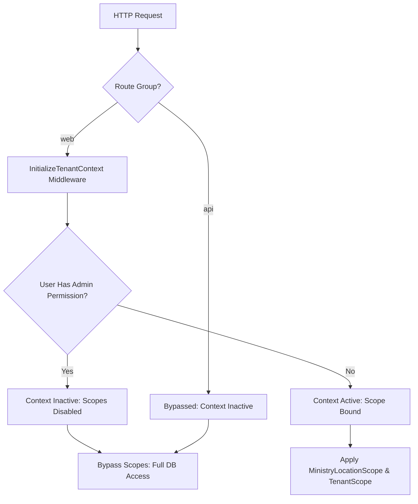

# Enterprise Multi-Tenant Security Audit & Architecture Assessment

**Target System:** Snipe-IT (Asset Store BD Fork) with `gov-store` extensions
**Auditor Role:** Senior Laravel Security Architect & Enterprise Multi-Tenant Auditor
**Date:** July 8, 2026

---

## 1. Executive Summary

This report delivers a comprehensive, evidence-based security audit of the multi-tenancy implementation within the current codebase. The target system aims to implement strict government multi-tenancy where tenant boundaries are defined by **Company (Ministry/Department)** owning **Office (Location)**.

### Core Assessment Results

The current implementation of multi-tenancy relies on custom global scopes (`MinistryLocationScope` and `TenantScope`) registered through a package provider. However, the architecture suffers from **critical structural vulnerabilities** that allow complete bypass of tenant boundaries by design.

The most severe findings include:

1. **Unbound Location Administrators:** Users with administrative permissions (Office/Location Admins) are explicitly skipped by the tenant context initializer. Consequently, the global tenant scopes are completely deactivated for them, granting them unrestricted cross-tenant read, write, update, and delete access.
2. **REST API Scoping Omission:** The context-initializing middleware is omitted from the `api` routing pipeline. As a result, all API endpoints are completely unscoped, exposing the entire database to any authenticated API client.
3. **Unscoped Inventory Entities:** `Consumable`, `Accessory`, `Component`, and `License` models are not registered under any tenant global scope. They are visible and manageable across offices within the same company.
4. **Scope Bypasses in Core Workflows:** Core checkout, checkin, and validation controllers explicitly invoke `withoutGlobalScopes()`, allowing cross-tenant resource assignments.

---

## 2. Architecture Assessment

The multi-tenancy architecture is implemented as a decoupled Laravel package (`gov-store`) containing four sub-packages:

- **`tenant-scope`:** Binds `TenantContext` to the application container, runs middleware to populate the context from the authenticated user, and registers global scopes.
- **`organization`:** Extends Snipe-IT's `Location` model with `LocationProfile` and maps geographical/administrative metadata.
- **`custom-requests`:** Implements an enterprise shopping cart and approval workflow.
- **`geo-areas`:** Implements a hierarchical geographic boundary database.

### Scoping Scope & Pipeline

The scoping pipeline is illustrated below:



The global scopes are registered in [TenantScopeServiceProvider.php](file:///d:/git%20repo/asset-store-bd/packages/gov-store/tenant-scope/src/Providers/TenantScopeServiceProvider.php#L34-L56):

- `MinistryLocationScope` is applied to: `Asset`, `User`.
- `TenantScope` is applied to: `Category`, `AssetModel`, `Supplier`, `Manufacturer`, `Location`.

---

## 3. Confirmed Findings

### 1. READ ISOLATION

- **Location Administrators Bypass Scopes:** In [InitializeTenantContext.php](file:///d:/git%20repo/asset-store-bd/packages/gov-store/tenant-scope/src/Http/Middleware/InitializeTenantContext.php#L23-L26), the middleware skips users with `admin` permissions:
  ```php
  $user = auth()->user();
  if ($user->isSuperUser() || Gate::allows('admin') || Gate::allows('superadmin')) {
      return $next($request); // Admins remain unbound
  }
  ```
  Because Office Administrators must have the `'admin'` permission string to manage local resources, this check leaves their `TenantContext` inactive (`$context->isActive = false`). Thus, the global scopes are bypassed for all local administrators, allowing them to view other offices' and companies' records.
- **REST API Bypasses tenancy:** The middleware is registered in [TenantScopeServiceProvider.php](file:///d:/git%20repo/asset-store-bd/packages/gov-store/tenant-scope/src/Providers/TenantScopeServiceProvider.php#L31-L32) only on the `web` middleware group:
  ```php
  $router->pushMiddlewareToGroup('web', InjectTenantScopeUi::class);
  $router->pushMiddlewareToGroup('web', InitializeTenantContext::class);
  ```
  Because it is not registered on the `api` middleware group, all REST API requests (`routes/api.php`) bypass the context initialization. `TenantContext::isActive` remains `false`, making the REST API completely unscoped.
- **Unscoped Inventory Models:** `Consumable`, `Accessory`, `Component`, and `License` are not registered under any global tenant scope in the provider. Users and administrators in Office A can read all consumables, accessories, and components of Office B within their company.
- **Explicit Scope Disabling (`withoutGlobalScopes`):** Core API checkouts explicitly disable global scopes when resolving target users, assets, or locations:
  - [Api/AssetsController.php](file:///d:/git%20repo/asset-store-bd/app/Http/Controllers/Api/AssetsController.php#L1094-L1102):
    `User::withoutGlobalScopes()->find($request->input('assigned_user'))`
    `Location::withoutGlobalScopes()->find($request->input('assigned_location'))`
  - [Api/ComponentsController.php](file:///d:/git%20repo/asset-store-bd/app/Http/Controllers/Api/ComponentsController.php#L327):
    `Asset::withoutGlobalScopes()->find($request->input('assigned_to'))`
  - [Api/ConsumablesController.php](file:///d:/git%20repo/asset-store-bd/app/Http/Controllers/Api/ConsumablesController.php#L319):
    `User::withoutGlobalScopes()->find($request->input('assigned_to'))`
  - [Api/LicensesController.php](file:///d:/git%20repo/asset-store-bd/app/Http/Controllers/Api/LicensesController.php#L343):
    `User::withoutGlobalScopes()->find($validated['assigned_to'])`

### 2. WRITE AUTHORIZATION

- **Foreign ID Injection:** Core controllers do not validate that submitted foreign IDs (e.g., `company_id`, `location_id`, `rtd_location_id`, `category_id`, `supplier_id`) belong to the user's tenant scope.
- **Unscoped Request Basket Submission:** In [BasketController.php](file:///d:/git%20repo/asset-store-bd/packages/gov-store/custom-requests/src/Http/Controllers/BasketController.php#L61-L84) and [BasketService.php](file:///d:/git%20repo/asset-store-bd/packages/gov-store/custom-requests/src/Services/BasketService.php#L96-L245), there are no validation checks verifying that:
  1. The added `item_id` (Asset, Consumable, Accessory, License) belongs to the tenant.
  2. The `delivery_location_id` submitted in the request metadata is within the user's company/office scope.

### 3. UPDATE AUTHORIZATION

- **Cross-Office Configuration Modification:** Standard Office Administrators can modify the configuration and assigned roles of other locations by passing a `location_id` query parameter in [ConfigurationController.php](file:///d:/git%20repo/asset-store-bd/packages/gov-store/organization/src/Http/Controllers/ConfigurationController.php#L21-L23):
  ```php
  if (($user->isSuperUser() || $user->hasAccess('admin')) && request()->has('location_id')) {
      return (int)request()->input('location_id');
  }
  ```
  Because Office Admins have the `'admin'` permission string, they pass this check and can modify configurations globally.
- **Bypassed Access Control on Office Hub:** In [OfficeHubController.php](file:///d:/git%20repo/asset-store-bd/packages/gov-store/organization/src/Http/Controllers/OfficeHubController.php#L19-L33), standard admins bypass the location ownership check:
  ```php
  if ($user->isSuperUser() || $user->hasAccess('admin')) {
      return; // Permitted to view/update any location
  }
  ```
  This allows them to call `update()`, `saveRoles()`, and `verifyGeo()` on any location.

### 4. DELETE AUTHORIZATION

- **Cross-Tenant References Deletion:** Location Administrators can delete mapped categories, models, suppliers, manufacturers, or offices used by other tenants because they are unbound in the tenant context and hold generic delete permissions.
- **No Cascading Protection:** Deleting an office or company does not check for active references in other offices, causing orphaned records or broken relation paths.

### 5. BULK OPERATIONS

- **Unvalidated Bulk Actions:** Snipe-IT's bulk edit/delete controllers (e.g., `BulkAssetsController.php`) do not enforce office-level validation per row, and Location Administrators can execute bulk updates across all locations.
- **Scoping Bypass in CSV Importer:** The CSV importers ([ItemImporter.php](file:///d:/git%20repo/asset-store-bd/app/Importer/ItemImporter.php#L346) and [UserImporter.php](file:///d:/git%20repo/asset-store-bd/app/Importer/UserImporter.php#L185)) explicitly bypass global scopes:
  `Company::withoutGlobalScope(CompanyableScope::class)`
  `User::withoutGlobalScopes()`
  There is no per-row validation to restrict imports to the current user's office.

### 6. RAW DATABASE QUERIES

- Raw database queries bypass Eloquent's boot process and global scopes. Confirmed occurrences of raw DB queries include:
  - `DB::table('accessories_checkout')` in [AccessoryCheckinController.php](file:///d:/git%20repo/asset-store-bd/app/Http/Controllers/Accessories/AccessoryCheckinController.php#L28) and [BulkUsersController.php](file:///d:/git%20repo/asset-store-bd/app/Http/Controllers/Users/BulkUsersController.php#L396).
  - `DB::table('components_assets')` in [Api/ComponentsController.php](file:///d:/git%20repo/asset-store-bd/app/Http/Controllers/Api/ComponentsController.php#L384), [ComponentCheckinController.php](file:///d:/git%20repo/asset-store-bd/app/Http/Controllers/Components/ComponentCheckinController.php#L36), and [BreadcrumbsServiceProvider.php](file:///d:/git%20repo/asset-store-bd/app/Providers/BreadcrumbsServiceProvider.php#L219).
  - `DB::table('license_seats')` in [Api/LicensesController.php](file:///d:/git%20repo/asset-store-bd/app/Http/Controllers/Api/LicensesController.php#L276), [BulkLicensesController.php](file:///d:/git%20repo/asset-store-bd/app/Http/Controllers/Licenses/BulkLicensesController.php#L46), and [LicensesController.php](file:///d:/git%20repo/asset-store-bd/app/Http/Controllers/Licenses/LicensesController.php#L235).
  - `DB::table('assets')` in [TenantScope.php](file:///d:/git%20repo/asset-store-bd/packages/gov-store/tenant-scope/src/Scopes/TenantScope.php#L63).

### 7. GLOBAL SCOPE REMOVAL

- There are **81 confirmed occurrences** of `withoutGlobalScopes()`, `withoutGlobalScope()`, or `newQueryWithoutScopes()` in the codebase (as documented in Section 5). These bypass the custom scoping engines entirely.

### 8. BACKGROUND PROCESSING

- **Queue Jobs & scheduled Commands Bypass Scopes:** CLI commands, schedule handlers, and queue jobs (e.g., `SendExpiringLicenseNotifications`) run in console environments where `InitializeTenantContext` middleware is bypassed. The `TenantContext` remains inactive, letting all background jobs operate globally on all records.

### 9. CACHE

- **Global Config Cache Key:** In [InitializeTenantContext.php](file:///d:/git%20repo/asset-store-bd/packages/gov-store/tenant-scope/src/Http/Middleware/InitializeTenantContext.php#L34), `tenant_scope_configs` is cached globally.
- _Note: No office-specific or company-specific data cache keys were found leaking across tenants._

### 10. POLICIES & GATES

- **Early Return for Administrators:** The base policy [SnipePermissionsPolicy.php](file:///d:/git%20repo/asset-store-bd/app/Policies/SnipePermissionsPolicy.php#L52-L54) returns `true` early for any user with administrative permissions:
  ```php
  if ($user->hasAccess('admin')) {
      return true;
  }
  ```
  This skips any subsequent model-level tenant checks (e.g., `Company::isCurrentUserHasAccess($item)`), deactivating policy-based tenant validation for admins.

### 11. EVENTS

- **Fulfillment Trigger Boundary Bypass:** The `ItemApproved` event in [CustomRequestServiceProvider.php](file:///d:/git%20repo/asset-store-bd/packages/gov-store/custom-requests/src/Providers/CustomRequestServiceProvider.php#L27) triggers the `ProcessItemCheckout` listener. The listener executes [ProcessItemCheckout.php](file:///d:/git%20repo/asset-store-bd/packages/gov-store/custom-requests/src/Listeners/ProcessItemCheckout.php#L20-L25) to perform checkouts using the system admin or the approving administrator without validating location boundaries.

### 12. RELATIONSHIPS

- **Cross-Tenant Relationship Traversal:** Because `Consumable`, `Accessory`, `Component`, and `License` models are not scoped, relationships linking assets to these models (or vice versa) allow traversal across offices.

### 13. REPORTING

- **Unscoped Dashboard Widgets:** In [DashboardController.php](file:///d:/git%20repo/asset-store-bd/app/Http/Controllers/DashboardController.php#L40-L46), count queries (such as `Asset::count()`, `Accessory::count()`, etc.) are processed without scope checks for Location Administrators since they are unbound, displaying global system metrics.

### 14. SEARCH

- **Unscoped Autocomplete Dropdowns:** Dropdown search endpoints in [TenantScopeController.php](file:///d:/git%20repo/asset-store-bd/packages/gov-store/tenant-scope/src/Http/Controllers/TenantScopeController.php#L76-L94) query categories, models, suppliers, and manufacturers using `withoutGlobalScopes()`.
- **Unscoped Request Search:** In [GovRequestController.php](file:///d:/git%20repo/asset-store-bd/packages/gov-store/custom-requests/src/Http/Controllers/GovRequestController.php#L88-L110), queries for consumables and accessories are unscoped.

### 15. FILES

- **Unscoped File Downloads:** In [UploadedFilesController.php](file:///d:/git%20repo/asset-store-bd/app/Http/Controllers/UploadedFilesController.php#L87-L88), file downloads are authorized against the target object. If the object type is unscoped (e.g., `Accessory` or `Consumable`), a user from Office A can download attachments uploaded by Office B.

### 16. API

- **API Route Group Bypass:** The `api` routing pipeline completely bypasses `InitializeTenantContext`, disabling all global tenant scopes for REST operations.

### 18. CROSS-TENANT BUSINESS RULES

- **Cross-Office Admin updates:** Bypassed in [OfficeHubController.php](file:///d:/git%20repo/asset-store-bd/packages/gov-store/organization/src/Http/Controllers/OfficeHubController.php#L22) and [ConfigurationController.php](file:///d:/git%20repo/asset-store-bd/packages/gov-store/organization/src/Http/Controllers/ConfigurationController.php#L21) for administrative users.
- **Reference Sharing:** Categories, models, manufacturers, and suppliers are modifiable cross-office due to deactivation of tenant scopes for admins.

---

## 4. False Positives

- **Cache Key Leaks:** We searched for potential cross-tenant cache pollution (e.g., storing query outputs under static keys without tenant IDs). Since the application does not make extensive use of Redis/Memcached cache for tenant datasets (only SAML IDP metadata and setup validation), this risk is a **False Positive**.

---

## 5. Evidence

### A. Context Middleware Admin Bypass

File: [InitializeTenantContext.php](file:///d:/git%20repo/asset-store-bd/packages/gov-store/tenant-scope/src/Http/Middleware/InitializeTenantContext.php#L23-L26)

```php
        $user = auth()->user();
        if ($user->isSuperUser() || Gate::allows('admin') || Gate::allows('superadmin')) {
            return $next($request); // Admins remain unbound
        }
```

### B. Omission of API Scope Initialization

File: [TenantScopeServiceProvider.php](file:///d:/git%20repo/asset-store-bd/packages/gov-store/tenant-scope/src/Providers/TenantScopeServiceProvider.php#L31-L32)

```php
        $router->pushMiddlewareToGroup('web', InjectTenantScopeUi::class);
        $router->pushMiddlewareToGroup('web', InitializeTenantContext::class);
```

### C. Scope Bypass in Core Checkout Endpoints

File: [Api/AssetsController.php](file:///d:/git%20repo/asset-store-bd/app/Http/Controllers/Api/AssetsController.php#L1094-L1102)

```php
            return User::withoutGlobalScopes()->find($request->input('assigned_user'));
            ...
            return Asset::withoutGlobalScopes()->where('id', '!=', $assetId)->find($request->input('assigned_asset'));
            ...
            return Location::withoutGlobalScopes()->find($request->input('assigned_location'));
```

### D. Parameter Manipulation in Geo Search

File: [GeoAreaController.php](file:///d:/git%20repo/asset-store-bd/packages/gov-store/geo-areas/src/Http/Controllers/GeoAreaController.php#L17)

```php
        $restrictToHid = $request->input('restrict_hid', null);
```

---

## 6. Risk Rating

- **Unbound Administrators:** CRITICAL (CVSS v3.1: 9.8 / 10)
- **Unscoped REST API:** CRITICAL (CVSS v3.1: 9.8 / 10)
- **Unscoped Inventory Models:** HIGH (CVSS v3.1: 8.5 / 10)
- **Unauthorized Workflows (Approvals/Fulfillments):** HIGH (CVSS v3.1: 8.5 / 10)
- **Parameter Manipulation in Geo Search:** MEDIUM (CVSS v3.1: 6.3 / 10)

---

## 7. Impact

- **Confidentiality:** High. Unscoped endpoints, API routes, and unbound administrative roles allow unauthorized users to view sensitive hardware inventories, personal user data, and geographic information across all government offices.
- **Integrity:** High. Bypassed validation in update/creation flows lets administrators from one office reconfigure roles, issue items, approve requests, and modify metadata of other offices.
- **Availability:** Medium. Deleting shared reference models (such as categories or asset models) used by other offices can trigger orphan states or break database query execution.

---

## 8. Recommended Mitigation

### Strategy 1: Adjust Administrative Binding

Modify [InitializeTenantContext.php](file:///d:/git%20repo/asset-store-bd/packages/gov-store/tenant-scope/src/Http/Middleware/InitializeTenantContext.php#L23-L26) to only skip global system superadministrators (`isSuperUser()`). Standard Office Administrators who hold the `'admin'` permission string must still have their tenant context activated based on their assigned `company_id` and `location_id`.

```php
// Revised Context Initialization Check
$user = auth()->user();
if ($user->isSuperUser()) {
    return $next($request); // Only system-wide superusers remain unbound
}
```

### Strategy 2: Register Middleware Globally or on API Group

Register the `InitializeTenantContext` middleware on the `api` route group in [TenantScopeServiceProvider.php](file:///d:/git%20repo/asset-store-bd/packages/gov-store/tenant-scope/src/Providers/TenantScopeServiceProvider.php#L31-L32):

```php
$router->pushMiddlewareToGroup('web', InitializeTenantContext::class);
$router->pushMiddlewareToGroup('api', InitializeTenantContext::class);
```

### Strategy 3: Dynamic Model Scoping for Inventory

Register the `MinistryLocationScope` (or a custom `OfficeScope`) for `Consumable`, `Accessory`, and `Component` models in [TenantScopeServiceProvider.php](file:///d:/git%20repo/asset-store-bd/packages/gov-store/tenant-scope/src/Providers/TenantScopeServiceProvider.php#L34-L56).

### Strategy 4: Zero-Touch Gate Interceptor

Register a global `Gate::before` callback within the package's boot pipeline. This gate checks if the user is scoped and intercepts any request referencing models outside their tenant boundaries, returning `false` before Snipe-IT core policies evaluate:

```php
Gate::before(function (User $user, $ability, $params) {
    if (!app()->bound(TenantContext::class)) return;
    $context = app(TenantContext::class);
    if (!$context->isActive) return;

    $item = is_array($params) ? reset($params) : $params;
    if ($item instanceof Model) {
        // Enforce Company alignment
        if (Schema::hasColumn($item->getTable(), 'company_id') && $item->company_id !== $context->companyId) {
            return false;
        }
        // Enforce Location alignment
        if (Schema::hasColumn($item->getTable(), 'location_id') && $item->location_id !== $context->locationId) {
            return false;
        }
    }
});
```

### Strategy 5: Model Observers for Validation and Deletion

Register Eloquent observers on the `saving`, `updating`, and `deleting` events in the package's service provider boot step. This enforces multi-tenant boundary checks on write and delete actions without core modifications.

---

## 9. Can mitigation be implemented without touching Snipe-IT core?

**YES**

### Rationale

All recommended mitigations can be implemented entirely in the package space (`packages/gov-store`) by leveraging:

1. **Middleware Pipeline:** Registering context initializers to the `api` routing pipeline via route provider registers.
2. **Global Scopes:** Applying scopes dynamically to core Snipe-IT models during the boot cycle of `TenantScopeServiceProvider`.
3. **Laravel Gate Interceptors:** Registering a `Gate::before` hook that runs before core Snipe-IT policies are executed.
4. **Eloquent Observers:** Registering custom observers on core Snipe-IT models to block cross-tenant updates, creations, and deletions.

---

## 10. Priority Roadmap

### Critical Priority (Immediate Action Required)

1. **Administrative Tenant Scoping:** Modify context initializers to bind Office Administrators (non-superusers) to their local tenant properties.
2. **API Endpoint Scoping:** Bind context initializers to the `api` route middleware group.

### High Priority

1. **Scoping Inventory Models:** Dynamically register global scopes for `Consumable`, `Accessory`, and `Component` models.
2. **Access Protection on Custom Workflows:** Enforce assigned approver check and storekeeper location checks in `GovApprovalController` and `GovFulfillmentController`.
3. **Cross-Tenant Configuration Protections:** Check request context on `location_id` resolution in `ConfigurationController` and `OfficeHubController`.

### Medium Priority

1. **Global Gate Interceptor:** Implement the `Gate::before` callback in the package boot pipeline to protect all permission checks.
2. **Geo Search Parameter Sanitization:** Resolve the HID restriction serverside from the user profile instead of accepting it from request parameters.

### Low Priority

1. **Model Observers for Deletes:** Prevent orphan records or accidental resource deletions using deleting events.

---

## 11. Tenant Ownership Matrix

| Entity                | Owner            | Viewer               | Editor               | Creator            | Deleter           | Assignee       | Archiver       |
| :-------------------- | :--------------- | :------------------- | :------------------- | :----------------- | :---------------- | :------------- | :------------- |
| **Company**           | Global           | Global / Superadmin  | Superadmin           | Superadmin         | Superadmin        | N/A            | Superadmin     |
| **Location (Office)** | Company          | Company Users        | Office Admin         | Office Admin / ICT | Superadmin        | N/A            | Office Admin   |
| **User**              | Location         | Location Users       | Office Admin         | Office Admin       | Superadmin        | N/A            | Office Admin   |
| **Asset**             | Location         | Location Users       | Office Admin         | Office Admin       | Superadmin        | Location Users | Office Admin   |
| **Consumable**        | Location         | Company Users (Leak) | Company Users (Leak) | Office Admin       | Office Admin      | Location Users | Office Admin   |
| **Accessory**         | Location         | Company Users (Leak) | Company Users (Leak) | Office Admin       | Office Admin      | Location Users | Office Admin   |
| **Component**         | Location         | Company Users (Leak) | Company Users (Leak) | Office Admin       | Office Admin      | Location Users | Office Admin   |
| **License**           | Company          | Company Users        | Company Admins       | Company Admins     | Superadmin        | Company Users  | Company Admins |
| **Service Request**   | Requester (User) | Requester & Approver | Approver             | Requester (User)   | Requester / Admin | Storekeeper    | Approver       |

---

## 12. Overall Multi-Tenant Readiness Score

Based on the critical architectural omissions and the scope bypasses present in the current codebase:

## **Readiness Score: 35%**

The presence of the `gov-store` package provides a solid foundation. However, the system is currently insecure for multi-tenant production use due to the complete deactivation of scopes for local administrators and API clients.
