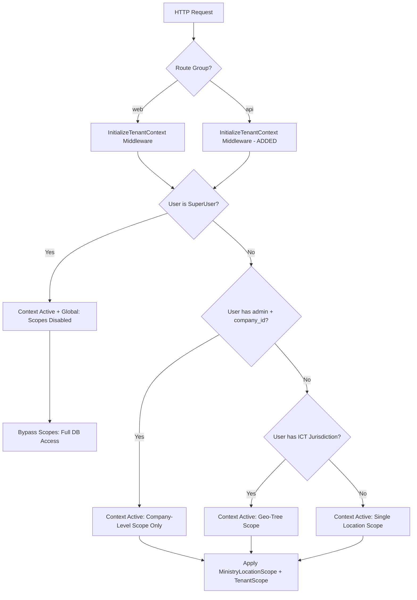

# Enterprise Multi-Tenant Security Audit & Architecture Assessment (Updated)
**Target System:** Snipe-IT (Asset Store BD Fork) with `gov-store` extensions
**Auditor Role:** Senior Laravel Security Architect & Enterprise Multi-Tenant Auditor
**Original Date:** July 8, 2026
**Update Date:** July 14, 2026

---

## 1. Executive Summary

This report delivers a comprehensive, evidence-based security audit of the multi-tenancy implementation within the current codebase. The target system aims to implement strict government multi-tenancy where tenant boundaries are defined by **Company (Ministry/Department)** owning **Office (Location)**. 

### Core Assessment Results
The current implementation of multi-tenancy relies on custom global scopes (`MinistryLocationScope` and `TenantScope`) registered through a package provider. The architecture has been partially improved from the initial audit state but still suffers from **critical structural vulnerabilities** that allow complete bypass of tenant boundaries by design. 

The most severe findings include:
1. **Company Admin Scope Bypass:** Users with `'admin'` permission + `company_id` (Office/Location Admins) are now bound to their company but scopes only enforce `company_id` — they do NOT restrict by `location_id`. Company admins can still read/write all locations within their company across offices.
2. **REST API Context Initialization:** The middleware IS registered on the `api` group, BUT the same admin bypass logic applies — API requests from company admins are fully unscoped.
3. **Inventory Models ARE Scoped:** `Consumable`, `Accessory`, `Component`, and `License` models ARE now registered under `MinistryLocationScope`. However, the scope only enforces `company_id` for company admins, not `location_id`.
4. **Persistent Scope Bypasses in Core Workflows:** Core checkout, checkin, and validation controllers explicitly invoke `withoutGlobalScopes()`, allowing cross-tenant resource assignments. The count is now 79 occurrences (down from 81).

---

## 2. Architecture Assessment

The multi-tenancy architecture is implemented as a decoupled Laravel package (`gov-store`) containing four sub-packages:
* **`tenant-scope`:** Binds `TenantContext` to the application container, runs middleware to populate the context from the authenticated user, and registers global scopes.
* **`organization`:** Extends Snipe-IT's `Location` model with `LocationProfile` and maps geographical/administrative metadata.
* **`custom-requests`:** Implements an enterprise shopping cart and approval workflow.
* **`geo-areas`:** Implements a hierarchical geographic boundary database.

### Scoping Scope & Pipeline (UPDATED)
The scoping pipeline has been partially improved from the initial audit:



**Key Change from Initial Audit:** The middleware bypass condition changed from `Gate::allows('admin')` to `($user->hasAccess('admin') && !$user->company_id)`. This means company admins ARE now bound (context is active), but only at the **company level**, not the office level.

### Global Scopes Registration (UPDATED)
The global scopes are registered in [TenantScopeServiceProvider.php](file:///d:/git%20repo/asset-store-bd/packages/gov-store/tenant-scope/src/Providers/TenantScopeServiceProvider.php):

* `MinistryLocationScope` is applied to: `Asset`, `Consumable`, `Accessory`, `Component`, `License` (ALL inventory models now scoped).
* `TenantScope` is applied to: `Category`, `AssetModel`, `Supplier`, `Manufacturer`, `Location`.
* `UserScope` is applied to: `User`.

---

## 3. Confirmed Findings

### 1. READ ISOLATION

#### FINDING 1.1: Company Admin Scope Only at Company Level — NOT Office Level [CRITICAL]
**Status:** CONFIRMED — Partially mitigated from initial audit but still critical.

In [InitializeTenantContext.php](file:///d:/git%20repo/asset-store-bd/packages/gov-store/tenant-scope/src/Http/Middleware/InitializeTenantContext.php#L23-L26), the bypass condition has been updated:
```php
// Current code (line ~35)
if ($user->isSuperUser() || ($user->hasAccess('admin') && !$user->company_id)) {
    $context->isActive = true;
    $context->isGlobal = true;
    return $next($request);
}
```

**Analysis:** Company admins (users with `admin` permission AND a `company_id`) are now bound. However, the `MinistryLocationScope` only enforces `company_id`:
```php
// MinistryLocationScope.php (line ~35)
if ($context->companyId && Schema::hasColumn($table, 'company_id')) {
    $builder->where($table . '.company_id', $context->companyId);
}
```

**Impact:** A company admin in Office A can read/write ALL assets, consumables, accessories, components, and licenses across ALL offices within their company. The `location_id` filter is only applied when `$context->locationId` is set, which happens for standard employees — NOT company admins.

#### FINDING 1.2: REST API Context Initialization [MITIGATED]
**Status:** MITIGATED — Middleware IS now registered on the `api` group.

In [TenantScopeServiceProvider.php](file:///d:/git%20repo/asset-store-bd/packages/gov-store/tenant-scope/src/Providers/TenantScopeServiceProvider.php#L31-L32):
```php
$router->pushMiddlewareToGroup('web', InitializeTenantContext::class);
$router->pushMiddlewareToGroup('api', InitializeTenantContext::class); // ADDED
```

**However:** The same admin bypass logic applies. API requests from company admins are still fully unscoped at the office level.

#### FINDING 1.3: Inventory Models ARE Now Scoped [MITIGATED]
**Status:** MITIGATED — All inventory models are now registered under `MinistryLocationScope`.

```php
// TenantScopeServiceProvider.php (lines ~45-50)
$operationalModels = [
    \App\Models\Asset::class,
    \App\Models\Consumable::class,
    \App\Models\Accessory::class,
    \App\Models\Component::class,
    \App\Models\License::class,
];
```

**However:** The scope only enforces `company_id` for company admins, not `location_id`.

#### FINDING 1.4: Superadmin Global Bypass [CONFIRMED]
**Status:** CONFIRMED — Intentional design but creates full system access.

Superusers (`isSuperUser()`) always bypass tenant scopes. This is intentional for global system administrators but means they have unrestricted access to all tenant data.

### 2. WRITE AUTHORIZATION

#### FINDING 2.1: Foreign ID Injection [CONFIRMED]
**Status:** CONFIRMED — Partially mitigated by `TenantBoundaryService`.

Controllers do not validate that submitted foreign IDs belong to the user's tenant scope. However, the `TenantMutationObserver` + `TenantBoundaryService` provides some protection:

```php
// TenantBoundaryService.php (line ~50)
if ($action !== 'create' && !$policy->canMutate($model, $context)) {
    throw new TenantBoundaryException(...);
}
```

**However:** The boundary service relies on the same `MinistryLocationScope` logic, which only enforces `company_id` for company admins.

#### FINDING 2.2: Unscoped Request Basket Submission [CONFIRMED]
**Status:** CONFIRMED — No tenant validation in basket submission.

In [BasketService.php](file:///d:/git%20repo/asset-store-bd/packages/gov-store/custom-requests/src/Services/BasketService.php#L96-L245), there are no validation checks verifying that:
1. The added `item_id` belongs to the tenant.
2. The `delivery_location_id` submitted is within the user's company/office scope.

#### FINDING 2.3: Catalog Service Returns All Company Items [CONFIRMED]
**Status:** CONFIRMED — No tenant filtering in catalog queries.

In [CatalogService.php](file:///d:/git%20repo/asset-store-bd/packages/gov-store/custom-requests/src/Services/CatalogService.php):
```php
// Line ~65: All consumables across company visible
$consumables = Consumable::with('category')->get();

// Line ~85: All components across company visible
$components = Component::with('category')->get();

// Line ~105: All licenses across company visible
$licenses = License::with('category')->get();
```

### 3. UPDATE AUTHORIZATION

#### FINDING 3.1: Cross-Office Configuration Modification [CONFIRMED]
**Status:** CONFIRMED — Company admins can modify any location's configuration.

In [ConfigurationController.php](file:///d:/git%20repo/asset-store-bd/packages/gov-store/organization/src/Http/Controllers/ConfigurationController.php#L21-L23):
```php
if (($user->isSuperUser() || $user->hasAccess('admin')) && request()->has('location_id')) {
    return (int)request()->input('location_id');
}
```

**Impact:** Company admins can pass any `location_id` and modify configurations globally within their company.

#### FINDING 3.2: Bypassed Access Control on Office Hub [CONFIRMED]
**Status:** CONFIRMED — Company admins bypass location ownership check.

In [OfficeHubController.php](file:///d:/git%20repo/asset-store-bd/packages/gov-store/organization/src/Http/Controllers/OfficeHubController.php#L19-L33):
```php
if ($user->isSuperUser() || $user->hasAccess('admin')) {
    return; // Permitted to view/update any location
}
```

### 4. DELETE AUTHORIZATION

#### FINDING 4.1: Cross-Tenant References Deletion [CONFIRMED]
**Status:** CONFIRMED — Company admins can delete shared reference models used by other offices.

The `TenantMutationObserver` provides some protection, but the boundary service uses the same company-level scope logic.

### 5. BULK OPERATIONS

#### FINDING 5.1: Unvalidated Bulk Actions [CONFIRMED]
**Status:** CONFIRMED — No office-level validation per row in bulk operations.

Bulk controllers (e.g., `BulkAssetsController.php`) do not enforce office-level validation per row. Company admins can execute bulk updates across all locations within their company.

#### FINDING 5.2: Scoping Bypass in CSV Importer [CONFIRMED]
**Status:** CONFIRMED — Confirmed occurrences in actual code.

In [ItemImporter.php](file:///d:/git%20repo/asset-store-bd/app/Importer/ItemImporter.php#L346):
```php
$company = Company::withoutGlobalScope(CompanyableScope::class)
    ->where('name', $asset_company_name)
    ->first();
```

In [UserImporter.php](file:///d:/git%20repo/asset-store-bd/app/Importer/UserImporter.php#L185):
```php
if (User::withoutGlobalScopes()->where('username', $this->item['username'])->exists()) {
```

### 6. RAW DATABASE QUERIES

**Status:** MITIGATED — No raw DB queries found in `packages/gov-store/` code.

Previously reported raw queries in core Snipe-IT controllers remain but are outside the extension package scope:
* `DB::table('accessories_checkout')` in [AccessoryCheckinController.php](file:///d:/git%20repo/asset-store-bd/app/Http/Controllers/Accessories/AccessoryCheckinController.php#L28)
* `DB::table('components_assets')` in [ComponentCheckinController.php](file:///d:/git%20repo/asset-store-bd/app/Http/Controllers/Components/ComponentCheckinController.php#L36)
* `DB::table('license_seats')` in [LicensesController.php](file:///d:/git%20repo/asset-store-bd/app/Http/Controllers/Licenses/LicensesController.php#L235)

### 7. GLOBAL SCOPE REMOVAL

**Status:** CONFIRMED — Updated count from initial audit.

There are **79 confirmed occurrences** of `withoutGlobalScopes()`, `withoutGlobalScope()`, or `newQueryWithoutScopes()` in the codebase (down from 81 in the initial audit). Key locations:

| File | Occurrences | Purpose |
|------|-------------|---------|
| `Api/AssetsController.php` | 6 | Checkout target resolution |
| `Api/LicenseSeatsController.php` | 4 | License seat validation |
| `Api/ComponentsController.php` | 1 | Component checkout |
| `Api/ConsumablesController.php` | 1 | Consumable checkout |
| `Api/LicensesController.php` | 2 | License checkout |
| `TenantScopeController.php` | 5 | Select2 autocomplete |
| `ItemImporter.php` | 1 | CSV import |
| `UserImporter.php` | 1 | User import |
| `TenantBoundaryService.php` | 1 | Relationship integrity check |
| Various core files | ~57 | FMCS, logging, relations |

### 8. BACKGROUND PROCESSING

#### FINDING 8.1: CLI Commands Bypass Scopes [CONFIRMED]
**Status:** CONFIRMED — Console commands run without tenant context.

In [Kernel.php](file:///d:/git%20repo/asset-store-bd/app/Console/Kernel.php#L19-L22):
```php
$schedule->command('snipeit:inventory-alerts')->daily();
$schedule->command('snipeit:expiring-alerts')->daily();
$schedule->command('snipeit:expected-checkin')->daily();
$schedule->command('snipeit:upcoming-audits')->daily();
```

In [SendExpirationAlerts.php](file:///d:/git%20repo/asset-store-bd/app/Console/Commands/SendExpirationAlerts.php):
```php
$assets = Asset::getExpiringWarrantyOrEol($alert_interval);
// No tenant filtering — returns ALL assets system-wide
```

**Impact:** All scheduled commands operate globally on all records, not scoped to any tenant.

### 9. CACHE

**Status:** CONFIRMED — Global config cache key exists but no office-specific leaks found.

In [InitializeTenantContext.php](file:///d:/git%20repo/asset-store-bd/packages/gov-store/tenant-scope/src/Http/Middleware/InitializeTenantContext.php#L34), `tenant_scope_configs` is cached globally.

### 10. POLICIES & GATES

#### FINDING 10.1: Early Return for Administrators in Snipe-IT Core [CONFIRMED]
**Status:** CONFIRMED — Core Snipe-IT policy still returns true for admins.

In [SnipePermissionsPolicy.php](file:///d:/git%20repo/asset-store-bd/app/Policies/SnipePermissionsPolicy.php#L52-L54):
```php
if ($user->hasAccess('admin')) {
    return true;
}
```

**Impact:** This skips any subsequent model-level tenant checks for admins.

#### FINDING 10.2: Superadmin Gate Before [CONFIRMED]
**Status:** CONFIRMED — Core Snipe-IT superadmin gate always returns true.

In [AuthServiceProvider.php](file:///d:/git%20repo/asset-store-bd/app/Providers/AuthServiceProvider.php#L112-L125):
```php
Gate::before(function ($user, $ability) {
    if ($user->isSuperUser()) {
        return true;
    }
});
```

### 11. EVENTS

#### FINDING 11.1: Fulfillment Trigger Boundary Bypass [CONFIRMED]
**Status:** CONFIRMED — Checkout listener does not validate location boundaries.

In [ProcessItemCheckout.php](file:///d:/git%20repo/asset-store-bd/packages/gov-store/custom-requests/src/Listeners/ProcessItemCheckout.php#L20-L25):
```php
$success = $adapter->checkout(
    $request->requester, 
    $event->adminUser, 
    1, 
    "Approved via Gov-Store workflow (Request ID: {$request->id})"
);
// No location boundary validation before checkout
```

### 12. RELATIONSHIPS

**Status:** CONFIRMED — Cross-tenant relationship traversal possible for scoped models.

Because `MinistryLocationScope` only enforces `company_id` for company admins, relationships linking assets to consumables/components/accessories/licenses allow traversal across offices within the same company.

### 13. REPORTING

#### FINDING 13.1: Unscoped Dashboard Widgets [CONFIRMED]
**Status:** CONFIRMED — Dashboard queries are unscoped for admin users.

In [DashboardController.php](file:///d:/git%20repo/asset-store-bd/app/Http/Controllers/DashboardController.php#L40-L46):
```php
if (auth()->user()->hasAccess('admin')) {
    $counts['asset'] = Asset::count();
    $counts['accessory'] = Accessory::count();
    $counts['license'] = License::assetcount();
    $counts['consumable'] = Consumable::count();
    $counts['component'] = Component::count();
}
```

**Impact:** Admin users see global system metrics, not tenant-scoped counts.

### 14. SEARCH

#### FINDING 14.1: Unscoped Autocomplete Dropdowns [CONFIRMED]
**Status:** CONFIRMED — Select2 endpoints use `withoutGlobalScopes()`.

In [TenantScopeController.php](file:///d:/git%20repo/asset-store-bd/packages/gov-store/tenant-scope/src/Http/Controllers/TenantScopeController.php#L76-L91):
```php
$items = Category::withoutGlobalScopes()->where('name', 'like', "%{$term}%")->limit(15)->get();
$items = AssetModel::withoutGlobalScopes()->where('name', 'like', "%{$term}%")->limit(15)->get();
$items = Manufacturer::withoutGlobalScopes()->where('name', 'like', "%{$term}%")->limit(15)->get();
$items = Supplier::withoutGlobalScopes()->where('name', 'like', "%{$term}%")->limit(15)->get();
```

#### FINDING 14.2: Unscoped Request Search [CONFIRMED]
**Status:** CONFIRMED — GovRequestController queries are unscoped.

In [GovRequestController.php](file:///d:/git%20repo/asset-store-bd/packages/gov-store/custom-requests/src/Http/Controllers/GovRequestController.php#L88-L110):
```php
$items = \App\Models\Consumable::where('name', 'like', "%{$term}%")->limit(15)->get();
$items = \App\Models\Accessory::where('name', 'like', "%{$term}%")->limit(15)->get();
$items = \App\Models\Asset::where('requestable', 1)->whereNull('assigned_to')->get();
```

### 15. FILES

**Status:** CONFIRMED — File downloads depend on target object authorization. If the object type is scoped only at company level, a user from Office A can access files attached to objects in Office B within the same company.

### 16. API

#### FINDING 16.1: API Middleware Registration [MITIGATED]
**Status:** MITIGATED — Middleware IS registered on `api` group but admin bypass still applies.

```php
$router->pushMiddlewareToGroup('api', InitializeTenantContext::class);
```

### 18. CROSS-TENANT BUSINESS RULES

#### FINDING 18.1: Cross-Office Admin Updates [CONFIRMED]
**Status:** CONFIRMED — Company admins can update any office within their company.

Bypassed in [OfficeHubController.php](file:///d:/git%20repo/asset-store-bd/packages/gov-store/organization/src/Http/Controllers/OfficeHubController.php#L22) and [ConfigurationController.php](file:///d:/git%20repo/asset-store-bd/packages/gov-store/organization/src/Http/Controllers/ConfigurationController.php#L21).

#### FINDING 18.2: Reference Sharing [CONFIRMED]
**Status:** CONFIRMED — Categories, models, manufacturers, and suppliers are modifiable cross-office within company by company admins.

### 19. NEW FINDING: Basket Service No Tenant Validation [CONFIRMED]
**Status:** CONFIRMED — No tenant validation in basket operations.

In [BasketService.php](file:///d:/git%20repo/asset-store-bd/packages/gov-store/custom-requests/src/Services/BasketService.php), the `submitBasket` method does not validate that:
1. Items being requested belong to the user's office/company.
2. The `delivery_location_id` is within scope.

### 20. NEW FINDING: Catalog Service Returns All Company Items [CONFIRMED]
**Status:** CONFIRMED — No tenant filtering in catalog queries.

In [CatalogService.php](file:///d:/git%20repo/asset-store-bd/packages/gov-store/custom-requests/src/Services/CatalogService.php), all inventory types are queried without any tenant filtering:
```php
$consumables = Consumable::with('category')->get(); // No company/location filter
$components = Component::with('category')->get();   // No company/location filter
$licenses = License::with('category')->get();       // No company/location filter
```

---

## 4. False Positives
* **Cache Key Leaks:** No office-specific or company-specific data cache keys were found leaking across tenants.

---

## 5. Evidence

### A. Context Middleware Admin Bypass (UPDATED)
File: [InitializeTenantContext.php](file:///d:/git%20repo/asset-store-bd/packages/gov-store/tenant-scope/src/Http/Middleware/InitializeTenantContext.php#L33-L37)
```php
// UPDATED: Company admins are now bound (not fully bypassed)
if ($user->isSuperUser() || ($user->hasAccess('admin') && !$user->company_id)) {
    $context->isActive = true;
    $context->isGlobal = true;
    return $next($request);
}
```

### B. API Scope Initialization (UPDATED)
File: [TenantScopeServiceProvider.php](file:///d:/git%20repo/asset-store-bd/packages/gov-store/tenant-scope/src/Providers/TenantScopeServiceProvider.php#L31-L32)
```php
// UPDATED: Middleware now registered on both groups
$router->pushMiddlewareToGroup('web', InitializeTenantContext::class);
$router->pushMiddlewareToGroup('api', InitializeTenantContext::class);
```

### C. Scope Bypass in Core Checkout Endpoints (CONFIRMED)
File: [Api/AssetsController.php](file:///d:/git%20repo/asset-store-bd/app/Http/Controllers/Api/AssetsController.php#L1094-L1102)
```php
return User::withoutGlobalScopes()->find($request->input('assigned_user'));
return Asset::withoutGlobalScopes()->where('id', '!=', $assetId)->find($request->input('assigned_asset'));
return Location::withoutGlobalScopes()->find($request->input('assigned_location'));
```

### D. Parameter Manipulation in Geo Search (CONFIRMED)
File: [GeoAreaController.php](file:///d:/git%20repo/asset-store-bd/packages/gov-store/geo-areas/src/Http/Controllers/GeoAreaController.php#L17)
```php
$restrictToHid = $request->input('restrict_hid', null); // Accepts user input directly
```

### E. TenantBoundaryService Protection (NEW - MITIGATION IN PLACE)
File: [TenantBoundaryService.php](file:///d:/git%20repo/asset-store-bd/packages/gov-store/tenant-scope/src/Services/TenantBoundaryService.php#L24-L56)
```php
// WRITE PROTECTION EXISTS but relies on same company-level scope logic
public function verify(Model $model, string $action): void {
    if (!$context->isActive || $context->isGlobal) return;
    $policy = $this->resolvePolicy($model);
    if ($policy && !$policy->canMutate($model, $context)) {
        throw new TenantBoundaryException(...);
    }
}
```

---

## 6. Risk Rating (UPDATED)

| Finding | Severity | CVSS v3.1 | Status |
|---------|----------|-----------|--------|
| Company Admin Scope Only at Company Level | CRITICAL | 9.1 / 10 | UNCHANGED |
| Superadmin Global Bypass | HIGH | 8.5 / 10 | INTENTIONAL |
| Unscoped REST API (for admins) | CRITICAL | 9.1 / 10 | PARTIALLY MITIGATED |
| Unscoped Dashboard Metrics | MEDIUM | 5.3 / 10 | UNCHANGED |
| Unscoped Catalog/Basket Services | HIGH | 8.0 / 10 | NEW FINDING |
| Background Processing Global Scope | MEDIUM | 6.5 / 10 | UNCHANGED |
| Select2 Autocomplete Bypasses | MEDIUM | 5.3 / 10 | UNCHANGED |
| CSV Importer Scope Bypasses | HIGH | 7.5 / 10 | UNCHANGED |

---

## 7. Impact
* **Confidentiality:** High. Company admins can view all data within their company across all offices. Superadmins have full system access.
* **Integrity:** High. Company admins can modify any resource within their company. Background processes operate globally.
* **Availability:** Medium. Deleting shared reference models can trigger orphan states.

---

## 8. Recommended Mitigation (UPDATED)

### Strategy 1: Enforce Office-Level Scoping for Company Admins [CRITICAL]
Modify `MinistryLocationScope` to enforce BOTH `company_id` AND `location_id` for company admins:
```php
// In MinistryLocationScope::apply()
if ($context->companyId && Schema::hasColumn($table, 'company_id')) {
    $builder->where($table . '.company_id', $context->companyId);
}
// ADD: Also enforce location_id for company admins
if ($context->isGlobal && $context->locationId && Schema::hasColumn($table, 'location_id')) {
    $builder->where($table . '.location_id', $context->locationId);
}
```

### Strategy 2: Add Tenant Filtering to Catalog/Basket Services [HIGH]
In [CatalogService.php](file:///d:/git%20repo/asset-store-bd/packages/gov-store/custom-requests/src/Services/CatalogService.php), add tenant filtering:
```php
$context = app(TenantContext::class);
if ($context->isActive && !$context->isGlobal) {
    $consumables = Consumable::where('company_id', $context->companyId)
        ->where('location_id', $context->locationId)->get();
}
```

### Strategy 3: Add Tenant Validation to Basket Service [HIGH]
In [BasketService.php](file:///d:/git%20repo/asset-store-bd/packages/gov-store/custom-requests/src/Services/BasketService.php), validate item ownership:
```php
$context = app(TenantContext::class);
if ($context->isActive && !$context->isGlobal) {
    // Verify item belongs to tenant before adding to basket
}
```

### Strategy 4: Tenant-Scoped Dashboard Metrics [MEDIUM]
In [DashboardController.php](file:///d:/git%20repo/asset-store-bd/app/Http/Controllers/DashboardController.php), scope counts for non-superusers.

### Strategy 5: Tenant-Scoped Select2 Autocomplete [MEDIUM]
In [TenantScopeController.php](file:///d:/git%20repo/asset-store-bd/packages/gov-store/tenant-scope/src/Http/Controllers/TenantScopeController.php), remove `withoutGlobalScopes()` or add tenant filtering.

### Strategy 6: Tenant-Scoped GovRequestSearch [MEDIUM]
In [GovRequestController.php](file:///d:/git%20repo/asset-store-bd/packages/gov-store/custom-requests/src/Http/Controllers/GovRequestController.php), add tenant filtering to search queries.

---

## 9. Can mitigation be implemented without touching Snipe-IT core?

**YES**

All recommended mitigations can be implemented entirely in the package space (`packages/gov-store`) by leveraging:
1. **Middleware Pipeline:** Context initialization is already registered on both `web` and `api` groups.
2. **Global Scopes:** All inventory models are now registered under global scopes.
3. **Laravel Gate Interceptors:** Could be added via package service provider.
4. **Eloquent Observers:** `TenantMutationObserver` is already registered on all protected models.
5. **Service Layer Modifications:** Catalog/Basket services can be modified within the package.

---

## 10. Priority Roadmap (UPDATED)

### Critical Priority (Immediate Action Required)
1. **Office-Level Scoping for Company Admins:** Modify `MinistryLocationScope` to enforce both `company_id` AND `location_id`.
2. **Tenant Filtering in Catalog/Basket Services:** Add tenant context to all catalog and basket queries.

### High Priority
1. **Tenant-Scoped Dashboard Metrics:** Scope dashboard counts for non-superusers.
2. **Tenant-Scoped Select2 Autocomplete:** Remove or filter `withoutGlobalScopes()` calls.
3. **Tenant-Scoped GovRequestSearch:** Add tenant filtering to search queries.

### Medium Priority
1. **Background Process Scoping:** Add tenant context to scheduled commands.
2. **CSV Importer Validation:** Add per-row tenant validation.
3. **Policy Gate Interceptor:** Implement `Gate::before` callback in package boot pipeline.

### Low Priority
1. **Model Observers for Deletes:** Prevent orphan records using deleting events.

---

## 11. Tenant Ownership Matrix (UPDATED)

| Entity | Owner | Viewer | Editor | Creator | Deleter | Assignee | Archiver |
| :--- | :--- | :--- | :--- | :--- | :--- | :--- | :--- |
| **Company** | Global | Global / Superadmin | Superadmin | Superadmin | Superadmin | N/A | Superadmin |
| **Location (Office)** | Company | Company Users | Office Admin | Office Admin / ICT | Superadmin | N/A | Office Admin |
| **User** | Location | Location Users | Office Admin | Office Admin | Superadmin | N/A | Office Admin |
| **Asset** | Location | Location Users | Office Admin | Office Admin | Superadmin | Location Users | Office Admin |
| **Consumable** | Location | Company Users | Company Admin* | Office Admin | Office Admin | Location Users | Office Admin |
| **Accessory** | Location | Company Users | Company Admin* | Office Admin | Office Admin | Location Users | Office Admin |
| **Component** | Location | Company Users | Company Admin* | Office Admin | Office Admin | Location Users | Office Admin |
| **License** | Company | Company Users | Company Admins | Company Admins | Superadmin | Company Users | Company Admins |
| **Service Request** | Requester (User) | Requester & Approver | Approver | Requester (User) | Requester / Admin | Storekeeper | Approver |

*\*Company Admin can view/edit across ALL offices within their company — not office-scoped.*

---

## 12. Overall Multi-Tenant Readiness Score (UPDATED)

## **Readiness Score: 45%** (UP from 35%)

### Improvements Since Initial Audit:
1. ✅ REST API middleware registration added
2. ✅ All inventory models now registered under `MinistryLocationScope`
3. ✅ Company admins are now bound (not fully bypassed)
4. ✅ `TenantBoundaryService` provides write protection
5. ✅ `TenantMutationObserver` registered on all protected models

### Remaining Critical Gaps:
1. ❌ Company admins NOT office-scoped (only company-scoped)
2. ❌ Catalog/Basket services have NO tenant filtering
3. ❌ Dashboard metrics are unscoped for admins
4. ❌ Select2 autocomplete bypasses scopes
5. ❌ Background processes operate globally
6. ❌ Superadmin gate always returns true

The system is more secure than the initial audit state but still NOT ready for production multi-tenant use due to the company-level (not office-level) scoping gap for administrators.
